# ESP32-WROOM-32D & ESP32-WROOM-32U Datasheet

> **Document Version:** 2.7 (Release date: 2026-08-06)  
> **Manufacturer:** Espressif Systems  
> **Official Website:** [www.espressif.com](https://www.espressif.com)  
> **Document Lifecycle Status:** **NOT RECOMMENDED FOR NEW DESIGNS (NRND)**  
> **Scope:** Faithful, unabridged technical transcription of the official manufacturer datasheet for automated LLM analysis, embedded systems engineering, and hardware/software design verification.

---

## Contents

- [1 Module Overview](#1-module-overview)
  - [1.1 Features](#11-features)
  - [1.2 Series Comparison](#12-series-comparison)
  - [1.3 Applications](#13-applications)
- [2 Pin Definitions](#2-pin-definitions)
  - [2.1 Pin Layout](#21-pin-layout)
  - [2.2 Pin Description](#22-pin-description)
- [3 Boot Configurations](#3-boot-configurations)
  - [3.1 Chip Boot Mode Control](#31-chip-boot-mode-control)
  - [3.2 Internal LDO (VDD_SDIO) Voltage Control](#32-internal-ldo-vdd_sdio-voltage-control)
  - [3.3 U0TXD Printing Control](#33-u0txd-printing-control)
  - [3.4 Timing Control of SDIO Slave](#34-timing-control-of-sdio-slave)
  - [3.5 JTAG Signal Source Control](#35-jtag-signal-source-control)
  - [3.6 Chip Power-up and Reset](#36-chip-power-up-and-reset)
- [4 Peripherals](#4-peripherals)
  - [4.1 Peripheral Overview](#41-peripheral-overview)
  - [4.2 Digital Peripherals](#42-digital-peripherals)
    - [4.2.1 General Purpose Input / Output Interface (GPIO)](#421-general-purpose-input--output-interface-gpio)
    - [4.2.2 Serial Peripheral Interface (SPI)](#422-serial-peripheral-interface-spi)
    - [4.2.3 Universal Asynchronous Receiver Transmitter (UART)](#423-universal-asynchronous-receiver-transmitter-uart)
    - [4.2.4 I2C Interface](#424-i2c-interface)
    - [4.2.5 I2S Interface](#425-i2s-interface)
    - [4.2.6 Remote Control Peripheral (RMT)](#426-remote-control-peripheral-rmt)
    - [4.2.7 Pulse Counter Controller (PCNT)](#427-pulse-counter-controller-pcnt)
    - [4.2.8 LED PWM Controller](#428-led-pwm-controller)
    - [4.2.9 Motor Control PWM (MCPWM)](#429-motor-control-pwm-mcpwm)
    - [4.2.10 SD/SDIO/MMC Host Controller](#4210-sdsdiommc-host-controller)
    - [4.2.11 SDIO/SPI Slave Controller](#4211-sdiospi-slave-controller)
    - [4.2.12 TWAI Controller](#4212-twai-controller)
    - [4.2.13 Ethernet MAC Interface](#4213-ethernet-mac-interface)
  - [4.3 Analog Peripherals](#43-analog-peripherals)
    - [4.3.1 Analog-to-Digital Converter (ADC)](#431-analog-to-digital-converter-adc)
    - [4.3.2 Digital-to-Analog Converter (DAC)](#432-digital-to-analog-converter-dac)
    - [4.3.3 Touch Sensor](#433-touch-sensor)
- [5 Electrical Characteristics](#5-electrical-characteristics)
  - [5.1 Absolute Maximum Ratings](#51-absolute-maximum-ratings)
  - [5.2 Recommended Operating Conditions](#52-recommended-operating-conditions)
  - [5.3 DC Characteristics (3.3 V, 25 °C)](#53-dc-characteristics-33-v-25-c)
  - [5.4 Current Consumption Characteristics](#54-current-consumption-characteristics)
  - [5.5 Memory Specifications](#55-memory-specifications)
- [6 RF Characteristics](#6-rf-characteristics)
  - [6.1 Wi-Fi Radio](#61-wi-fi-radio)
    - [6.1.1 Wi-Fi RF Transmitter (TX) Characteristics](#611-wi-fi-rf-transmitter-tx-characteristics)
    - [6.1.2 Wi-Fi RF Receiver (RX) Characteristics](#612-wi-fi-rf-receiver-rx-characteristics)
  - [6.2 Bluetooth LE Radio](#62-bluetooth-le-radio)
    - [6.2.1 Receiver](#621-receiver)
    - [6.2.2 Transmitter](#622-transmitter)
- [7 Module Schematics](#7-module-schematics)
- [8 Peripheral Schematics](#8-peripheral-schematics)
- [9 Physical Dimensions](#9-physical-dimensions)
  - [9.1 Module Dimensions](#91-module-dimensions)
  - [9.2 Dimensions of External Antenna Connector](#92-dimensions-of-external-antenna-connector)
- [10 PCB Layout Recommendations](#10-pcb-layout-recommendations)
  - [10.1 PCB Land Pattern](#101-pcb-land-pattern)
  - [10.2 Module Placement for PCB Design](#102-module-placement-for-pcb-design)
- [11 Product Handling](#11-product-handling)
  - [11.1 Storage Conditions](#111-storage-conditions)
  - [11.2 Electrostatic Discharge (ESD)](#112-electrostatic-discharge-esd)
  - [11.3 Reflow Profile](#113-reflow-profile)
  - [11.4 Ultrasonic Vibration](#114-ultrasonic-vibration)
- [Datasheet Versioning](#datasheet-versioning)
- [Related Documentation and Resources](#related-documentation-and-resources)
- [Revision History](#revision-history)
- [Disclaimer and Copyright Notice](#disclaimer-and-copyright-notice)

---

# 1 Module Overview

> **Note:**  
> Check the link or the QR code to make sure that you use the latest version of this document:  
> https://espressif.com/documentation/esp32-wroom-32d_esp32-wroom-32u_datasheet_en.pdf

## 1.1 Features

### CPU and On-Chip Memory
- **ESP32-D0WD embedded**, Xtensa dual-core 32-bit LX6 microprocessor, up to 240 MHz
- **448 KB ROM**
- **520 KB SRAM**
- **8 KB SRAM in RTC**

### Wi-Fi
- **802.11b/g/n**
- **Bit rate:** 802.11n up to 150 Mbps
- **A-MPDU and A-MSDU aggregation**
- **0.4 µs guard interval support**
- **Center frequency range of operating channel:** 2412 ~ 2484 MHz

### Bluetooth®
- **Bluetooth V4.2 BR/EDR and Bluetooth LE specification**
- **Class-1, class-2 and class-3 transmitter**
- **AFH (Adaptive Frequency Hopping)**
- **CVSD and SBC audio codecs**

### Peripherals
- **Up to 32 GPIOs**
  - 5 strapping GPIOs
- **Peripherals set:** SD card, UART, SPI, SDIO, I2C, LED PWM, Motor PWM, I2S, IR, pulse counter, GPIO, capacitive touch sensor, ADC, DAC, TWAI® (compatible with ISO 11898-1, i.e. CAN Specification 2.0)

### Integrated Components on Module
- **40 MHz crystal oscillator**
- **4 MB SPI flash**

### Antenna Options
- **ESP32-WROOM-32D:** On-board PCB antenna
- **ESP32-WROOM-32U:** External antenna via a connector (IPEX / U.FL)

### Operating Conditions
- **Operating voltage/Power supply:** 3.0 ~ 3.6 V
- **Operating ambient temperature:** –40 ~ 85 °C

### Certification
- **RF certification:** See certificates (https://espressif.com/en/support/documents/certificates)
- **Green certification:** REACH/RoHS

### Test
- **Reliability Tests:** HTOL / HTSL / uHAST / TCT / ESD

---

## 1.2 Series Comparison

ESP32-WROOM-32D and ESP32-WROOM-32U are powerful, generic Wi-Fi + Bluetooth® + Bluetooth LE MCU modules that target a wide variety of applications, ranging from low-power sensor networks to the most demanding tasks, such as voice encoding, music streaming and MP3 decoding.

ESP32-WROOM-32D comes with a PCB antenna. ESP32-WROOM-32U comes with a connector for an external antenna. The modules feature a 4 MB external SPI flash.

The series comparison for the modules is as follows:

#### Table 1: ESP32-WROOM-32D (ANT) Series Comparison

| Part Number | Flash $^{3}$ | Ambient Temp. $^{1}$ (°C) | Size $^{2}$ (mm) |
| :--- | :---: | :---: | :---: |
| **ESP32-WROOM-32D** | 4 MB | –40 ~ 85 | 18.0 × 25.5 × 3.1 |

- $^{1}$ Ambient temperature specifies the recommended temperature range of the environment immediately outside the Espressif module.
- $^{2}$ For details, refer to Section [9.1 Module Dimensions](#91-module-dimensions).
- $^{3}$ For specifications, refer to Section [5.5 Memory Specifications](#55-memory-specifications).

#### Table 2: ESP32-WROOM-32U (CONN) Series Comparison $^{4}$

| Part Number | Flash $^{3}$ | Ambient Temp. $^{1}$ (°C) | Size $^{2}$ (mm) |
| :--- | :---: | :---: | :---: |
| **ESP32-WROOM-32U** | 4 MB | –40 ~ 85 | 18.0 × 19.2 × 3.2 |

- $^{4}$ This table shares the same notes presented in Table 1 above.

At the core of the modules is **ESP32-D0WD**, an Xtensa® 32-bit LX6 CPU that operates at up to 240 MHz. You can power off the CPU and make use of the low-power coprocessor to constantly monitor the peripherals for changes or crossing of thresholds.

> **Note:**  
> - For details on the part numbers of the ESP32 family of chips, please refer to the document *ESP32 Datasheet*.  
> - For chip revision identification, ESP-IDF release that supports a specific chip revision, and other information on chip revisions, please refer to *ESP32 Series SoC Errata > Section Chip Revision Identification*.

---

## 1.3 Applications

- Smart Home
- Industrial Automation
- Health Care
- Consumer Electronics
- Smart Agriculture
- POS Machines
- Service Robot
- Audio Devices
- Generic Low-power IoT Sensor Hubs
- Generic Low-power IoT Data Loggers
- Cameras for Video Streaming
- Speech Recognition
- Image Recognition
- SDIO Wi-Fi + Bluetooth Networking Card

---

# 2 Pin Definitions

## 2.1 Pin Layout

The pin diagram below shows the approximate location of pins on the module. For the actual diagram drawn to scale, please refer to Section [9.1 Module Dimensions](#91-module-dimensions).

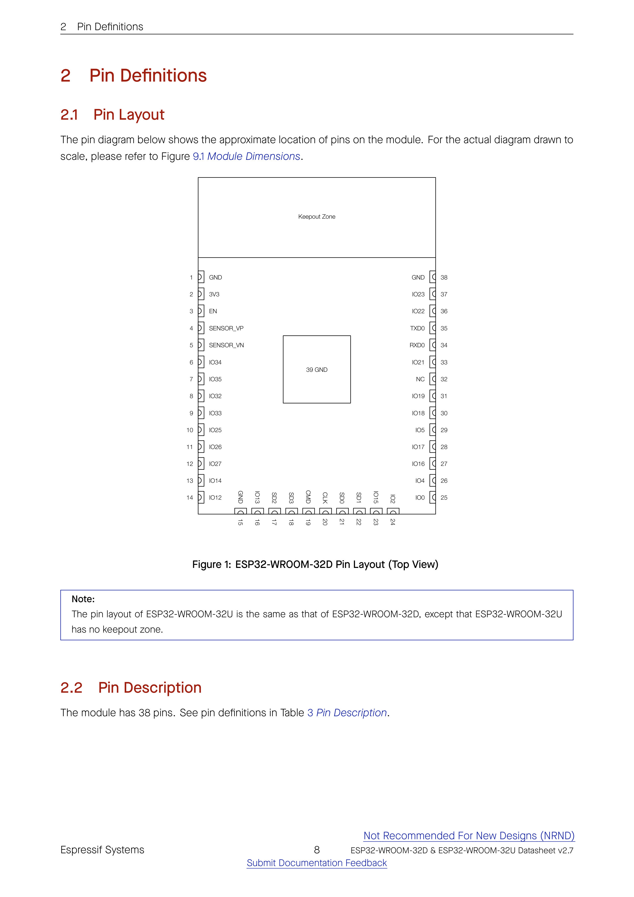

### Pinout Mapping Diagram (Top View)

```
                            +--------------------------+
                            |       KEEPOUT ZONE       |
                            |  (PCB Antenna on 32D;    |
                            |   No keepout on 32U)     |
                            +--------------------------+
                  GND   [ 1]                            [38]  GND
                  3V3   [ 2]                            [37]  IO23
                   EN   [ 3]                            [36]  IO22
            SENSOR_VP   [ 4]                            [35]  TXD0 (GPIO1)
            SENSOR_VN   [ 5]                            [34]  RXD0 (GPIO3)
                 IO34   [ 6]      +--------------+      [33]  IO21
                 IO35   [ 7]      |              |      [32]  NC
                 IO32   [ 8]      |   PAD 39     |      [31]  IO19
                 IO33   [ 9]      |   ( GND )    |      [30]  IO18
                 IO25   [10]      |              |      [29]  IO5
                 IO26   [11]      +--------------+      [28]  IO17
                 IO27   [12]                            [27]  IO16
                 IO14   [13]                            [26]  IO4
                 IO12   [14]                            [25]  IO0
                            [15][16][17][18][19][20][21][22][23][24]
                              |   |   |   |   |   |   |   |   |   |
                             GND IO13 SD2 SD3 CMD CLK SD0 SD1 IO15 IO2
```

> **Note:**  
> The pin layout of ESP32-WROOM-32U is the same as that of ESP32-WROOM-32D, except that ESP32-WROOM-32U has no keepout zone.

---

## 2.2 Pin Description

The module has 38 physical pins plus 1 thermal ground pad (Pin 39). See pin definitions in Table 3.

#### Table 3: Pin Definitions

| Name | No. | Type $^{1}$ | Function |
| :--- | :---: | :---: | :--- |
| **GND** | 1 | P | Ground |
| **3V3** | 2 | P | Power supply (3.0 V ~ 3.6 V) |
| **EN** | 3 | I | Module-enable signal. Active high. |
| **SENSOR_VP** | 4 | I | GPIO36, ADC1_CH0, RTC_GPIO0 |
| **SENSOR_VN** | 5 | I | GPIO39, ADC1_CH3, RTC_GPIO3 |
| **IO34** | 6 | I | GPIO34, ADC1_CH6, RTC_GPIO4 |
| **IO35** | 7 | I | GPIO35, ADC1_CH7, RTC_GPIO5 |
| **IO32** | 8 | I/O | GPIO32, XTAL_32K_P (32.768 kHz crystal oscillator input), ADC1_CH4, TOUCH9, RTC_GPIO9 |
| **IO33** | 9 | I/O | GPIO33, XTAL_32K_N (32.768 kHz crystal oscillator output), ADC1_CH5, TOUCH8, RTC_GPIO8 |
| **IO25** | 10 | I/O | GPIO25, DAC_1, ADC2_CH8, RTC_GPIO6, EMAC_RXD0 |
| **IO26** | 11 | I/O | GPIO26, DAC_2, ADC2_CH9, RTC_GPIO7, EMAC_RXD1 |
| **IO27** | 12 | I/O | GPIO27, ADC2_CH7, TOUCH7, RTC_GPIO17, EMAC_RX_DV |
| **IO14** | 13 | I/O | GPIO14, ADC2_CH6, TOUCH6, RTC_GPIO16, MTMS, HSPICLK, HS2_CLK, SD_CLK, EMAC_TXD2 |
| **IO12** | 14 | I/O | GPIO12, ADC2_CH5, TOUCH5, RTC_GPIO15, MTDI, HSPIQ, HS2_DATA2, SD_DATA2, EMAC_TXD3 |
| **GND** | 15 | P | Ground |
| **IO13** | 16 | I/O | GPIO13, ADC2_CH4, TOUCH4, RTC_GPIO14, MTCK, HSPID, HS2_DATA3, SD_DATA3, EMAC_RX_ER |
| **SHD/SD2** $^{2}$ | 17 | I/O | GPIO9, SD_DATA2, SPIHD, HS1_DATA2, U1RXD |
| **SWP/SD3** $^{2}$ | 18 | I/O | GPIO10, SD_DATA3, SPIWP, HS1_DATA3, U1TXD |
| **SCS/CMD** $^{2}$ | 19 | I/O | GPIO11, SD_CMD, SPICS0, HS1_CMD, U1RTS |
| **SCK/CLK** $^{2}$ | 20 | I/O | GPIO6, SD_CLK, SPICLK, HS1_CLK, U1CTS |
| **SDO/SD0** $^{2}$ | 21 | I/O | GPIO7, SD_DATA0, SPIQ, HS1_DATA0, U2RTS |
| **SDI/SD1** $^{2}$ | 22 | I/O | GPIO8, SD_DATA1, SPID, HS1_DATA1, U2CTS |
| **IO15** | 23 | I/O | GPIO15, ADC2_CH3, TOUCH3, MTDO, HSPICS0, RTC_GPIO13, HS2_CMD, SD_CMD, EMAC_RXD3 |
| **IO2** | 24 | I/O | GPIO2, ADC2_CH2, TOUCH2, RTC_GPIO12, HSPIWP, HS2_DATA0, SD_DATA0 |
| **IO0** | 25 | I/O | GPIO0, ADC2_CH1, TOUCH1, RTC_GPIO11, CLK_OUT1, EMAC_TX_CLK |
| **IO4** | 26 | I/O | GPIO4, ADC2_CH0, TOUCH0, RTC_GPIO10, HSPIHD, HS2_DATA1, SD_DATA1, EMAC_TX_ER |
| **IO16** | 27 | I/O | GPIO16, HS1_DATA4, U2RXD, EMAC_CLK_OUT |
| **IO17** | 28 | I/O | GPIO17, HS1_DATA5, U2TXD, EMAC_CLK_OUT_180 |
| **IO5** | 29 | I/O | GPIO5, VSPICS0, HS1_DATA6, EMAC_RX_CLK |
| **IO18** | 30 | I/O | GPIO18, VSPICLK, HS1_DATA7 |
| **IO19** | 31 | I/O | GPIO19, VSPIQ, U0CTS, EMAC_TXD0 |
| **NC** | 32 | - | Not Connected |
| **IO21** | 33 | I/O | GPIO21, VSPIHD, EMAC_TX_EN |
| **RXD0** | 34 | I/O | GPIO3, U0RXD, CLK_OUT2 |
| **TXD0** | 35 | I/O | GPIO1, U0TXD, CLK_OUT3, EMAC_RXD2 |
| **IO22** | 36 | I/O | GPIO22, VSPIWP, U0RTS, EMAC_TXD1 |
| **IO23** | 37 | I/O | GPIO23, VSPID, HS1_STROBE |
| **GND** | 38 | P | Ground |
| **GND** | 39 | P | Thermal Pad (Center ground pad) |

- $^{1}$ **P:** Power supply; **I:** Input; **O:** Output.  
- $^{2}$ Pins `SCK/CLK`, `SDO/SD0`, `SDI/SD1`, `SHD/SD2`, `SWP/SD3` and `SCS/CMD` (namely GPIO6 to GPIO11 on the ESP32-D0WD chip) are connected to the integrated SPI flash on the module and **are not recommended for other uses**.

---

# 3 Boot Configurations

> **Note:**  
> The content below is excerpted from *ESP32 Series Datasheet > Section Boot Configurations*. For the strapping pin mapping between the chip and modules, please refer to Chapter [7 Module Schematics](#7-module-schematics).

The chip allows for configuring the following boot parameters through strapping pins and eFuse bits at power-up or a hardware reset, without microcontroller interaction:

- **Chip boot mode**
  - Strapping pin: `GPIO0` and `GPIO2`
- **Internal LDO (VDD_SDIO) Voltage**
  - Strapping pin: `MTDI`
  - eFuse bit: `EFUSE_SDIO_FORCE` and `EFUSE_SDIO_TIEH`
- **U0TXD printing**
  - Strapping pin: `MTDO`
- **Timing of SDIO Slave**
  - Strapping pin: `MTDO` and `GPIO5`
- **JTAG signal source**
  - eFuse bit: `EFUSE_DISABLE_JTAG`

The default values of all the above eFuse bits are `0`, which means that they are not burnt. Given that eFuse is one-time programmable, once an eFuse bit is programmed to `1`, it can never be reverted to `0`. For how to program eFuse bits, please refer to *ESP32 Technical Reference Manual > Chapter eFuse Controller*.

The default values of the strapping pins, namely the logic levels, are determined by pins’ internal weak pull-up/pull-down resistors at reset if the pins are not connected to any circuit, or connected to an external high-impedance circuit.

#### Table 4: Default Configuration of Strapping Pins

| Strapping Pin | Default Configuration | Bit Value |
| :--- | :---: | :---: |
| **GPIO0** | Pull-up | **1** |
| **GPIO2** | Pull-down | **0** |
| **MTDI** | Pull-down | **0** |
| **MTDO** | Pull-up | **1** |
| **GPIO5** | Pull-up | **1** |

To change the bit values, the strapping pins should be connected to external pull-down/pull-up resistances. If the ESP32 is used as a device by a host MCU, the strapping pin voltage levels can also be controlled by the host MCU.

All strapping pins have latches. At system reset, the latches sample the bit values of their respective strapping pins and store them until the chip is powered down or shut down. The states of latches cannot be changed in any other way. It makes the strapping pin values available during the entire chip operation, and the pins are freed up to be used as regular IO pins after reset.

The timing of signals connected to the strapping pins should adhere to the setup time and hold time specifications in Table 5 and Figure 2.

#### Table 5: Description of Timing Parameters for the Strapping Pins

| Parameter | Description | Min (ms) |
| :--- | :--- | :---: |
| **$t_{SU}$** | Setup time is the time reserved for the power rails to stabilize before the `CHIP_PU` pin is pulled high to activate the chip. | **0** |
| **$t_{H}$** | Hold time is the time reserved for the chip to read the strapping pin values after `CHIP_PU` is already high and before these pins start operating as regular IO pins. | **1** |

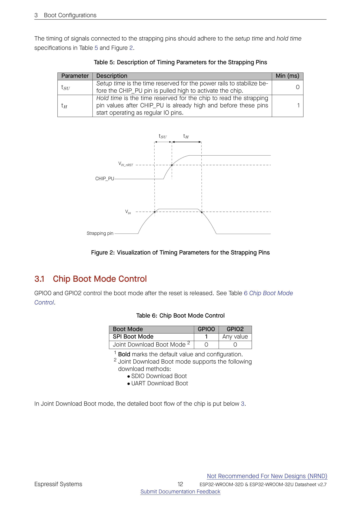

```
CHIP_PU             ____________________________________ High
                   / (threshold: VIH_nRST)
                  /
_______Low_______/
                 |<-- tSU -->|<-- tH -->|
Strapping pin    ____________|__________|
                / (threshold: VIH)       \_______ (can now change)
______Low______/
```

---

## 3.1 Chip Boot Mode Control

`GPIO0` and `GPIO2` control the boot mode after the reset is released. See Table 6.

#### Table 6: Chip Boot Mode Control

| Boot Mode | GPIO0 | GPIO2 |
| :--- | :---: | :---: |
| **SPI Boot Mode** $^{1}$ | **1** | Any value |
| **Joint Download Boot Mode** $^{2}$ | **0** | **0** |

- $^{1}$ **Bold** marks the default value and configuration.
- $^{2}$ Joint Download Boot mode supports the following download methods:
  - SDIO Download Boot
  - UART Download Boot

In Joint Download Boot mode, the detailed boot flow of the chip is shown in Figure 3.

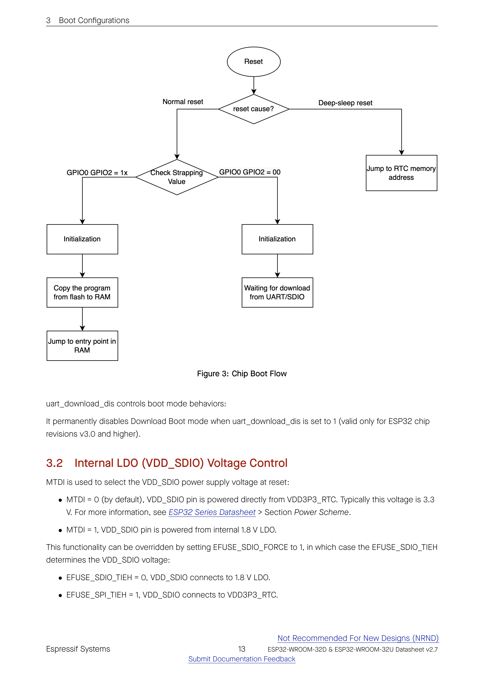

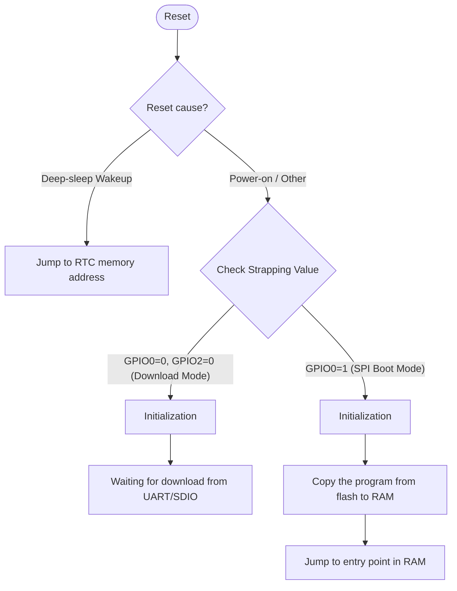

`uart_download_dis` controls boot mode behaviors:  
It permanently disables Download Boot mode when `uart_download_dis` is set to `1` (valid only for ESP32 chip revisions v3.0 and higher).

---

## 3.2 Internal LDO (VDD_SDIO) Voltage Control

`MTDI` is used to select the `VDD_SDIO` power supply voltage at reset:

- **`MTDI = 0` (by default):** `VDD_SDIO` pin is powered directly from `VDD3P3_RTC`. Typically this voltage is **3.3 V**. For more information, see *ESP32 Series Datasheet > Section Power Scheme*.
- **`MTDI = 1`:** `VDD_SDIO` pin is powered from internal **1.8 V LDO**.

This functionality can be overridden by setting `EFUSE_SDIO_FORCE` to `1`, in which case `EFUSE_SDIO_TIEH` determines the `VDD_SDIO` voltage:

- `EFUSE_SDIO_TIEH = 0`: `VDD_SDIO` connects to 1.8 V LDO.
- `EFUSE_SPI_TIEH = 1` (`EFUSE_SDIO_TIEH = 1`): `VDD_SDIO` connects to `VDD3P3_RTC`.

---

## 3.3 U0TXD Printing Control

During booting, the strapping pin `MTDO` can be used to control the `U0TXD` Printing, as Table 7 shows.

#### Table 7: U0TXD Printing Control

| U0TXD Printing Control | MTDO |
| :--- | :---: |
| **Enabled** $^{1}$ | **1** |
| **Disabled** | **0** |

- $^{1}$ **Bold** marks the default value and configuration.

---

## 3.4 Timing Control of SDIO Slave

The strapping pin `MTDO` and `GPIO5` can be used to control the timing of SDIO slave, see Table 8.

#### Table 8: Timing Control of SDIO Slave

| Edge behavior | MTDO | GPIO5 |
| :--- | :---: | :---: |
| **Falling edge sampling, falling edge output** | 0 | 0 |
| **Falling edge sampling, rising edge output** | 0 | 1 |
| **Rising edge sampling, falling edge output** | 1 | 0 |
| **Rising edge sampling, rising edge output** $^{1}$ | **1** | **1** |

- $^{1}$ **Bold** marks the default value and configuration.

---

## 3.5 JTAG Signal Source Control

If `EFUSE_DISABLE_JTAG` is set to `1`, the source of JTAG signals can be disabled.

---

## 3.6 Chip Power-up and Reset

Once the power is supplied to the chip, its power rails need a short time to stabilize. After that, `CHIP_PU` – the pin used for power-up and reset – is pulled high to activate the chip. For information on `CHIP_PU` as well as power-up and reset timing, see Figure 4 and Table 9.

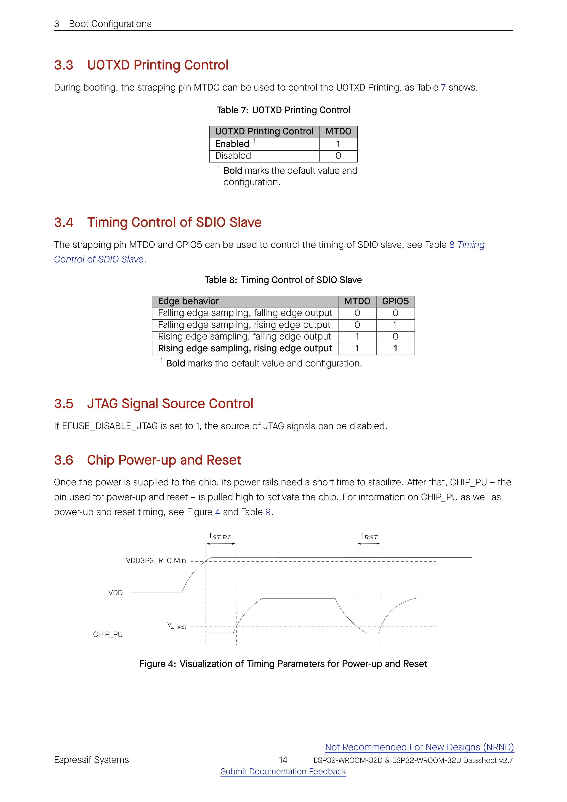

```
VDD               ___________________________ Stable (> VDD3P3_RTC Min)
                 /
_______0V_______/
                |<-- tSTBL -->|
CHIP_PU                       \                    ________ Reset release
                               \   Reset Pulse    /
_______Low (0V)_________________\____(< VIL)____/
                                      |<-- tRST -->|
```

#### Table 9: Description of Timing Parameters for Power-up and Reset

| Parameter | Description | Min (µs) |
| :--- | :--- | :---: |
| **$t_{STBL}$** | Time reserved for the 3.3 V rails to stabilize before the `CHIP_PU` pin is pulled high to activate the chip | **50** |
| **$t_{RST}$** | Time reserved for `CHIP_PU` to stay below $V_{IL\_nRST}$ to reset the chip (see Table 15) | **50** |

---

# 4 Peripherals

## 4.1 Peripheral Overview

ESP32-D0WD chip integrates a rich set of peripherals including SPI, I2S, UART, I2C, pulse count controller, TWAI®, ADC, DAC, touch sensor, etc.

To learn more about on-chip components, please refer to *ESP32 Series Datasheet > Section Functional Description*.

> **Note:**  
> The content below is sourced from *ESP32 Series Datasheet > Section Peripheral Overview*.

---

## 4.2 Digital Peripherals

### 4.2.1 General Purpose Input / Output Interface (GPIO)
ESP32 has 34 GPIO pins, each of which can be configured as an input or output pin. Some GPIOs can be configured with internal pull-up or pull-down resistors, or set to high impedance. When configured as an input, the pin can be configured to trigger an interrupt on rising edge, falling edge, or both.

### 4.2.2 Serial Peripheral Interface (SPI)
ESP32 features three SPIs (SPI, HSPI, and VSPI) in slave and master modes in 1-bit, 2-bit, and 4-bit configurations:
- Four-line full-duplex/half-duplex communication and three-line half-duplex communication support
- Master mode and slave mode
- Programmable CPOL and CPHA
- Programmable clock

For details, see *ESP32 Technical Reference Manual > Chapter SPI Controller*.

#### Pin Assignment
For SPI, the pins are multiplexed with `GPIO6 ~ GPIO11` via the IO MUX. For HSPI and VSPI, the pins can be multiplexed with any GPIOs via the GPIO Matrix, but using dedicated IO MUX pins provides higher clock speeds.

### 4.2.3 Universal Asynchronous Receiver Transmitter (UART)
ESP32 has three UART interfaces: UART0, UART1, and UART2, which support:
- Asynchronous communication (RS232 and RS485) and IrDA at up to 5 Mbps
- Fractional baud rate generator
- Hardware flow control (CTS and RTS signals)
- Software flow control (XON and XOFF)

#### Pin Assignment
UART pins can be mapped to any GPIO via the GPIO Matrix, with default pins `GPIO1` (TXD0), `GPIO3` (RXD0), `GPIO19` (CTS0), `GPIO22` (RTS0).

### 4.2.4 I2C Interface
ESP32 has two I2C bus interfaces which can serve as I2C master or slave depending on the user's configuration:
- Standard mode (100 Kbit/s)
- Fast mode (400 Kbit/s)
- Up to 5 MHz, yet constrained by SDA pull-up strength
- Support for 7-bit and 10-bit addressing, as well as dual address mode
- Supports continuous data transmission with disabled Serial Clock Line (SCL)
- Supports programmable digital noise filter

Users can program command registers to control I2C interfaces to have more flexibility.

#### Pin Assignment
The pins for I2C can be chosen from any GPIOs via the GPIO Matrix.

### 4.2.5 I2S Interface
ESP32 has two I2S peripherals (I2S0 and I2S1):
- Full-duplex and half-duplex modes
- Master and slave modes
- 8/16/24/32-bit resolution per channel
- Configurable clock frequency
- Supports PDM (Pulse Density Modulation) and TDM (Time Division Multiplexing)

### 4.2.6 Remote Control Peripheral (RMT)
The RMT peripheral is designed to transmit and receive infrared remote control signals:
- Eight channels for sending and receiving infrared remote control signals
- Independent transmission and reception capabilities for each channel
- Clock divider counter, state machine, and receiver for each RX channel
- Supports various infrared protocols

For details, see *ESP32 Technical Reference Manual > Chapter Remote Control Peripheral*.

### 4.2.7 Pulse Counter Controller (PCNT)
The PCNT controller can be used to count the number of rising and/or falling edges of input signals:
- Eight independent pulse counter units
- Each unit has two channels, each capturing edge and level control signals
- 16-bit signed counter per unit
- Filtering for noise elimination

### 4.2.8 LED PWM Controller
The LED PWM controller can generate 16 independent channels of digital waveforms:
- 16 independent channels
- Configurable frequency and duty cycle
- 14-bit duty cycle resolution
- Adjustable phase of PWM signal output
- PWM duty cycle dithering
- Automatic duty cycle fading

For details, see *ESP32 Technical Reference Manual > Chapter LED PWM Controller*.

#### Pin Assignment
The pins for the LED PWM Controller can be chosen from any GPIOs via the GPIO Matrix.

### 4.2.9 Motor Control PWM (MCPWM)
ESP32 has two MCPWM units (MCPWM0 and MCPWM1), each with:
- Dedicated capture and compare units
- Dead-time generator
- Fault protection
- Decoding current or voltage amplitude derived from duty-cycle-encoded signals of current/voltage sensors
- Three individual capture channels, each of which with a 32-bit time-stamp register
- Selection of edge polarity and prescaling of input capture signals
- The capture timer can sync with a PWM timer or external signals

### 4.2.10 SD/SDIO/MMC Host Controller
ESP32 features an SD/SDIO/MMC host controller supporting:
- 1-bit and 4-bit modes for SD and SDIO cards
- Clock frequency up to 40 MHz in 4-bit mode
- MMC Specification Version 4.41 support

### 4.2.11 SDIO/SPI Slave Controller
The SDIO/SPI slave controller supports the following features:
- SPI, 1-bit SDIO, and 4-bit SDIO transfer modes over the full clock range from 0 to 50 MHz
- Configurable sampling and driving clock edge
- Special registers for direct access by host
- Interrupts to host for initiating data transfer
- Automatic loading of SDIO bus data

### 4.2.12 TWAI Controller
The Two-Wire Automotive Interface (TWAI®) is compatible with ISO 11898-1 (CAN Specification 2.0B):
- Standard frames (11-bit ID) and extended frames (29-bit ID)
- Bit rates from 1 Kbit/s to 1 Mbit/s
- 64-byte receive FIFO
- Acceptance filters
- Error detection and recovery

#### Pin Assignment
The pins for the Two-wire Automotive Interface can be chosen from any GPIOs via the GPIO Matrix.

### 4.2.13 Ethernet MAC Interface
An IEEE-802.3-2008-compliant Media Access Controller (MAC) interface for Ethernet LAN communications:
- 10/100 Mbps data rates
- RMII (Reduced Media Independent Interface) interface to external PHY
- Dedicated DMA controller

---

## 4.3 Analog Peripherals

### 4.3.1 Analog-to-Digital Converter (ADC)
ESP32 integrates two 12-bit SAR ADCs:
- **ADC1:** 8 channels (`GPIO32 ~ GPIO39` / SENSOR_VP, SENSOR_VN, IO32 ~ IO35)
- **ADC2:** 10 channels (`GPIO0, GPIO2, GPIO4, GPIO12 ~ GPIO15, GPIO25 ~ GPIO27`)
- Measurement range: 0 ~ 3.3 V with configurable attenuation (0 dB, 2.5 dB, 6 dB, 11 dB)
- Sampling rate up to 2 Msps (DIG controller) or 200 ksps (RTC controller)

> **Important:** ADC2 is shared with the Wi-Fi subsystem and cannot be used when Wi-Fi is active.

#### Table 10: ADC Characteristics

| Parameter | Description | Min | Max | Unit |
| :--- | :--- | :---: | :---: | :---: |
| **DNL** (Differential nonlinearity) | RTC controller; ADC connected to an external 100 nF capacitor; DC signal input; ambient temperature at 25 °C; Wi-Fi & Bluetooth off | –7 | 7 | LSB |
| **INL** (Integral nonlinearity) | RTC controller; ADC connected to an external 100 nF capacitor; DC signal input; ambient temperature at 25 °C; Wi-Fi & Bluetooth off | –12 | 12 | LSB |
| **Sampling rate** | RTC controller | — | 200 | ksps |
| **Sampling rate** | DIG controller | — | 2 | Msps |

#### Table 11: ADC Calibration Results

| Parameter | Description | Min | Max | Unit |
| :--- | :--- | :---: | :---: | :---: |
| **Total error** | Atten = 0, effective measurement range of 100 ~ 950 mV | –23 | 23 | mV |
| **Total error** | Atten = 1, effective measurement range of 100 ~ 1250 mV | –30 | 30 | mV |
| **Total error** | Atten = 2, effective measurement range of 150 ~ 1750 mV | –40 | 40 | mV |
| **Total error** | Atten = 3, effective measurement range of 150 ~ 2450 mV | –60 | 60 | mV |

### 4.3.2 Digital-to-Analog Converter (DAC)
ESP32 has two 8-bit DAC channels:
- `DAC_1` on `GPIO25`
- `DAC_2` on `GPIO26`
- Output voltage range: 0 ~ VDD33

### 4.3.3 Touch Sensor
ESP32 has 10 capacitive-sensing GPIOs which detect changes in capacitance caused by fingers or other objects touching or approaching the pins.

#### Table 12: Capacitive-Sensing GPIOs Available on ESP32

| Capacitive-Sensing Signal Name | Pin Name |
| :---: | :---: |
| **T0** | GPIO4 |
| **T1** | GPIO0 |
| **T2** | GPIO2 |
| **T3** | MTDO (GPIO15) |
| **T4** | MTCK (GPIO13) |
| **T5** | MTDI (GPIO12) |
| **T6** | MTMS (GPIO14) |
| **T7** | GPIO27 |
| **T8** | 32K_XN (GPIO33) |
| **T9** | 32K_XP (GPIO32) |

---

# 5 Electrical Characteristics

## 5.1 Absolute Maximum Ratings

Stresses above those listed in Table 13 may cause permanent damage to the device. These are stress ratings only, and functional operation of the device at these or any other conditions beyond those indicated in Table 14 Recommended Operating Conditions is not implied.

#### Table 13: Absolute Maximum Ratings

| Symbol | Parameter | Min | Max | Unit |
| :--- | :--- | :---: | :---: | :---: |
| **VDD33** | Power supply voltage | –0.3 | 3.6 | V |
| **$I_{output}$** $^{1}$ | Cumulative IO output current | — | 1,100 | mA |
| **$T_{store}$** | Storage temperature | –40 | 105 | °C |

- $^{1}$ The sum of currents sourced or sunk by all IOs combined.

---

## 5.2 Recommended Operating Conditions

#### Table 14: Recommended Operating Conditions

| Symbol | Parameter | Min | Typical | Max | Unit |
| :--- | :--- | :---: | :---: | :---: | :---: |
| **VDD33** | Power supply voltage | 3.0 | 3.3 | 3.6 | V |
| **$I_{VDD}$** | Current delivered by external power supply | 0.5 | — | — | A |
| **T** | Operating ambient temperature | –40 | — | 85 | °C |

---

## 5.3 DC Characteristics (3.3 V, 25 °C)

#### Table 15: DC Characteristics (3.3 V, 25 °C)

| Symbol | Parameter | Min | Typ | Max | Unit |
| :--- | :--- | :---: | :---: | :---: | :---: |
| **$C_{IN}$** | Pin capacitance | — | 2 | — | pF |
| **$V_{IH}$** | High-level input voltage | $0.75 	imes VDD^{1}$ | — | $VDD^{1} + 0.3$ | V |
| **$V_{IL}$** | Low-level input voltage | –0.3 | — | $0.25 	imes VDD^{1}$ | V |
| **$I_{IH}$** | High-level input current | — | — | 50 | nA |
| **$I_{IL}$** | Low-level input current | — | — | 50 | nA |
| **$V_{OH}$** | High-level output voltage | $0.8 	imes VDD^{1}$ | — | — | V |
| **$V_{OL}$** | Low-level output voltage | — | — | $0.1 	imes VDD^{1}$ | V |
| **$I_{OH}$** | High-level source current ($VDD^{1}=3.3	ext{ V}, V_{OH} \ge 2.64	ext{ V}$, max drive strength)<br>• VDD3P3_CPU power domain $^{1, 2}$<br>• VDD3P3_RTC power domain $^{1, 2}$<br>• VDD_SDIO power domain $^{1, 3}$ | <br>—<br>—<br>— | <br>40<br>40<br>20 | <br>—<br>—<br>— | <br>mA<br>mA<br>mA |
| **$I_{OL}$** | Low-level sink current ($VDD^{1}=3.3	ext{ V}, V_{OL}=0.495	ext{ V}$, max drive strength) | — | 28 | — | mA |
| **$R_{PU}$** | Resistance of internal pull-up resistor | — | 45 | — | kΩ |
| **$R_{PD}$** | Resistance of internal pull-down resistor | — | 45 | — | kΩ |
| **$V_{IH\_nRST}$** | Chip reset release voltage (`CHIP_PU` voltage within specified range) | $0.75 	imes VDD^{1}$ | — | $VDD^{1} + 0.3$ | V |
| **$V_{IL\_nRST}$** | Low-level input voltage of `CHIP_PU` to shut down the chip | — | — | 0.6 | V |

- $^{1}$ $VDD$ is the I/O voltage for a particular power domain of pins.
- $^{2}$ VDD3P3_CPU and VDD3P3_RTC power domains are typically 3.3 V.
- $^{3}$ VDD_SDIO power domain is 1.8 V or 3.3 V depending on the MTDI strapping pin configuration.

---

## 5.4 Current Consumption Characteristics

With the use of advanced power management technologies, the module can switch between different power modes.

- **Active mode:** Both CPU and chip radio are powered on. Chip can transmit, receive, or listen. Typical peak current during RF transmission is up to 500 mA (power supply must deliver at least 500 mA).
- **Modem-sleep mode:** The CPU is operational and the clock is configurable. Wi-Fi and Bluetooth baseband and radio are disabled.
- **Light-sleep mode:** The CPU is paused. Any wake-up events (MAC, host, RTC timer, external interrupts) will wake up the chip.
- **Deep-sleep mode:** Only the RTC memory and peripherals are powered on. Wi-Fi and Bluetooth connection data are stored in RTC memory.
- **Hibernation mode:** The internal 8-MHz oscillator and ULP coprocessor are disabled. The RTC recovery memory is powered down. Only one RTC timer on the slow clock and certain RTC GPIOs remain active.

---

## 5.5 Memory Specifications

#### Table 16: Flash Specifications

| Parameter | Description | Min | Typ | Max | Unit |
| :--- | :--- | :---: | :---: | :---: | :---: |
| **VCC** | Power supply voltage (1.8 V option) | 1.65 | 1.80 | 2.00 | V |
| **VCC** | Power supply voltage (3.3 V option - default) | 2.7 | 3.3 | 3.6 | V |
| **$F_C$** | Maximum clock frequency | 80 | — | — | MHz |
| **—** | Program/erase cycles | 100,000 | — | — | cycles |
| **$T_{RET}$** | Data retention time | 20 | — | — | years |
| **$T_{PP}$** | Page program time | — | 0.8 | 5 | ms |
| **$T_{SE}$** | Sector erase time (4 KB) | — | 70 | 500 | ms |
| **$T_{BE\_1}$** | Block erase time (32 KB) | — | 0.2 | 2 | s |
| **$T_{BE\_2}$** | Block erase time (64 KB) | — | 0.3 | 3 | s |
| **$T_{CE}$** | Chip erase time (16 Mb) | — | 7 | 20 | s |
| **$T_{CE}$** | Chip erase time (32 Mb = 4 MB, standard module) | — | 20 | 60 | s |
| **$T_{CE}$** | Chip erase time (64 Mb) | — | 25 | 100 | s |
| **$T_{CE}$** | Chip erase time (128 Mb) | — | 60 | 200 | s |
| **$T_{CE}$** | Chip erase time (256 Mb) | — | 70 | 300 | s |

---

# 6 RF Characteristics

This section contains tables with RF characteristics of the Espressif product.

The RF data is measured at the antenna port, where RF cable is connected, including the front-end loss. The external antennas used for the tests on the modules with external antenna connectors have an impedance of 50 Ω. Devices should operate in the center frequency range allocated by regional regulatory authorities. The target center frequency range and the target transmit power are configurable by software. See *ESP RF Test Tool and Test Guide* for instructions.

Unless otherwise stated, the RF tests are conducted with a 3.3 V (±5%) supply at 25 ºC ambient temperature.

---

## 6.1 Wi-Fi Radio

#### Table 17: Wi-Fi RF Characteristics

| Name | Description |
| :--- | :--- |
| **Center frequency range of operating channel** | 2412 ~ 2484 MHz |
| **Wi-Fi wireless standard** | IEEE 802.11b/g/n |

### 6.1.1 Wi-Fi RF Transmitter (TX) Characteristics

#### Table 18: TX Power with Spectral Mask and EVM Meeting 802.11 Standards

| Rate | Min (dBm) | Typ (dBm) | Max (dBm) |
| :--- | :---: | :---: | :---: |
| **802.11b, 1 Mbps** | — | 19.5 | — |
| **802.11b, 11 Mbps** | — | 19.5 | — |
| **802.11g, 6 Mbps** | — | 18.0 | — |
| **802.11g, 54 Mbps** | — | 14.0 | — |
| **802.11n, HT20, MCS0** | — | 18.0 | — |
| **802.11n, HT20, MCS7** | — | 13.0 | — |
| **802.11n, HT40, MCS0** | — | 18.0 | — |
| **802.11n, HT40, MCS7** | — | 13.0 | — |

#### Table 19: TX EVM Test $^{1}$

| Rate | Min (dB) | Typ (dB) | Limit (dB) |
| :--- | :---: | :---: | :---: |
| **802.11b, 1 Mbps, DSSS** | — | –25.0 | –10.0 |
| **802.11b, 11 Mbps, CCK** | — | –25.0 | –10.0 |
| **802.11g, 6 Mbps, OFDM** | — | –24.0 | –5.0 |
| **802.11g, 54 Mbps, OFDM** | — | –28.0 | –25.0 |
| **802.11n, HT20, MCS0** | — | –24.0 | –5.0 |
| **802.11n, HT20, MCS7** | — | –30.0 | –27.0 |
| **802.11n, HT40, MCS0** | — | –24.0 | –5.0 |
| **802.11n, HT40, MCS7** | — | –30.0 | –27.0 |

- $^{1}$ EVM is measured at the corresponding typical TX power provided in Table 18 above.

---

### 6.1.2 Wi-Fi RF Receiver (RX) Characteristics

For RX tests, the PER (packet error rate) limit is 8% for 802.11b, and 10% for 802.11g/n.

#### Table 20: RX Sensitivity

| Rate | Min (dBm) | Typ (dBm) | Max (dBm) |
| :--- | :---: | :---: | :---: |
| **802.11b, 1 Mbps, DSSS** | — | –97.0 | — |
| **802.11b, 2 Mbps, DSSS** | — | –94.0 | — |
| **802.11b, 5.5 Mbps, CCK** | — | –91.0 | — |
| **802.11b, 11 Mbps, CCK** | — | –88.0 | — |
| **802.11g, 6 Mbps, OFDM** | — | –93.0 | — |
| **802.11g, 9 Mbps, OFDM** | — | –91.0 | — |
| **802.11g, 12 Mbps, OFDM** | — | –90.0 | — |
| **802.11g, 18 Mbps, OFDM** | — | –87.0 | — |
| **802.11g, 24 Mbps, OFDM** | — | –84.0 | — |
| **802.11g, 36 Mbps, OFDM** | — | –81.0 | — |
| **802.11g, 48 Mbps, OFDM** | — | –77.0 | — |
| **802.11g, 54 Mbps, OFDM** | — | –75.0 | — |
| **802.11n, HT20, MCS0** | — | –91.0 | — |
| **802.11n, HT20, MCS1** | — | –88.0 | — |
| **802.11n, HT20, MCS2** | — | –86.0 | — |
| **802.11n, HT20, MCS3** | — | –83.0 | — |
| **802.11n, HT20, MCS4** | — | –80.0 | — |
| **802.11n, HT20, MCS5** | — | –75.0 | — |
| **802.11n, HT20, MCS6** | — | –73.0 | — |
| **802.11n, HT20, MCS7** | — | –72.0 | — |
| **802.11n, HT40, MCS0** | — | –88.0 | — |
| **802.11n, HT40, MCS1** | — | –85.0 | — |
| **802.11n, HT40, MCS2** | — | –83.0 | — |
| **802.11n, HT40, MCS3** | — | –80.0 | — |
| **802.11n, HT40, MCS4** | — | –76.0 | — |
| **802.11n, HT40, MCS5** | — | –72.0 | — |
| **802.11n, HT40, MCS6** | — | –70.0 | — |
| **802.11n, HT40, MCS7** | — | –69.0 | — |

#### Table 21: Maximum RX Level

| Rate | Min (dBm) | Typ (dBm) | Max (dBm) |
| :--- | :---: | :---: | :---: |
| **802.11b, 1 Mbps** | — | 5 | — |
| **802.11b, 11 Mbps** | — | 5 | — |
| **802.11g, 6 Mbps** | — | 0 | — |
| **802.11g, 54 Mbps** | — | –8 | — |
| **802.11n, HT20, MCS0** | — | 0 | — |
| **802.11n, HT20, MCS7** | — | –8 | — |
| **802.11n, HT40, MCS0** | — | 0 | — |
| **802.11n, HT40, MCS7** | — | –8 | — |

#### Table 22: RX Adjacent Channel Rejection

| Rate | Min (dB) | Typ (dB) | Max (dB) |
| :--- | :---: | :---: | :---: |
| **802.11b, 1 Mbps, DSSS** | — | 35 | — |
| **802.11b, 11 Mbps, CCK** | — | 35 | — |
| **802.11g, 6 Mbps, OFDM** | — | 27 | — |
| **802.11g, 54 Mbps, OFDM** | — | 13 | — |
| **802.11n, HT20, MCS0** | — | 27 | — |
| **802.11n, HT20, MCS7** | — | 12 | — |
| **802.11n, HT40, MCS0** | — | 16 | — |
| **802.11n, HT40, MCS7** | — | 7 | — |

---

## 6.2 Bluetooth LE Radio

### 6.2.1 Receiver

#### Table 23: Receiver Characteristics – Bluetooth LE

| Parameter | Condition | Min | Typ | Max | Unit |
| :--- | :--- | :---: | :---: | :---: | :---: |
| **Sensitivity @ 30.8% PER** | — | — | –97 | — | dBm |
| **Maximum received signal @ 30.8% PER** | — | 0 | — | — | dBm |
| **Co-channel C/I** | — | — | +10 | — | dB |
| **Adjacent channel selectivity C/I** | $F = F_0 + 1	ext{ MHz}$ | — | –5 | — | dB |
| | $F = F_0 – 1	ext{ MHz}$ | — | –5 | — | dB |
| | $F = F_0 + 2	ext{ MHz}$ | — | –25 | — | dB |
| | $F = F_0 – 2	ext{ MHz}$ | — | –35 | — | dB |
| | $F = F_0 + 3	ext{ MHz}$ | — | –25 | — | dB |
| | $F = F_0 – 3	ext{ MHz}$ | — | –45 | — | dB |
| **Out-of-band blocking performance** | 30 MHz ~ 2000 MHz | –10 | — | — | dBm |
| | 2000 MHz ~ 2400 MHz | –27 | — | — | dBm |
| | 2500 MHz ~ 3000 MHz | –27 | — | — | dBm |
| | 3000 MHz ~ 12.5 GHz | –10 | — | — | dBm |
| **Intermodulation** | — | –36 | — | — | dBm |

---

### 6.2.2 Transmitter

#### Table 24: Transmitter Characteristics – Bluetooth LE

| Parameter | Condition | Min | Typ | Max | Unit |
| :--- | :--- | :---: | :---: | :---: | :---: |
| **RF transmit power** | — | — | 0 | — | dBm |
| **Gain control step** | — | — | 3 | — | dBm |
| **RF power control range** | — | –12 | — | +9 | dBm |
| **Adjacent channel transmit power** | $F = F_0 \pm 2	ext{ MHz}$ | — | –52 | — | dBm |
| | $F = F_0 \pm 3	ext{ MHz}$ | — | –58 | — | dBm |
| | $F = F_0 \pm > 3	ext{ MHz}$ | — | –60 | — | dBm |
| **$\Delta f_{1avg}$** | — | — | — | 265 | kHz |
| **$\Delta f_{2max}$** | — | 247 | — | — | kHz |
| **$\Delta f_{2avg} / \Delta f_{1avg}$** | — | — | –0.92 | — | — |
| **ICFT** | — | — | –10 | — | kHz |
| **Drift rate** | — | — | 0.7 | — | kHz / 50 µs |
| **Drift** | — | — | 2 | — | kHz |

---

# 7 Module Schematics

## 7.1 ESP32-WROOM-32D Schematics

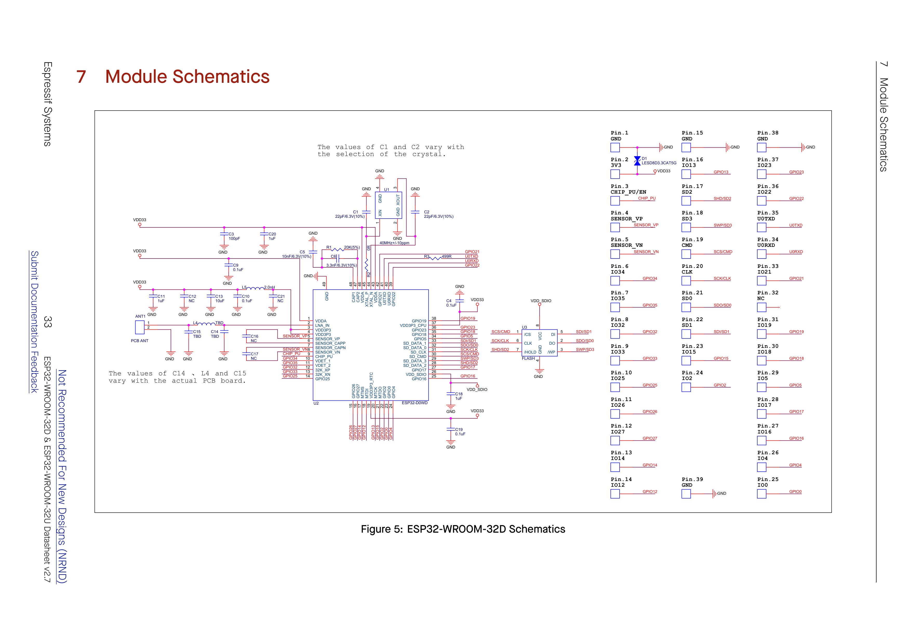

> **Design Notes:**  
> - *The values of C1 and C2 vary with the selection of the crystal.*  
> - *The values of C14, L4, and C15 vary with the actual PCB board.*

### Bill of Materials (BOM) & Netlist Analysis — ESP32-WROOM-32D

#### 1. Integrated Circuits & Core Components
- **U2 (ESP32-D0WD):** Dual-core Xtensa LX6 SoC (QFN48 package with central ground pad Pin 49 GND).
  - *Power Pins:*
    - Pin 1 (VDDA): Analog supply filtered via L5 (2.0 nH) from VDD33.
    - Pin 3, 4 (VDD3P3): Digital I/O supply from VDD33, decoupled by C9 (0.1 µF).
    - Pin 19 (VDD3P3_RTC): RTC domain supply from VDD33, decoupled by C19 (0.1 µF).
    - Pin 26 (VDD_SDIO): Internal LDO output supplying SPI Flash U3 VCC (Pin 8), decoupled by C18 (1 µF).
    - Pin 37 (VDD3P3_CPU): CPU digital supply from VDD33, decoupled by C4 (0.1 µF).
    - Pin 43, 46 (VDDA): Analog supplies, decoupled by C10 (0.1 µF) and C13 (10 µF).
    - Pin 49 (GND): Central exposed thermal pad soldered to GND.
  - *Internal Regulator & Bias:*
    - Pin 47 (CAP2), Pin 48 (CAP1): Connected across RC filtering network C6 (3.3 nF / 6.3 V, 10%), R1 (20 kΩ, 5%), with C5 (10 nF / 6.3 V, 10%) to GND.
- **U1 (Crystal Oscillator):** 40 MHz ±10 ppm crystal resonator.
  - Pin 1 (XIN): Connected to U2 Pin 45 (XTAL_P) via R3 (499 Ω) and load capacitor C1 (22 pF / 6.3 V, 10%) to GND.
  - Pin 2, 4 (GND): Connected to GND.
  - Pin 3 (XOUT): Connected to U2 Pin 44 (XTAL_N) via R2 (0 Ω) and load capacitor C2 (22 pF / 6.3 V, 10%) to GND.
- **U3 (SPI Flash):** 4 MB (32 Mb) SPI NOR Flash.
  - Pin 1 (/CS): Connected to U2 Pin 30 (SD_CMD / SCS) and Module Pin 19 (CMD).
  - Pin 2 (DO): Connected to U2 Pin 32 (SD_DATA_0 / SDO) and Module Pin 21 (SD0).
  - Pin 3 (/WP): Connected to U2 Pin 28 (SD_DATA_2 / SHD) and Module Pin 17 (SD2).
  - Pin 4 (GND): Connected to GND.
  - Pin 5 (DI): Connected to U2 Pin 33 (SD_DATA_1 / SDI) and Module Pin 22 (SD1).
  - Pin 6 (CLK): Connected to U2 Pin 31 (SD_CLK / SCK) and Module Pin 20 (CLK).
  - Pin 7 (/HOLD): Connected to U2 Pin 29 (SD_DATA_3 / SWP) and Module Pin 18 (SD3).
  - Pin 8 (VCC): Connected to U2 Pin 26 (VDD_SDIO) and decoupled by C18 (1 µF to GND).
- **ANT1 (PCB Antenna):** On-board inverted-F / meandered PCB antenna.
  - Signal fed from U2 Pin 2 (LNA_IN) via matching $\pi$-filter formed by series inductor L4 (TBD) and shunt capacitors C14 (TBD) and C15 (TBD) to GND.
  - Filter network also includes options C16 (NC), C17 (NC), C21 (NC).
- **D1 (ESD Protection):** LESD8D3.3CAT5G TVS diode placed between Module Pin 2 (3V3) and GND.

#### 2. Module Edge Pins Connection Summary
- **Pins 1, 15, 38, 39:** GND
- **Pin 2:** 3V3 (VDD33 main power input)
- **Pin 3:** CHIP_PU / EN (active-high chip enable)
- **Pins 4, 5:** SENSOR_VP (GPIO36), SENSOR_VN (GPIO39)
- **Pins 6 ~ 14:** IO34, IO35, IO32, IO33, IO25, IO26, IO27, IO14, IO12
- **Pins 16 ~ 24:** IO13, SD2, SD3, CMD, CLK, SD0, SD1, IO15, IO2
- **Pins 25 ~ 37:** IO0, IO4, IO16, IO17, IO5, IO18, IO19, NC (Pin 32), IO21, RXD0, TXD0, IO22, IO23

---

## 7.2 ESP32-WROOM-32U Schematics

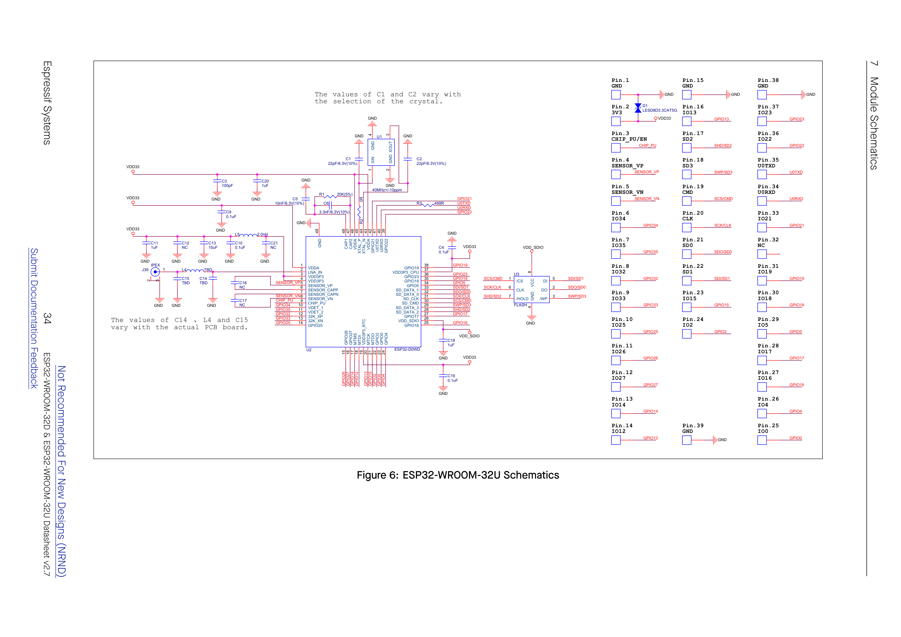

### Bill of Materials & Differences — ESP32-WROOM-32U vs 32D
The internal schematic of ESP32-WROOM-32U is identical to ESP32-WROOM-32D in terms of:
- U2 (ESP32-D0WD SoC) wiring and pin mapping;
- U1 (40 MHz crystal) and load capacitors;
- U3 (SPI Flash) wiring and VDD_SDIO decoupling;
- DC power decoupling (C3, C4, C9, C10, C11, C13, C18, C19, C20, D1);

**Key Architectural Difference:**
- Instead of the on-board PCB antenna ANT1, ESP32-WROOM-32U uses **J39 (IPEX / U.FL connector)**.
- The RF trace from U2 Pin 2 (LNA_IN) connects through the matching network (L4, C14, C15) directly to the center pin of J39, with the outer shell soldered to the module GND plane.

---

# 8 Peripheral Schematics

This is the typical application circuit of the module connected with peripheral components (for example, power supply, antenna, reset button, JTAG interface, and UART interface).

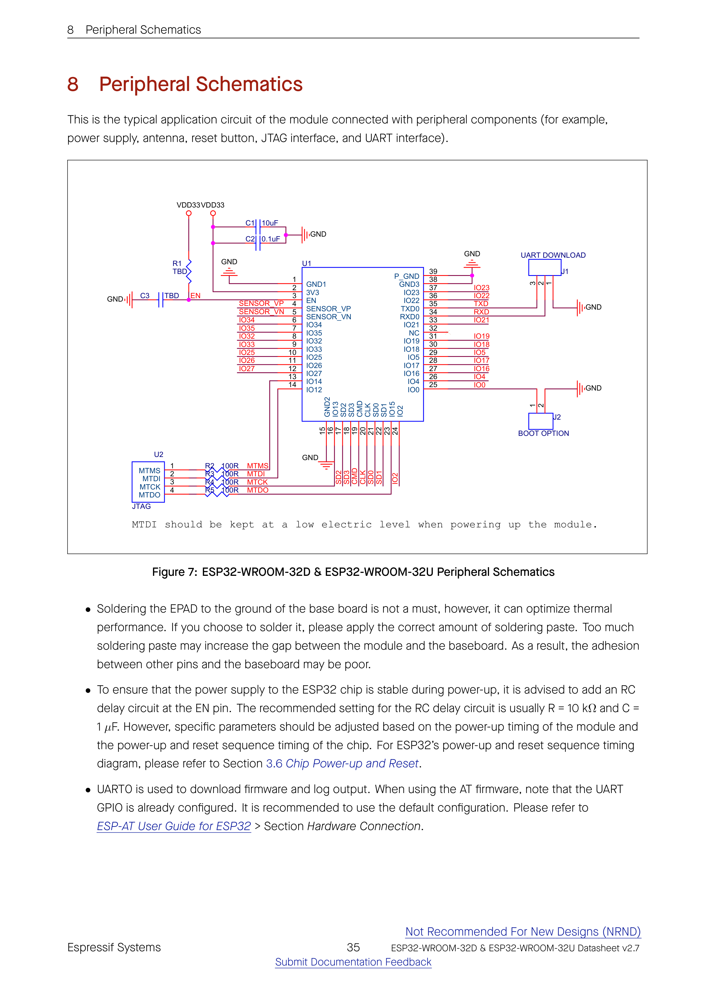

```
                            +-----------------------------+
                            |           MODULE            |
                            |   (ESP32-WROOM-32D / 32U)   |
  3.3V Power Rail           |                             |
  VDD33 >---+----------+--->| [2]  3V3                    |
            |          |    |                             |
          [C1]       [C2]   |                             |
          10uF       0.1uF  |                             |
            |          |    |                             |
           GND        GND   |                             |
                            |                             |
  Reset Circuit             |                             |
  VDD33 >-[R1 10k]-+------->| [3]  EN                     |
                   |        |                             |
                 [C3 1uF]   |                             |
                   |        |                             |
                  GND       |                             |
                 [SW1 RST]  |                             |
                   |        |                             |
                  GND       |                             |
                            |                             |
  JTAG Header (U2)          |                             |
  Pin 1: MTMS >-[R2 100R]-->| [13] IO14 / MTMS            |
  Pin 2: MTDI >-[R3 100R]-->| [14] IO12 / MTDI            |
  Pin 3: MTCK >-[R4 100R]-->| [16] IO13 / MTCK            |
  Pin 4: MTDO >-[R5 100R]-->| [23] IO15 / MTDO            |
                            |                             |
  UART Download Header (J1) |                             |
  Pin 1: TXD  <-------------| [35] TXD0 (GPIO1)           |
  Pin 2: RXD  ------------->| [34] RXD0 (GPIO3)           |
  Pin 3: GND  ------------->| [1, 15, 38, 39] GND         |
                            |                             |
  Boot Option Header (J2)   |                             |
  Pin 1: IO0  ------------->| [25] IO0                    |
  Pin 2: GND  ------------->| GND                         |
                            +-----------------------------+
```

### Detailed Circuit Breakdown

1. **Power Supply Decoupling:**
   - The main 3.3 V rail (`VDD33`) is fed to Module Pin 2 (`3V3`).
   - Filter capacitors placed close to the module pin:
     - **C1:** 10 µF electrolytic or ceramic capacitor.
     - **C2:** 0.1 µF ceramic decoupling capacitor.
   - Ground pins 1, 15, 38 and thermal pad 39 connect to a solid ground plane.

2. **Power-up & Reset Timing Circuit (EN Pin):**
   - An RC delay circuit is connected to Pin 3 (`EN / CHIP_PU`):
     - **R1:** 10 kΩ pull-up resistor to `VDD33`.
     - **C3:** 1 µF capacitor from `EN` to `GND`.
   - A momentary push-button (`RESET`) connects `EN` directly to `GND` to trigger manual hardware reset.
   - *Design rationale:* Ensures that the 3.3 V power rail stabilizes ($t_{STBL} \ge 50	ext{ µs}$) before `EN` crosses the high-level input threshold $V_{IH\_nRST}$.

3. **UART0 Firmware Download Interface (J1 Header):**
   - **Pin 1 (TXD):** Connects to Module Pin 35 (`TXD0 / GPIO1`).
   - **Pin 2 (RXD):** Connects to Module Pin 34 (`RXD0 / GPIO3`).
   - **Pin 3 (GND):** Connects to common ground.
   - Used for flashing firmware and console serial monitor logging.

4. **Boot Option Jumper / Button (J2 Header):**
   - **Pin 1:** Connects to Module Pin 25 (`IO0`).
   - **Pin 2:** Connects to `GND`.
   - When shorted / held low during reset release: ESP32 enters **UART Download Boot Mode**.
   - When open / left floating: Internal weak pull-up latches `IO0 = 1`, and the chip enters **SPI Flash Boot Mode**.

5. **JTAG Debug Interface (U2 Header):**
   - Standard 4-wire JTAG signals connected via series damping resistors:
     - Pin 1 (`MTMS`): Series resistor **R2 (100 Ω)** to Module Pin 13 (`IO14`).
     - Pin 2 (`MTDI`): Series resistor **R3 (100 Ω)** to Module Pin 14 (`IO12`).
     - Pin 3 (`MTCK`): Series resistor **R4 (100 Ω)** to Module Pin 16 (`IO13`).
     - Pin 4 (`MTDO`): Series resistor **R5 (100 Ω)** to Module Pin 23 (`IO15`).

> **CRITICAL HARDWARE WARNING:**  
> **MTDI should be kept at a low electric level when powering up the module.**  
> If `MTDI` is pulled high at power-up, the internal LDO voltage for `VDD_SDIO` is set to 1.8 V instead of 3.3 V, causing the integrated 3.3 V SPI flash to fail to power up properly and preventing the chip from booting.

### Implementation Guidelines from Espressif
- **Soldering the EPAD:** Soldering the EPAD (Pin 39 GND) to the ground of the base board is not a must; however, it can optimize thermal performance. If you choose to solder it, please apply the correct amount of soldering paste. Too much soldering paste may increase the gap between the module and the baseboard. As a result, the adhesion between other pins and the baseboard may be poor.
- **EN Delay Settings:** To ensure that the power supply to the ESP32 chip is stable during power-up, it is advised to add an RC delay circuit at the EN pin. The recommended setting for the RC delay circuit is usually $R = 10	ext{ k}\Omega$ and $C = 1	ext{ \mu F}$. However, specific parameters should be adjusted based on the power-up timing of the module and the power-up and reset sequence timing of the chip. For ESP32’s power-up and reset sequence timing diagram, please refer to Section [3.6 Chip Power-up and Reset](#36-chip-power-up-and-reset).
- **UART0 Configuration:** UART0 is used to download firmware and log output. When using the AT firmware, note that the UART GPIO is already configured. It is recommended to use the default configuration. Please refer to *ESP-AT User Guide for ESP32 > Section Hardware Connection*.

---

# 9 Physical Dimensions

## 9.1 Module Dimensions

### Dimensions of ESP32-WROOM-32D

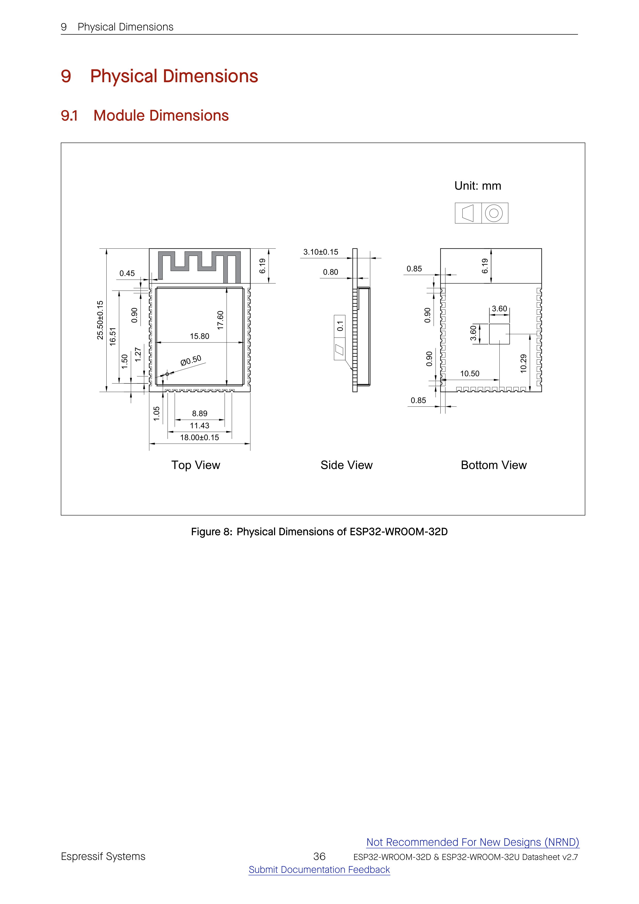

#### Table: Physical Dimensions Breakdown — ESP32-WROOM-32D (Unit: mm)

| Dimension Item | Nominal Value | Tolerance | View / Reference |
| :--- | :---: | :---: | :--- |
| **Module Width** | 18.00 | ±0.15 | Top / Bottom View |
| **Module Length** | 25.50 | ±0.15 | Top / Bottom View |
| **Module Thickness (Height)** | 3.10 | ±0.15 | Side View |
| **Shielding Can Length** | 17.60 | — | Top View |
| **Shielding Can Width** | 15.80 | — | Top View |
| **Shielding Can Thickness** | 0.80 | — | Side View |
| **Antenna Keepout Area Height** | 6.19 | — | Top View (PCB antenna area) |
| **Shield Test Hole Diameter** | Ø0.50 | — | Top View |
| **Shield to Side Edge Margin** | 0.45 | — | Top View |
| **Pin Pitch** | 1.27 | — | Top / Bottom View |
| **Side Pin Pad Width** | 0.90 | — | Top / Bottom View |
| **Side Pin Pad Length** | 1.50 | — | Top / Bottom View |
| **Distance from Pin 1 to Bottom Edge** | 1.05 | — | Top View |
| **Bottom Pin Row Usable Span** | 8.89 / 11.43 | — | Top / Bottom View |
| **Side Pin Row Span (14 pins)** | 16.51 | — | Top / Bottom View |
| **Thermal Pad (EPAD) Dimensions** | 3.60 × 3.60 | — | Bottom View (Pin 39 GND) |
| **EPAD Distance to Left Edge** | 10.50 | — | Bottom View |
| **EPAD Distance to Bottom Edge** | 10.29 | — | Bottom View |
| **Coplanarity** | — | ≤ 0.10 | Side View |

---

### Dimensions of ESP32-WROOM-32U

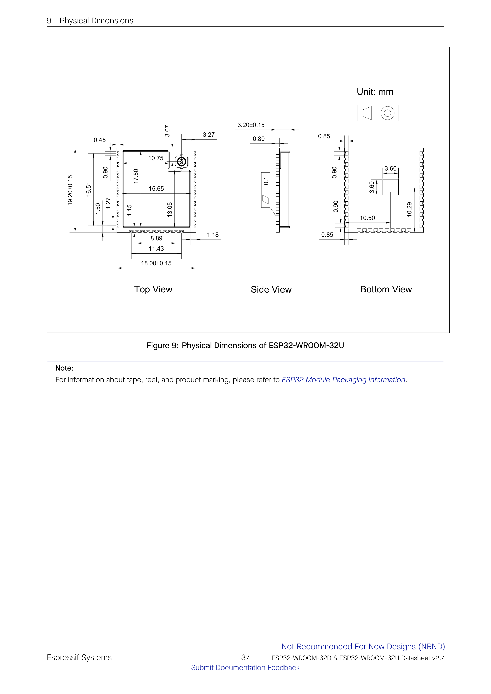

#### Table: Physical Dimensions Breakdown — ESP32-WROOM-32U (Unit: mm)

| Dimension Item | Nominal Value | Tolerance | View / Reference |
| :--- | :---: | :---: | :--- |
| **Module Width** | 18.00 | ±0.15 | Top / Bottom View |
| **Module Length** | 19.20 | ±0.15 | Top / Bottom View (No antenna keepout) |
| **Module Thickness (Height)** | 3.20 | ±0.15 | Side View |
| **Shielding Can Length** | 17.50 | — | Top View |
| **Shielding Can Width** | 15.65 | — | Top View (with connector notch) |
| **Shielding Can Notch Dimensions** | 10.75 × 13.05 | — | Top View |
| **IPEX Connector Center to Top Edge** | 3.07 | — | Top View |
| **IPEX Connector Center to Right Edge**| 3.27 | — | Top View |
| **Pin Pitch** | 1.27 | — | Top / Bottom View |
| **Side Pin Pad Width** | 0.90 | — | Top / Bottom View |
| **Side Pin Pad Length** | 1.50 | — | Top / Bottom View |
| **Distance from Pin 1 to Bottom Edge** | 1.15 / 1.18 | — | Top View |
| **Side Pin Row Span (14 pins)** | 16.51 | — | Top / Bottom View |
| **Thermal Pad (EPAD) Dimensions** | 3.60 × 3.60 | — | Bottom View (Pin 39 GND) |
| **EPAD Distance to Left Edge** | 10.50 | — | Bottom View |
| **EPAD Distance to Bottom Edge** | 10.29 | — | Bottom View |
| **Coplanarity** | — | ≤ 0.10 | Side View |

> **Note:**  
> For information about tape, reel, and product marking, please refer to *ESP32 Module Packaging Information*.

---

## 9.2 Dimensions of External Antenna Connector

ESP32-WROOM-32U uses the first generation external antenna connector as shown in Figure 10. This connector is compatible with the following connectors:
- **U.FL Series** connector from Hirose
- **MHF I** connector from I-PEX
- **AMC** connector from Amphenol

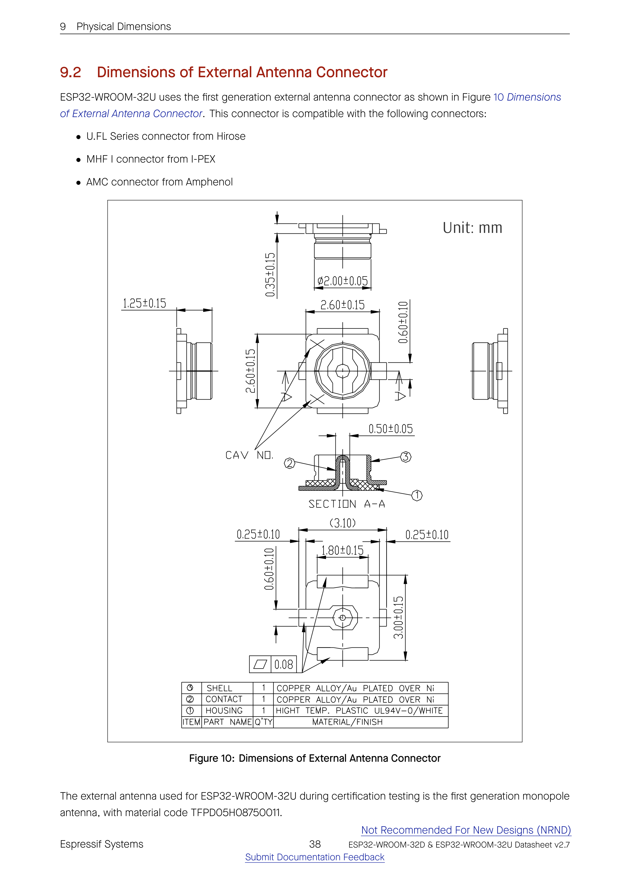

#### Table: External Antenna Connector Detailed Specifications (Unit: mm)

| Feature | Value | Tolerance | Description |
| :--- | :---: | :---: | :--- |
| **Overall Height Mounted** | 1.25 | ±0.15 | Total height above PCB surface |
| **Housing Footprint** | 2.60 × 2.60 | ±0.15 | Width and depth of body |
| **Mating Outer Ring Diameter** | Ø2.00 | ±0.05 | External diameter of metallic contact ring |
| **Ring Wall Thickness** | 0.35 | ±0.15 | Annular ring thickness |
| **Center Pin Diameter** | 0.50 | ±0.05 | Center RF signal receptacle |
| **Side Ground Contact Width** | 0.60 | ±0.10 | Lateral ground contact tabs |
| **Bottom Span with Solder Tabs** | 3.10 | Ref. | Overall width across outer solder points |
| **Central Housing Base Width** | 1.80 | ±0.15 | Bottom plastic base width |
| **Solder Pad Overhang** | 0.25 | ±0.10 | Side extension of solder lugs |
| **Longitudinal Solder Span** | 3.00 | ±0.15 | End-to-end solder pad dimension |
| **Coplanarity** | — | ≤ 0.08 | Max deviation of all contacts from plane |

#### Bill of Materials (BOM) of Antenna Connector

| Item | Part Name | Q'ty | Material / Finish |
| :---: | :--- | :---: | :--- |
| **①** | **HOUSING** | 1 | High Temperature Plastic UL94V-0 / White |
| **②** | **CONTACT** | 1 | Copper Alloy / Gold (Au) Plated over Nickel (Ni) |
| **③** | **SHELL** | 1 | Copper Alloy / Gold (Au) Plated over Nickel (Ni) |

The external antenna used for ESP32-WROOM-32U during certification testing is the first generation monopole antenna, with material code **TFPD05H08750011**.

---

# 10 PCB Layout Recommendations

## 10.1 PCB Land Pattern

This section provides the following resources for your reference:
- Figures for recommended PCB land patterns with all the dimensions needed for PCB design. See Figure 11 Recommended PCB Land Pattern of ESP32-WROOM-32D and Figure 12 Recommended PCB Land Pattern of ESP32-WROOM-32U.
- Source files of recommended PCB land patterns to measure dimensions not covered in Figure 11 and Figure 12. You can view the source files for ESP32-WROOM-32D and ESP32-WROOM-32U with Autodesk Viewer.
- 3D models of ESP32-WROOM-32D. Please make sure that you download the 3D model file in `.STEP` format (beware that some browsers might add `.txt`).

### Recommended PCB Land Pattern of ESP32-WROOM-32D

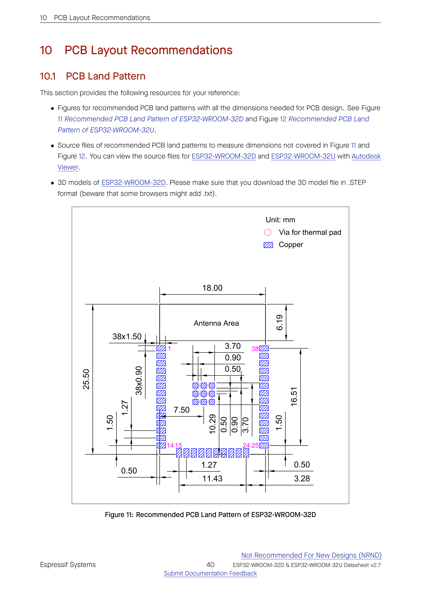

#### Land Pattern Dimensions — ESP32-WROOM-32D (Unit: mm)
- **Module Outline on Land Pattern:** 18.00 mm (width) × 25.50 mm (height)
- **Antenna Keepout Area Height:** 6.19 mm (no copper on any layer beneath this zone)
- **Perimeter SMD Pads:**
  - Total pads: **38 pads**
  - Pad dimensions: **1.50 mm (length) × 0.90 mm (width)**
  - Pin pitch: **1.27 mm**
  - Side row vertical pad span: **16.51 mm** (center-to-center from Pin 1 to Pin 14)
  - Bottom row horizontal pad span: **11.43 mm** (Pins 15 to 24)
  - Distance from edge to pad center: **0.50 mm**
  - Distance from bottom edge to corner pad: **3.28 mm**
- **Central Thermal Pad (EPAD):**
  - Thermal copper area: **3.70 mm × 3.70 mm** divided into a $3 	imes 3$ grid of smaller sub-pads
  - Sub-pad dimensions: **0.90 mm × 0.90 mm** each, spaced by **0.50 mm** gaps
  - Thermal vias: **9 through-hole vias** (arranged in $3 	imes 3$ pattern) for heat dissipation to bottom ground plane
  - Distance from left edge to center of thermal array: **7.50 mm**
  - Distance from bottom edge to center of thermal array: **10.29 mm**

---

### Recommended PCB Land Pattern of ESP32-WROOM-32U

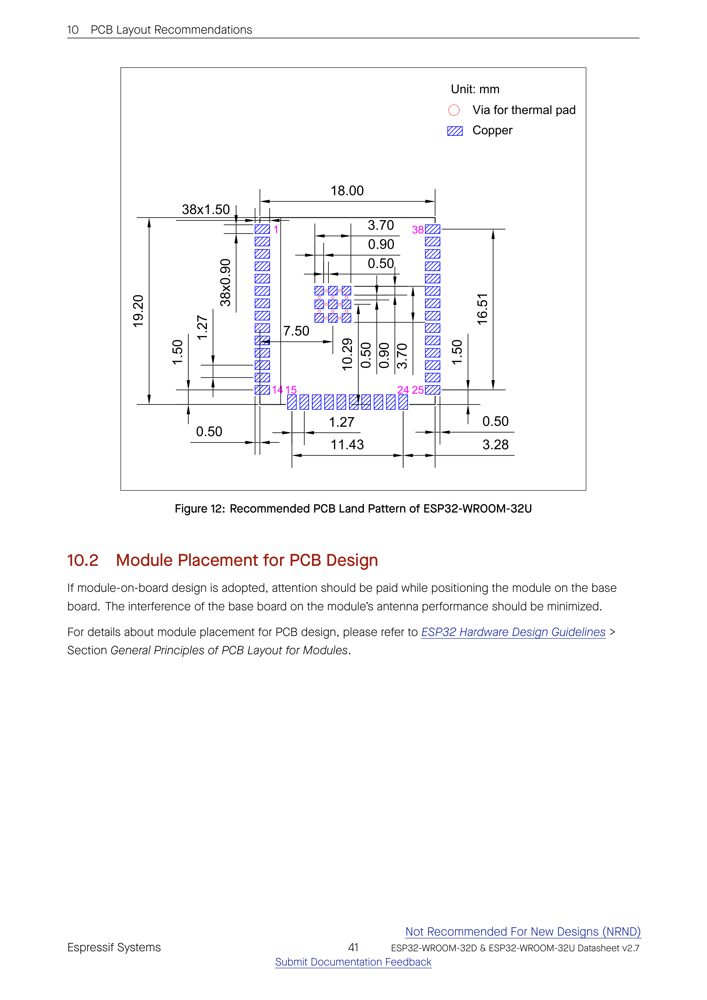

#### Land Pattern Dimensions — ESP32-WROOM-32U (Unit: mm)
- **Module Outline on Land Pattern:** 18.00 mm (width) × 19.20 mm (height)
- **Perimeter SMD Pads:**
  - Total pads: **38 pads**
  - Pad dimensions: **1.50 mm (length) × 0.90 mm (width)**
  - Pin pitch: **1.27 mm**
  - Side row vertical pad span: **16.51 mm**
  - Bottom row horizontal pad span: **11.43 mm**
  - Edge clearances: **0.50 mm** lateral, **3.28 mm** bottom corner
- **Central Thermal Pad (EPAD):**
  - Thermal copper area: **3.70 mm × 3.70 mm** ($3 	imes 3$ matrix of $0.90 	imes 0.90	ext{ mm}$ pads separated by $0.50	ext{ mm}$)
  - Thermal vias: **9 vias** for thermal connection to PCB ground planes
  - Distance from left edge: **7.50 mm**; distance from bottom edge: **10.29 mm**

---

## 10.2 Module Placement for PCB Design

If module-on-board design is adopted, attention should be paid while positioning the module on the base board. The interference of the base board on the module’s antenna performance should be minimized.

For details about module placement for PCB design, please refer to *ESP32 Hardware Design Guidelines > Section General Principles of PCB Layout for Modules*.

Key rules include:
1. For ESP32-WROOM-32D (PCB antenna), place the antenna portion extending outside the edge of the baseboard, or provide a cut-out on all layers of the baseboard underneath the antenna keepout zone ($6.19	ext{ mm} 	imes 18.00	ext{ mm}$).
2. Ensure no copper, ground planes, traces, metal components, or screws exist in or directly around the keepout area.
3. For ESP32-WROOM-32U, route the RF coaxial pigtail away from high-speed digital switching signals (such as SPI, SDIO, or PWM lines) to prevent RF desensitization.

---

# 11 Product Handling

## 11.1 Storage Conditions

The products sealed in moisture barrier bags (MBB) should be stored in a non-condensing atmospheric environment of **< 40 °C and 90% RH**. The module is rated at the **moisture sensitivity level (MSL) of 3**.

After unpacking, the module must be soldered within **168 hours** with the factory conditions **25 ± 5 °C and 60% RH**. If the above conditions are not met, the module needs to be baked.

---

## 11.2 Electrostatic Discharge (ESD)

- **Human body model (HBM):** ±2000 V
- **Charged-device model (CDM):** ±500 V

---

## 11.3 Reflow Profile

Solder the module in a single reflow.

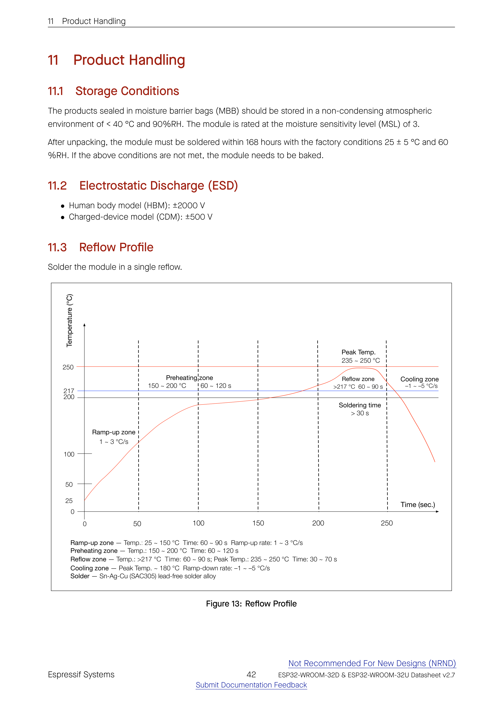

#### Table: Solder Reflow Temperature Profile Specifications

| Zone | Temperature Range | Duration / Dwell Time | Ramp Rate |
| :--- | :---: | :---: | :---: |
| **Ramp-up zone** | 25 °C ~ 150 °C | 60 ~ 90 s | 1 ~ 3 °C/s |
| **Preheating zone** | 150 °C ~ 200 °C | 60 ~ 120 s | — |
| **Reflow zone** | > 217 °C | 60 ~ 90 s | Peak Temp: 235 ~ 250 °C<br>Time > 217 °C: 30 ~ 70 s (Soldering time > 30 s) |
| **Cooling zone** | Peak Temp down to ~ 180 °C | — | –1 ~ –5 °C/s |
| **Solder Alloy** | **Sn-Ag-Cu (SAC305)** lead-free solder alloy | — | — |

---

## 11.4 Ultrasonic Vibration

> **WARNING:**  
> Avoid exposing Espressif modules to vibration from ultrasonic equipment, such as ultrasonic welders or ultrasonic cleaners. This vibration may induce resonance in the in-module crystal and lead to its malfunction or even failure. As a consequence, the module may stop working or its performance may deteriorate.

---

# Datasheet Versioning

#### Table: Datasheet Lifecycle & Watermark Definitions

| Datasheet Version | Status | Watermark | Definition |
| :--- | :--- | :--- | :--- |
| **v0.1 ~ v0.5** (excluding v0.5) | Draft | Confidential | This datasheet is under development for products in the design stage. Specifications may change without prior notice. |
| **v0.5 ~ v1.0** (excluding v1.0) | Preliminary release | Preliminary | This datasheet is actively updated for products in the verification stage. Specifications may change before mass production, and the changes will be documented in the datasheet’s Revision History. |
| **v1.0 and higher** | Official release | — | This datasheet is publicly released for products in mass production. Specifications are finalized, and major changes will be communicated via Product Change Notifications (PCN). |
| **Any version** | — | **Not Recommended for New Design (NRND)** $^{1}$ | This datasheet is updated less frequently for products not recommended for new designs. |
| **Any version** | — | **End of Life (EOL)** $^{2}$ | This datasheet is no longer maintained for products that have reached end of life. |

- $^{1}$ Watermark will be added to the datasheet title page only when all the product variants covered by this datasheet are not recommended for new designs.
- $^{2}$ Watermark will be added to the datasheet title page only when all the product variants covered by this datasheet have reached end of life.

---

# Related Documentation and Resources

### Related Documentation
- **ESP32 Series Datasheet** – Specifications of the ESP32 hardware.
- **ESP32 Technical Reference Manual** – Detailed information on how to use the ESP32 memory and peripherals.
- **ESP32 Hardware Design Guidelines** – Guidelines on how to integrate the ESP32 into your hardware product.
- **ESP32 ECO and Workarounds for Bugs** – Correction of ESP32 design errors.
- **ESP32 Series SoC Errata** – Descriptions of known errors in ESP32 series of SoCs.
- **Certificates:** https://espressif.com/en/support/documents/certificates
- **ESP32 Product/Process Change Notifications (PCN):** https://espressif.com/en/support/documents/pcns
- **ESP32 Advisories** – Information on security, bugs, compatibility, component reliability: https://espressif.com/en/support/documents/advisories
- **Documentation Updates and Update Notification Subscription:** https://espressif.com/en/support/download/documents

### Developer Zone
- **ESP-IDF Programming Guide for ESP32** – Extensive documentation for the ESP-IDF development framework.
- **ESP-IDF and other development frameworks on GitHub:** https://github.com/espressif
- **ESP32 BBS Forum** – Engineer-to-Engineer (E2E) Community for Espressif products: https://esp32.com/
- **ESP-FAQ** – A summary document of frequently asked questions: https://espressif.com/projects/esp-faq/en/latest/index.html
- **The ESP Journal** – Best Practices, Articles, and Notes from Espressif: https://blog.espressif.com/
- **SDKs and Demos, Apps, Tools, AT Firmware:** https://espressif.com/en/support/download/sdks-demos

### Products
- **ESP32 Series SoCs:** https://espressif.com/en/products/socs?id=ESP32
- **ESP32 Series Modules:** https://espressif.com/en/products/modules?id=ESP32
- **ESP32 Series DevKits:** https://espressif.com/en/products/devkits?id=ESP32
- **ESP Product Selector:** https://products.espressif.com/#/product-selector?language=en

### Contact Us
- **Sales Questions, Technical Enquiries, Circuit Schematic & PCB Design Review, Samples, Suppliers:** https://espressif.com/en/contact-us/sales-questions

---

# Revision History

#### Table: Complete Document Revision History

| Date | Version | Release Notes |
| :--- | :---: | :--- |
| **2026-08-06** | **v2.7** | • Table 1 Series Comparison and Table 2 Series Comparison: Updated ”Ordering Code” to ”Part Number”<br>• Updated Figure 2 Visualization of Timing Parameters for the Strapping Pins<br>• Section 4.2.3 Universal Asynchronous Receiver Transmitter (UART) and 4.2.4 I2C Interface: Fixed typos<br>• Table 15 DC Characteristics (3.3 V, 25 °C): Added $V_{IH\_nRST}$ |
| **2025-08-05** | **v2.6** | • Improved the wording and structure of following sections:<br>&nbsp;&nbsp;– Section 1: Module Overview: Updated Table ”ESP32-WROOM-32D and ESP32-WROOM-32U Specifications” to Section 1.1: Features and added Section 1.2: Series Comparison<br>&nbsp;&nbsp;– Updated Section ”Strapping Pins” and renamed to Boot Configurations<br>&nbsp;&nbsp;– Added Section 4: Peripherals<br>&nbsp;&nbsp;– Added Section 5.5: Memory Specifications<br>&nbsp;&nbsp;– Added Section 6: RF Characteristics<br>&nbsp;&nbsp;– Added a note about UART and pin 39 in Section 8: Peripheral Schematics<br>&nbsp;&nbsp;– Added notes about the external antenna connector in Section 9.2: Dimensions of External Antenna Connector<br>&nbsp;&nbsp;– Added Section Datasheet Versioning |
| **2025-04-14** | **v2.5** | Added notes about erase cycles and retention time for flash in Table ”ESP32-WROOM-32D vs. ESP32-WROOM-32U” which later were moved to Section 5.5: Memory Specifications |
| **2023.02** | **v2.4** | **Major updates:**<br>• Removed contents about hall sensor according to PCN20221202<br>• Added Section 11: Product Handling<br>**Other updates:**<br>• Added strapping pin timing in Section ”Strapping Pins”<br>• Added source files of PCB land patterns and 3D models of the modules (if available) in Section 10.1: PCB Land Pattern |
| **2022.03** | **v2.3** | Updated Table ”ESP32-WROOM-32D vs. ESP32-WROOM-32U”<br>Added a link to RF certificates in Section 1.1: Features<br>Updated Table 13<br>Added a note below Figure 9<br>Updated the description to the connector<br>Added Section Related Documentation and Resources |
| **2021.08** | **v2.2** | Replaced Espressif Product Ordering Information with ESP Product Selector<br>Updated the description of TWAI in Section 1.1: Features<br>Labeled this document as (Not Recommended For New Designs) |
| **2021.02** | **v2.1** | Updated Figure 8: Physical Dimensions of ESP32-WROOM-32D, Figure 9: Physical Dimensions of ESP32-WROOM-32U, Figure 11: Recommended PCB Land Pattern of ESP32-WROOM-32D, and Figure 12: Recommended PCB Land Pattern of ESP32-WROOM-32U<br>Modified the note below Figure: Reflow Profile<br>Modified the note below Figure 7: ESP32-WROOM-32D & ESP32-WROOM-32U Peripheral Schematics<br>Updated the trade mark from TWAI™ to TWAI® |
| **2020.11** | **v2.0** | Added TWAI™ in Section 1.1: Features<br>Added a note under Figure: Reflow Profile<br>Updated the C value in RC delay circuit from 0.1 µF to 1 µF<br>Provided feedback link |
| **2019.09** | **v1.9** | • Changed the supply voltage range from 2.7 V ~ 3.6 V to 3.0 V ~ 3.6 V<br>• Added Moisture sensitivity level (MSL) 3 in Section 1.1: Features<br>• Added notes about ”Operating frequency range” and ”TX power” under Table ”Wi-Fi Radio Characteristics” which later was updated to several tables in Section 6: RF Characteristics<br>• Updated Section 8 Peripheral Schematics and added a note about RC delay circuit under it<br>• Updated Figure 11 and Figure 12 Recommended PCB Land Pattern |
| **2019.01** | **v1.8** | Changed the RF power control range in Table 24 from –12 ~ +12 to –12 ~ +9 dBm. |
| **2018.10** | **V1.7** | Added notice on module custom options under Section 1.1: Features<br>Added ”Cumulative IO output current” entry to Table 13: Absolute Maximum Ratings<br>Added more parameters to Table 15: DC Characteristics |
| **2018.09** | **V1.6** | Updated the hole diameter in the shield from 1.00 mm to 0.50 mm, in Figure 8 |
| **2018.08** | **V1.5** | • Added certifications and reliability test items the module has passed in Section 1.1: Features, and removed software-specific information<br>• Updated Section ”RTC and Low-Power Management” which later renamed to 5.4: Current Consumption Characteristics<br>• Changed the modules’ dimensions<br>• Updated Figure 8 and 9: Physical Dimensions<br>• Updated Table ”Wi-Fi Radio Characteristics” |
| **2018.06** | **V1.4** | • Deleted Temperature Sensor in Section 1.1: Features<br>• Updated Chapter ”Functional Description”<br>• Added notes to Chapter 8: Peripheral Schematics<br>• Added Chapter 10.1: Recommended PCB Land Pattern<br>**Changes to electrical characteristics:**<br>• Updated Table 13: Absolute Maximum Ratings<br>• Added Table 14: Recommended Operating Conditions<br>• Added Table 15: DC Characteristics<br>• Updated the values of ”Gain control step”, ”Adjacent channel transmit power” in Table 24: Transmitter Characteristics - BLE |
| **2018.04** | **v1.3** | Updated Figure 6 ESP32-WROOM-32U Schematics and Figure 5 ESP32-WROOM-32D Schematics |
| **2018.02** | **v1.2** | Update Figure 6 ESP32-WROOM-32U Schematics |
| **2018.02** | **V1.1** | Updated Chapter 7 Module Schematics<br>Deleted description of low-noise amplifier<br>Replaced the module name ESP-WROOM-32D with ESP32-WROOM-32D<br>Added information about module certification in Section 1.1: Features<br>Updated the description of eFuse bits in Chapter ”Functional Description” |
| **2017.11** | **v1.0** | First release |

---

# Disclaimer and Copyright Notice

Information in this document, including URL references, is subject to change without notice.

**ALL THIRD PARTY’S INFORMATION IN THIS DOCUMENT IS PROVIDED AS IS WITH NO WARRANTIES TO ITS AUTHENTICITY AND ACCURACY.**

**NO WARRANTY IS PROVIDED TO THIS DOCUMENT FOR ITS MERCHANTABILITY, NON-INFRINGEMENT, FITNESS FOR ANY PARTICULAR PURPOSE, NOR DOES ANY WARRANTY OTHERWISE ARISING OUT OF ANY PROPOSAL, SPECIFICATION OR SAMPLE.**

All liability, including liability for infringement of any proprietary rights, relating to use of information in this document is disclaimed. No licenses express or implied, by estoppel or otherwise, to any intellectual property rights are granted herein.

The Wi-Fi Alliance Member logo is a trademark of the Wi-Fi Alliance. The Bluetooth logo is a registered trademark of Bluetooth SIG.

All trade names, trademarks and registered trademarks mentioned in this document are property of their respective owners, and are hereby acknowledged.

**Copyright © 2026 Espressif Systems (Shanghai) Co., Ltd. All rights reserved.**  
[www.espressif.com](https://www.espressif.com)
