# MFRC522 — Standard Performance MIFARE and NTAG Frontend

> **Document ID:** 112139  
> **Revision:** Rev. 3.9 — 27 April 2016  
> **Manufacturer:** NXP Semiconductors N.V.  
> **Document Status:** Product data sheet (COMPANY PUBLIC)  
> **Official Website:** [www.nxp.com](http://www.nxp.com)  
> **Scope:** Faithful, unabridged technical transcription of the official manufacturer datasheet for automated LLM analysis, embedded systems engineering, and hardware/software design verification.

---

## Contents

- [1. Introduction](#1-introduction)
  - [1.1 Differences between version 1.0 and 2.0](#11-differences-between-version-10-and-20)
- [2. General description](#2-general-description)
- [3. Features and benefits](#3-features-and-benefits)
- [4. Quick reference data](#4-quick-reference-data)
- [5. Ordering information](#5-ordering-information)
- [6. Block diagram](#6-block-diagram)
- [7. Pinning information](#7-pinning-information)
  - [7.1 Pin description](#71-pin-description)
- [8. Functional description](#8-functional-description)
  - [8.1 Digital interfaces](#81-digital-interfaces)
    - [8.1.1 Automatic microcontroller interface detection](#811-automatic-microcontroller-interface-detection)
    - [8.1.2 Serial Peripheral Interface](#812-serial-peripheral-interface)
      - [8.1.2.1 SPI read data](#8121-spi-read-data)
      - [8.1.2.2 SPI write data](#8122-spi-write-data)
      - [8.1.2.3 SPI address byte](#8123-spi-address-byte)
    - [8.1.3 UART interface](#813-uart-interface)
      - [8.1.3.1 Connection to a host](#8131-connection-to-a-host)
      - [8.1.3.2 Selectable UART transfer speeds](#8132-selectable-uart-transfer-speeds)
      - [8.1.3.3 UART framing](#8133-uart-framing)
    - [8.1.4 I2C-bus interface](#814-i2c-bus-interface)
      - [8.1.4.1 Data validity](#8141-data-validity)
      - [8.1.4.2 START and STOP conditions](#8142-start-and-stop-conditions)
      - [8.1.4.3 Byte format](#8143-byte-format)
      - [8.1.4.4 Acknowledge](#8144-acknowledge)
      - [8.1.4.5 7-Bit addressing](#8145-7-bit-addressing)
      - [8.1.4.6 Register write access](#8146-register-write-access)
      - [8.1.4.7 Register read access](#8147-register-read-access)
      - [8.1.4.8 High-speed mode](#8148-high-speed-mode)
      - [8.1.4.9 High-speed transfer](#8149-high-speed-transfer)
      - [8.1.4.10 Serial data transfer format in HS mode](#81410-serial-data-transfer-format-in-hs-mode)
      - [8.1.4.11 Switching between F/S mode and HS mode](#81411-switching-between-fs-mode-and-hs-mode)
      - [8.1.4.12 MFRC522 at lower speed modes](#81412-mfrc522-at-lower-speed-modes)
  - [8.2 Analog interface and contactless UART](#82-analog-interface-and-contactless-uart)
    - [8.2.1 General](#821-general)
    - [8.2.2 TX p-driver](#822-tx-p-driver)
    - [8.2.3 Serial data switch](#823-serial-data-switch)
    - [8.2.4 MFIN and MFOUT interface support](#824-mfin-and-mfout-interface-support)
    - [8.2.5 CRC coprocessor](#825-crc-coprocessor)
  - [8.3 FIFO buffer](#83-fifo-buffer)
    - [8.3.1 Accessing the FIFO buffer](#831-accessing-the-fifo-buffer)
    - [8.3.2 Controlling the FIFO buffer](#832-controlling-the-fifo-buffer)
    - [8.3.3 FIFO buffer status information](#833-fifo-buffer-status-information)
  - [8.4 Interrupt request system](#84-interrupt-request-system)
    - [8.4.1 Interrupt sources overview](#841-interrupt-sources-overview)
  - [8.5 Timer unit](#85-timer-unit)
  - [8.6 Power reduction modes](#86-power-reduction-modes)
    - [8.6.1 Hard power-down](#861-hard-power-down)
    - [8.6.2 Soft power-down mode](#862-soft-power-down-mode)
    - [8.6.3 Transmitter power-down mode](#863-transmitter-power-down-mode)
  - [8.7 Oscillator circuit](#87-oscillator-circuit)
  - [8.8 Reset and oscillator start-up time](#88-reset-and-oscillator-start-up-time)
    - [8.8.1 Reset timing requirements](#881-reset-timing-requirements)
    - [8.8.2 Oscillator start-up time](#882-oscillator-start-up-time)
- [9. MFRC522 registers](#9-mfrc522-registers)
  - [9.1 Register bit behavior](#91-register-bit-behavior)
  - [9.2 Register overview](#92-register-overview)
  - [9.3 Register descriptions](#93-register-descriptions)
    - [9.3.1 Page 0: Command and status](#931-page-0-command-and-status)
      - [9.3.1.1 Reserved register 00h](#9311-reserved-register-00h)
      - [9.3.1.2 CommandReg register](#9312-commandreg-register)
      - [9.3.1.3 ComIEnReg register](#9313-comienreg-register)
      - [9.3.1.4 DivIEnReg register](#9314-divienreg-register)
      - [9.3.1.5 ComIrqReg register](#9315-comirqreg-register)
      - [9.3.1.6 DivIrqReg register](#9316-divirqreg-register)
      - [9.3.1.7 ErrorReg register](#9317-errorreg-register)
      - [9.3.1.8 Status1Reg register](#9318-status1reg-register)
      - [9.3.1.9 Status2Reg register](#9319-status2reg-register)
      - [9.3.1.10 FIFODataReg register](#93110-fifodatareg-register)
      - [9.3.1.11 FIFOLevelReg register](#93111-fifolevelreg-register)
      - [9.3.1.12 WaterLevelReg register](#93112-waterlevelreg-register)
      - [9.3.1.13 ControlReg register](#93113-controlreg-register)
      - [9.3.1.14 BitFramingReg register](#93114-bitframingreg-register)
      - [9.3.1.15 CollReg register](#93115-collreg-register)
      - [9.3.1.16 Reserved register 0Fh](#93116-reserved-register-0fh)
    - [9.3.2 Page 1: Communication](#932-page-1-communication)
      - [9.3.2.1 Reserved register 10h](#9321-reserved-register-10h)
      - [9.3.2.2 ModeReg register](#9322-modereg-register)
      - [9.3.2.3 TxModeReg register](#9323-txmodereg-register)
      - [9.3.2.4 RxModeReg register](#9324-rxmodereg-register)
      - [9.3.2.5 TxControlReg register](#9325-txcontrolreg-register)
      - [9.3.2.6 TxASKReg register](#9326-txaskreg-register)
      - [9.3.2.7 TxSelReg register](#9327-txselreg-register)
      - [9.3.2.8 RxSelReg register](#9328-rxselreg-register)
      - [9.3.2.9 RxThresholdReg register](#9329-rxthresholdreg-register)
      - [9.3.2.10 DemodReg register](#93210-demodreg-register)
      - [9.3.2.11 Reserved register 1Ah](#93211-reserved-register-1ah)
      - [9.3.2.12 Reserved register 1Bh](#93212-reserved-register-1bh)
      - [9.3.2.13 MfTxReg register](#93213-mftxreg-register)
      - [9.3.2.14 MfRxReg register](#93214-mfrxreg-register)
      - [9.3.2.15 Reserved register 1Eh](#93215-reserved-register-1eh)
      - [9.3.2.16 SerialSpeedReg register](#93216-serialspeedreg-register)
    - [9.3.3 Page 2: Configuration](#933-page-2-configuration)
      - [9.3.3.1 Reserved register 20h](#9331-reserved-register-20h)
      - [9.3.3.2 CRCResultReg registers](#9332-crcresultreg-registers)
      - [9.3.3.3 Reserved register 23h](#9333-reserved-register-23h)
      - [9.3.3.4 ModWidthReg register](#9334-modwidthreg-register)
      - [9.3.3.5 Reserved register 25h](#9335-reserved-register-25h)
      - [9.3.3.6 RFCfgReg register](#9336-rfcfgreg-register)
      - [9.3.3.7 GsNReg register](#9337-gsnreg-register)
      - [9.3.3.8 CWGsPReg register](#9338-cwgspreg-register)
      - [9.3.3.9 ModGsPReg register](#9339-modgspreg-register)
      - [9.3.3.10 TModeReg and TPrescalerReg registers](#93310-tmodereg-and-tprescalerreg-registers)
      - [9.3.3.11 TReloadReg register](#93311-treloadreg-register)
      - [9.3.3.12 TCounterValReg register](#93312-tcountervalreg-register)
    - [9.3.4 Page 3: Test](#934-page-3-test)
      - [9.3.4.1 Reserved register 30h](#9341-reserved-register-30h)
      - [9.3.4.2 TestSel1Reg register](#9342-testsel1reg-register)
      - [9.3.4.3 TestSel2Reg register](#9343-testsel2reg-register)
      - [9.3.4.4 TestPinEnReg register](#9344-testpinenreg-register)
      - [9.3.4.5 TestPinValueReg register](#9345-testpinvaluereg-register)
      - [9.3.4.6 TestBusReg register](#9346-testbusreg-register)
      - [9.3.4.7 AutoTestReg register](#9347-autotestreg-register)
      - [9.3.4.8 VersionReg register](#9348-versionreg-register)
      - [9.3.4.9 AnalogTestReg register](#9349-analogtestreg-register)
      - [9.3.4.10 TestDAC1Reg register](#93410-testdac1reg-register)
      - [9.3.4.11 TestDAC2Reg register](#93411-testdac2reg-register)
      - [9.3.4.12 TestADCReg register](#93412-testadcreg-register)
      - [9.3.4.13 Reserved register 3Ch](#93413-reserved-register-3ch)
- [10. MFRC522 command set](#10-mfrc522-command-set)
  - [10.1 General description](#101-general-description)
  - [10.2 General behavior](#102-general-behavior)
  - [10.3 MFRC522 command overview](#103-mfrc522-command-overview)
    - [10.3.1 MFRC522 command descriptions](#1031-mfrc522-command-descriptions)
      - [10.3.1.1 Idle](#10311-idle)
      - [10.3.1.2 Mem](#10312-mem)
      - [10.3.1.3 Generate RandomID](#10313-generate-randomid)
      - [10.3.1.4 CalcCRC](#10314-calccrc)
      - [10.3.1.5 Transmit](#10315-transmit)
      - [10.3.1.6 NoCmdChange](#10316-nocmdchange)
      - [10.3.1.7 Receive](#10317-receive)
      - [10.3.1.8 Transceive](#10318-transceive)
      - [10.3.1.9 MFAuthent](#10319-mfauthent)
      - [10.3.1.10 SoftReset](#103110-softreset)
- [11. Limiting values](#11-limiting-values)
- [12. Recommended operating conditions](#12-recommended-operating-conditions)
- [13. Thermal characteristics](#13-thermal-characteristics)
- [14. Characteristics](#14-characteristics)
  - [14.1 Timing characteristics](#141-timing-characteristics)
- [15. Application information](#15-application-information)
- [16. Test information](#16-test-information)
  - [16.1 Test signals](#161-test-signals)
    - [16.1.1 Self test](#1611-self-test)
    - [16.1.2 Test bus](#1612-test-bus)
    - [16.1.3 Test signals on pins AUX1 or AUX2](#1613-test-signals-on-pins-aux1-or-aux2)
      - [16.1.3.1 Example: Output test signals TestDAC1 and TestDAC2](#16131-example-output-test-signals-testdac1-and-testdac2)
      - [16.1.3.2 Example: Output test signals Corr1 and MinLevel](#16132-example-output-test-signals-corr1-and-minlevel)
      - [16.1.3.3 Example: Output test signals ADC channel I and ADC channel Q](#16133-example-output-test-signals-adc-channel-i-and-adc-channel-q)
      - [16.1.3.4 Example: Output test signals RxActive and TxActive](#16134-example-output-test-signals-rxactive-and-txactive)
      - [16.1.3.5 Example: Output test signal RX data stream](#16135-example-output-test-signal-rx-data-stream)
      - [16.1.3.6 PRBS](#16136-prbs)
- [17. Package outline](#17-package-outline)
- [18. Handling information](#18-handling-information)
- [19. Packing information](#19-packing-information)
- [20. Abbreviations](#20-abbreviations)
- [21. References](#21-references)
- [22. Revision history](#22-revision-history)
- [23. Legal information](#23-legal-information)
  - [23.1 Data sheet status](#231-data-sheet-status)
  - [23.2 Definitions](#232-definitions)
  - [23.3 Disclaimers](#233-disclaimers)
  - [23.4 Trademarks](#234-trademarks)
- [24. Contact information](#24-contact-information)
- [25. Contents](#25-contents)

---

Rev. 3.9 — 27 April 2016
112139
Product data sheet
COMPANY PUBLIC

# 1. Introduction

This document describes the functionality and electrical specifications of the contactless 
reader/writer MFRC522.

Remark: The MFRC522 supports all variants of the MIFARE Mini, MIFARE 1K, 
MIFARE 4K, MIFARE Ultralight, MIFARE DESFire EV1 and MIFARE Plus RF 
identification protocols. To aid readability throughout this data sheet, the MIFARE Mini, 
MIFARE 1K, MIFARE 4K, MIFARE Ultralight, MIFARE DESFire EV1 and MIFARE Plus 
products and protocols have the generic name MIFARE.

## 1.1 Differences between version 1.0 and 2.0

The MFRC522 is available in two versions:

• MFRC52201HN1, hereafter referred to version 1.0 and
• MFRC52202HN1, hereafter referred to version 2.0.

The MFRC522 version 2.0 is fully compatible to version 1.0 and offers in addition the 
following features and improvements:

• Increased stability of the reader IC in rough conditions
• An additional timer prescaler, see Section 8.5.
• A corrected CRC handling when RX Multiple is set to 1

This data sheet version covers both versions of the MFRC522 and describes the 
differences between the versions if applicable.

# 2. General description

The MFRC522 is a highly integrated reader/writer IC for contactless communication 
at 13.56 MHz. The MFRC522 reader supports ISO/IEC 14443 A/MIFARE and NTAG.

The MFRC522’s internal transmitter is able to drive a reader/writer antenna designed to 
communicate with ISO/IEC 14443 A/MIFARE cards and transponders without additional 
active circuitry. The receiver module provides a robust and efficient implementation for 
demodulating and decoding signals from ISO/IEC 14443 A/MIFARE compatible cards and 
transponders. The digital module manages the complete ISO/IEC 14443 A framing and 
error detection (parity and CRC) functionality.

The MFRC522 supports MF1xxS20, MF1xxS70 and MF1xxS50 products. The MFRC522 
supports contactless communication and uses MIFARE higher transfer speeds up to 
848 kBd in both directions.

The following host interfaces are provided:

• Serial Peripheral Interface (SPI)
• Serial UART (similar to RS232 with voltage levels dependant on pin voltage supply)
• I2C-bus interface

# 3. Features and benefits

- Highly integrated analog circuitry to demodulate and decode responses

- Buffered output drivers for connecting an antenna with the minimum number of

external components

- Supports ISO/IEC 14443 A/MIFARE and NTAG

- Typical operating distance in Read/Write mode up to 50 mm depending on the

antenna size and tuning

- Supports MF1xxS20, MF1xxS70 and MF1xxS50 encryption in Read/Write mode 

- Supports ISO/IEC 14443 A higher transfer speed communication up to 848 kBd

- Supports MFIN/MFOUT

- Additional internal power supply to the smart card IC connected via MFIN/MFOUT

- Supported host interfaces

  - SPI up to 10 Mbit/s

  - I2C-bus interface up to 400 kBd in Fast mode, up to 3400 kBd in High-speed mode

  - RS232 Serial UART up to 1228.8 kBd, with voltage levels dependant on pin

voltage supply

- FIFO buffer handles 64 byte send and receive

- Flexible interrupt modes

- Hard reset with low power function

- Power-down by software mode

- Programmable timer

- Internal oscillator for connection to 27.12 MHz quartz crystal

- 2.5 V to 3.3 V power supply

- CRC coprocessor

- Programmable I/O pins

- Internal self-test

# 4. Quick reference data

#### Table 1: Quick reference data

| Symbol | Parameter | Conditions |  | Min | Typ | Max | Unit |
| --- | --- | --- | --- | --- | --- | --- | --- |
| V DDA | analog supply voltage | V  ≤ V = V = V DD(TVDD); DD(PVDD) DDA DDD V = V = V = V = 0 V SSA SSD SS(PVSS) SS(TVSS) | [1][2] | 2.5 | 3.3 | 3.6 | V |
| V DDD | digital supply voltage |  |  | 2.5 | 3.3 | 3.6 | V |
| V DD(TVDD) | TVDD supply voltage |  |  | 2.5 | 3.3 | 3.6 | V |
| V DD(PVDD) | PVDD supply voltage |  | [3] | 1.6 | 1.8 | 3.6 | V |
| V DD(SVDD) | SVDD supply voltage | V = V = V = V = 0 V SSA SSD SS(PVSS) SS(TVSS) |  | 1.6 | - | 3.6 | V |

#### Table 1: Quick reference data …continued

| Symbol | Parameter | Conditions |  | Min | Typ | Max | Unit |
| --- | --- | --- | --- | --- | --- | --- | --- |
| I pd | power-down current | V = V = V = V = 3 V DDA DDD DD(TVDD) DD(PVDD) |  |  |  |  |  |
|  |  | hard power-down; pin NRSTPD set LOW | [4] | - | - | 5 | µA |
|  |  | soft power-down; RF level detector on | [4] | - | - | 10 | µA |
| I DDD | digital supply current | pin DVDD; V = 3 V DDD |  | - | 6.5 | 9 | mA |
| I DDA | analog supply current | pin AVDD; V = 3 V, CommandReg register’s DDA RcvOff bit = 0 |  | - | 7 | 10 | mA |
|  |  | pin AVDD; receiver switched off; V = 3 V, DDA CommandReg register’s RcvOff bit = 1 |  | - | 3 | 5 | mA |
| I DD(PVDD) | PVDD supply current | pin PVDD | [5] | - | - | 40 | mA |
| I DD(TVDD) | TVDD supply current | pin TVDD; continuous wave | [6][7][8] | - | 60 | 100 | mA |
| T amb | ambient temperature | HVQFN32 |  | -25 | - | +85 | °C |

[1]
Supply voltages below 3 V reduce the performance in, for example, the achievable operating distance.

[2]
VDDA, VDDD and VDD(TVDD) must always be the same voltage.

[3]
VDD(PVDD) must always be the same or lower voltage than VDDD.

[4]
Ipd is the total current for all supplies.

[5]
IDD(PVDD) depends on the overall load at the digital pins.

[6]
IDD(TVDD) depends on VDD(TVDD) and the external circuit connected to pins TX1 and TX2.

[7]
During typical circuit operation, the overall current is below 100 mA.

[8]
Typical value using a complementary driver configuration and an antenna matched to 40  Ω between pins TX1 and TX2 at 13.56 MHz.

# 5. Ordering information

#### Table 2: Ordering information

| Type number | Package |  |  |
| --- | --- | --- | --- |
|  | Name | Description | Version |
| MFRC52201HN1/TRAYB[1] | HVQFN32 | plastic thermal enhanced very thin quad flat package; no leads; 32 terminal; body 5  ×  5  ×  0.85 mm | SOT617-1 |
| MFRC52201HN1/TRAYBM[2] | HVQFN32 | plastic thermal enhanced very thin quad flat package; no leads; 32 terminal; body 5  ×  5  ×  0.85 mm | SOT617-1 |
| MFRC52202HN1/TRAYB[1] | HVQFN32 | plastic thermal enhanced very thin quad flat package; no leads; 32 terminal; body 5  ×  5  ×  0.85 mm | SOT617-1 |
| MFRC52202HN1/TRAYBM[2] | HVQFN32 | plastic thermal enhanced very thin quad flat package; no leads; 32 terminal; body 5  ×  5  ×  0.85 mm | SOT617-1 |

[1]
Delivered in one tray.

[2]
Delivered in five trays.

# 6. Block diagram

The analog interface handles the modulation and demodulation of the analog signals.

The contactless UART manages the protocol requirements for the communication 
protocols in cooperation with the host. The FIFO buffer ensures fast and convenient data 
transfer to and from the host and the contactless UART and vice versa.

Various host interfaces are implemented to meet different customer requirements.

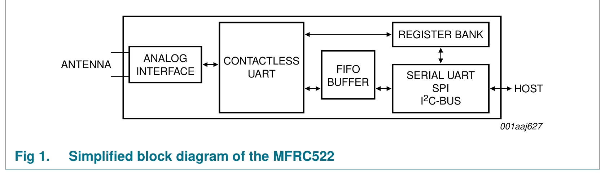

```
+-----------------------------------------------------------------------------------+
|                                      MFRC522                                      |
|                                                                                   |
|  +-------------------+        +-----------------------------------+               |
|  |                   | <----> |        CONTACTLESS UART           |               |
|  | ANALOG INTERFACE  |        +-----------------------------------+               |
|  |  (Modulation /    |                          ^                                 |
|  |   Demodulation)   |                          |                                 |
|  |                   |        +-----------------------------------+               |
|  +-------------------+        |           FIFO BUFFER             |               |
|            ^                  |            (64 Bytes)             |               |
|            |                  +-----------------------------------+               |
|            v                                    ^                                 |
|      +-----------+                              |                                 |
|      |  ANTENNA  |                              v                                 |
|      +-----------+            +-----------------------------------+       +------+ |
|                               |          HOST INTERFACES          | <---> | HOST | |
|                               |     (SPI / Serial UART / I2C)     |       | MCU  | |
|                               +-----------------------------------+       +------+ |
|                                                 ^                                 |
|                               +-----------------+                                 |
|                               v                                                   |
|                       +------------------+                                        |
|                       |  REGISTER BANK   |                                        |
|                       +------------------+                                        |
+-----------------------------------------------------------------------------------+
```

#### Key Architecture Subsystems

1. **Host Interfaces:** Connects to an external host microcontroller via SPI (up to 10 Mbit/s), I2C-bus (Fast mode up to 400 kBd, High-speed mode up to 3.4 Mbit/s), or Serial UART (transfer speeds up to 1228.8 kBd).
2. **Contactless UART:** Handles full framing, synchronization, parity generation/checking, CRC16 coprocessing, bit manipulation, and collision detection according to ISO/IEC 14443 A / MIFARE Classic protocols.
3. **Analog Interface:** Dual transmitter drivers (`TX1`, `TX2`) providing up to 100 mA continuous output drive for 100% ASK carrier modulation at 13.56 MHz, and a highly sensitive quadrature demodulator on pin `RX` for subcarrier-based card response decoding.
4. **FIFO Buffer:** 64-byte dual-port RAM allowing asynchronous data exchange between host interface and contactless UART with programmable watermarks (`WaterLevelReg`) and interrupt flags.
5. **Register Bank:** Organised as 4 pages of 16 registers each (64 registers total) managing command execution, interrupts, timers, analog driver impedances, and test buses.

|  | ANALOG INTERFACE |
| --- | --- |

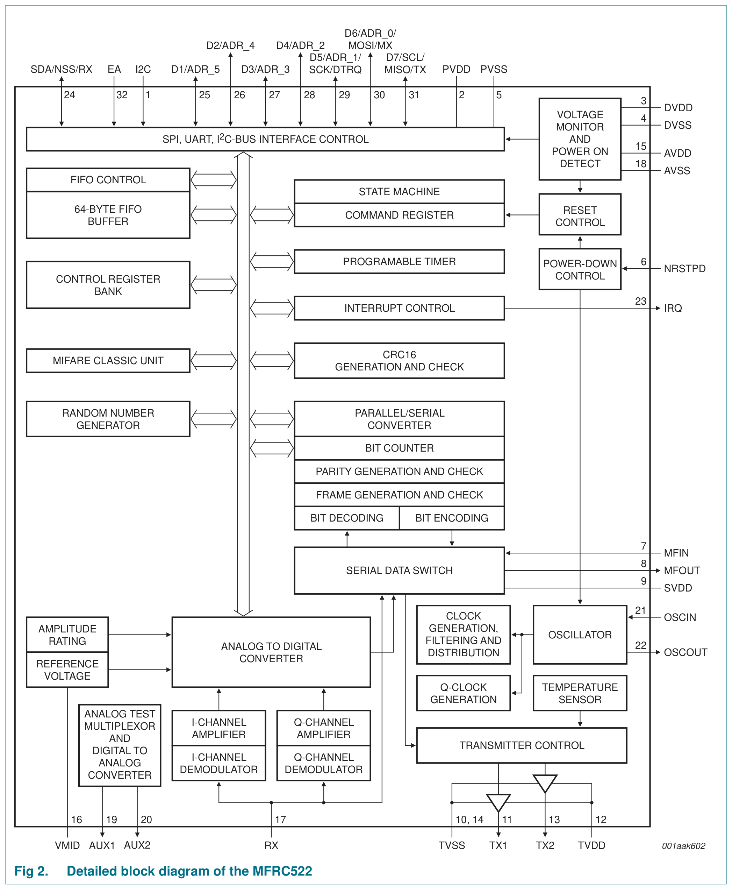

#### Detailed Functional Subsystems Breakdown

1. **Digital Host Interface:**
   - Supports 3 hardware interfaces: SPI (up to 10 Mbit/s), Serial UART (up to 1228.8 kBd), and I2C-bus (Fast mode up to 400 kBd, High-speed mode up to 3.4 Mbit/s).
   - Control register bank and 64-byte FIFO buffer with automatic watermark and status interrupt flags (`WaterLevel`, `HiAlert`, `LoAlert`).

2. **Contactless UART and Protocol Processing:**
   - State machine and Command Register coordinating operations (`Idle`, `Mem`, `CalcCRC`, `Transmit`, `Receive`, `Transceive`, `MFAuthent`, `SoftReset`).
   - Hardware CRC16 coprocessor (preset 6363h or 0000h according to ISO/IEC 14443 A).
   - MIFARE Classic Crypto1 unit handling mutual authentication and encrypted data exchange.
   - Framing, bit decoding, parity generation/checking, bit counter, and collision detection logic.

3. **Analog and RF Transceiver:**
   - Dual push-pull transmitter power drivers (`TX1` pin 10, `TX2` pin 14) directly driving antenna matching network with modulated 13.56 MHz RF carrier.
   - Output stage supply via `TVDD` (pins 11, 13) and ground reference `TVSS` (pin 12).
   - Receiver demodulator channel connected to `RX` (pin 17) with internal reference generator `VMID` (pin 16).
   - Internal amplifier, bandpass filter, and ADC providing in-phase (I) and quadrature (Q) channel decoding.

4. **Auxiliary and Clocking Blocks:**
   - 27.12 MHz crystal oscillator connected to `OSCIN` (pin 21) and `OSCOUT` (pin 22).
   - Configurable 16-bit timer unit with prescaler (`TModeReg`, `TPrescalerReg`, `TReloadReg`, `TCounterValReg`).
   - Digital test bus routing internal signals to external pins `AUX1` and `AUX2` for diagnostic and RF tuning purposes.

| 24 | 32 | 1 | 25 | 26 | 27 | 28 | 29 | 30 | 31 | 2 |
| --- | --- | --- | --- | --- | --- | --- | --- | --- | --- | --- |

| PARALLEL/SERIAL CONVERTER |  |
| --- | --- |
| BIT COUNTER |  |
| PARITY GENERATION AND CHECK |  |
| FRAME GENERATION AND CHECK |  |
| BIT DECODING | BIT ENCODING |

OSCILLATOR

RATING

22

ANALOG TO DIGITAL

OSCOUT

DISTRIBUTION

CONVERTER

REFERENCE

VOLTAGE

Q-CLOCK
GENERATION

TEMPERATURE

SENSOR

ANALOG TEST
MULTIPLEXOR

I-CHANNEL
AMPLIFIER

Q-CHANNEL

AMPLIFIER

AND
DIGITAL TO

TRANSMITTER CONTROL

I-CHANNEL
DEMODULATOR

Q-CHANNEL
DEMODULATOR

ANALOG
CONVERTER

16
19
20
17
10, 14
11
13
12

VMID
AUX1
AUX2
RX
TVSS
TX1
TX2
TVDD

001aak602

Fig 2.
Detailed block diagram of the MFRC522

# 7. Pinning information

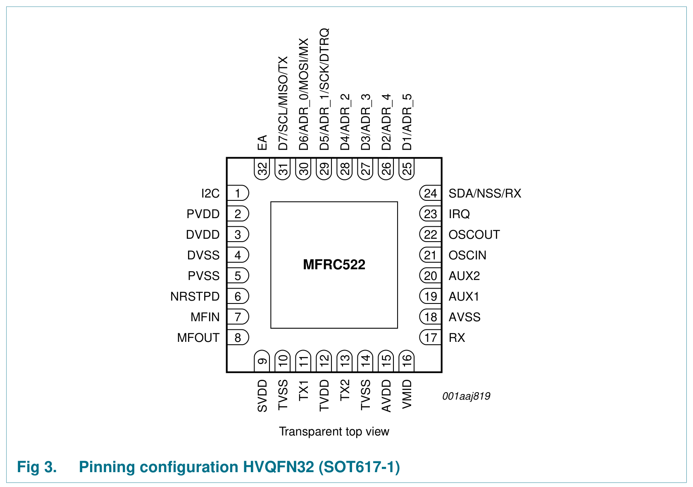

```
                             +-------------------+
                             |  32 31 30 29 ...  |
                             |  EA SCL MOSI SCK  |
              +--------------+                   +--------------+
       I2C  1 | [ ]                                         [ ] | 24  SDA / NSS
      PVDD  2 | [ ]                                         [ ] | 23  IRQ
      DVDD  3 | [ ]                                         [ ] | 22  OSCOUT
      DVSS  4 | [ ]             MFRC522                     [ ] | 21  OSCIN
      PVSS  5 | [ ]             HVQFN32                     [ ] | 20  AUX2
    NRSTPD  6 | [ ]            (SOT617-1)                   [ ] | 19  AUX1
     MFIN   7 | [ ]             Top View                    [ ] | 18  AVSS
    MFOUT   8 | [ ]                                         [ ] | 17  RX
              +--------------+                   +--------------+
                             |  9  10 11 12 ...  |
                             | NRsv TX1 TVDD TVSS|
                             +-------------------+
```

#### Pin Assignment by Function

- **Power Supplies:** `DVDD` (Pin 3, Digital 2.5V-3.3V), `AVDD` (Pin 15, Analog 2.5V-3.3V), `PVDD` (Pin 2, Pad I/O 1.6V-3.3V), `TVDD` (Pins 11/13, Transmitter 2.5V-3.3V).
- **Ground References:** `DVSS` (Pin 4), `AVSS` (Pin 18), `PVSS` (Pin 5), `TVSS` (Pin 12).
- **RF Transmitter & Receiver:** `TX1` (Pin 10), `TX2` (Pin 14), `RX` (Pin 17), `VMID` (Pin 16).
- **Clock & Control:** `OSCIN` (Pin 21), `OSCOUT` (Pin 22), `NRSTPD` (Pin 6, Reset and Power-down, Active LOW).
- **Host Interface Selection:** `I2C` (Pin 1), `EA` (Pin 32).
  - SPI Mode: `I2C = LOW`, `EA = LOW`.
  - UART Mode: `I2C = LOW`, `EA = HIGH`.
  - I2C Mode: `I2C = HIGH`, `EA = Don't Care`.
- **Host Interface Bus Pins:** `SDA/NSS/RX` (Pin 24), `D5/SCK` (Pin 29), `D6/MOSI/TX` (Pin 30), `D7/MISO` (Pin 31), `IRQ` (Pin 23).
- **Diagnostics & Auxiliary:** `MFIN` (Pin 7), `MFOUT` (Pin 8), `AUX1` (Pin 19), `AUX2` (Pin 20).

| Pin | Symbol | Type[1] | Description |
| --- | --- | --- | --- |
| 1 | I2C | I | I2C-bus enable input[2] |
| 2 | PVDD | P | pin power supply |
| 3 | DVDD | P | digital power supply |
| 4 | DVSS | G | digital ground[3] |
| 5 | PVSS | G | pin power supply ground |
| 6 | NRSTPD | I | reset and power-down input: power-down: enabled when LOW; internal current sinks are switched off, the oscillator is inhibited and the input pins are disconnected from the outside world reset: enabled by a positive edge |
| 7 | MFIN | I | MIFARE signal input |
| 8 | MFOUT | O | MIFARE signal output |
| 9 | SVDD | P | MFIN and MFOUT pin power supply |
| 10 | TVSS | G | transmitter output stage 1 ground |
| 11 | TX1 | O | transmitter 1 modulated 13.56 MHz energy carrier output |
| 12 | TVDD | P | transmitter power supply: supplies the output stage of transmitters 1 and 2 |
| 13 | TX2 | O | transmitter 2 modulated 13.56 MHz energy carrier output |
| 14 | TVSS | G | transmitter output stage 2 ground |
| 15 | AVDD | P | analog power supply |

#### Table 3: Pin description …continued

| Pin | Symbol | Type[1] | Description |
| --- | --- | --- | --- |
| 16 | VMID | P | internal reference voltage |
| 17 | RX | I | RF signal input |
| 18 | AVSS | G | analog ground |
| 19 | AUX1 | O | auxiliary outputs for test purposes |
| 20 | AUX2 | O | auxiliary outputs for test purposes |
| 21 | OSCIN | I | crystal oscillator inverting amplifier input; also the input for an externally generated clock (f = 27.12 MHz) clk |
| 22 | OSCOUT | O | crystal oscillator inverting amplifier output |
| 23 | IRQ | O | interrupt request output: indicates an interrupt event |
| 24 | SDA | I/O | I2C-bus serial data line input/output[2] |
|  | NSS | I | SPI signal input[2] |
|  | RX | I | UART address input[2] |
| 25 | D1 | I/O | test port[2] |
|  | ADR 5 _ | I/O | I2C-bus address 5 input[2] |
| 26 | D2 | I/O | test port |
|  | ADR 4 _ | I | I2C-bus address 4 input[2] |
| 27 | D3 | I/O | test port |
|  | ADR 3 _ | I | I2C-bus address 3 input[2] |
| 28 | D4 | I/O | test port |
|  | ADR 2 _ | I | I2C-bus address 2 input[2] |
| 29 | D5 | I/O | test port |
|  | ADR 1 _ | I | I2C-bus address 1 input[2] |
|  | SCK | I | SPI serial clock input[2] |
|  | DTRQ | O | UART request to send output to microcontroller[2] |
| 30 | D6 | I/O | test port |
|  | ADR 0 _ | I | I2C-bus address 0 input[2] |
|  | MOSI | I/O | SPI master out, slave in[2] |
|  | MX | O | UART output to microcontroller[2] |
| 31 | D7 | I/O | test port |
|  | SCL | I/O | I2C-bus clock input/output[2] |
|  | MISO | I/O | SPI master in, slave out[2] |
|  | TX | O | UART data output to microcontroller[2] |
| 32 | EA | I | external address input for coding I2C-bus address[2] |

[1]
Pin types: I = Input, O = Output, I/O = Input/Output, P = Power and G = Ground.

[2]
The pin functionality of these pins is explained in Section 8.1 “Digital interfaces”.

[3]
Connection of heatsink pad on package bottom side is not necessary. Optional connection to pin DVSS is possible.

# 8. Functional description

The MFRC522 transmission module supports the Read/Write mode for 
ISO/IEC 14443 A/MIFARE using various transfer speeds and modulation protocols.

BATTERY

MICROCONTROLLER

contactless card

reader/writer

001aak583

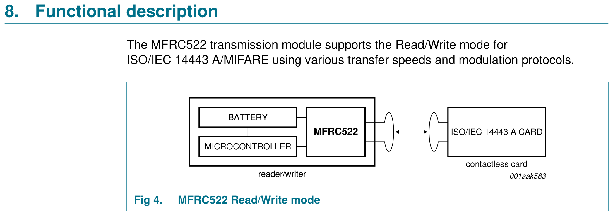

```
                 READER / PCD                                        TRANSPONDER / PICC
   +------------------------------------+                  +----------------------------------+
   |  Host MCU (e.g. ESP32)             |                  |  MIFARE Classic / Ultralight     |
   |     |                              |                  |  NTAG213 / NTAG215 / NTAG216     |
   |     v SPI / I2C / UART             |                  |                                  |
   |  MFRC522 Contactless Reader IC     |                  |                                  |
   |  +------------------------------+  |                  |  +----------------------------+  |
   |  | Contactless UART & Logic     |  |                  |  | RF Front-End & Logic IC    |  |
   |  +------------------------------+  |                  |  | (Modulator, State Machine, |  |
   |     |                        ^     |                  |  |  Crypto Engine, EEPROM)    |  |
   |     v TX1/TX2                | RX  |                  |  +----------------------------+  |
   |  +------------------------------+  |                  |                 ^                |
   |  | EMC Filter & Matching Network|  |                  |                 |                |
   |  +------------------------------+  |                  |                 v                |
   |     |                        |     |                  |  +----------------------------+  |
   |     +-----------+------------+     |                  |  | Resonant Tuning Capacitor  |  |
   |                 |                  |                  |  +----------------------------+  |
   |                 v                  |                  |                 ^                |
   |        +-----------------+         |                  |                 |                |
   |        | Reader Antenna  |         |                  |                 v                |
   |        |  Inductive Coil |         |                  |        +-----------------+       |
   |        +--------+--------+         |                  |        |  Card Antenna   |       |
   |                 |                  |                  |        |  Inductive Coil |       |
   +-----------------|------------------+                  +-----------------+----------------+
                     |                                                       |
                     +================= Magnetic Field ======================+
                                         (13.56 MHz)

#### Communication Link Characteristics

- **Forward Link (Reader/PCD to Card/PICC):**
  - Carrier Frequency: 13.56 MHz.
  - Modulation Scheme: 100% Amplitude Shift Keying (ASK).
  - Bit Encoding: Modified Miller code.
  - Nominal Bit Rate: 106 kBd ($T_0 = 128 / f_c pprox 9.44\ \mu	ext{s}$). Higher speeds (212, 424, 848 kBd) use lower modulation index ASK.
- **Return Link (Card/PICC to Reader/PCD):**
  - Modulation Scheme: Load modulation using a subcarrier.
  - Subcarrier Frequency: $f_s = f_c / 16 pprox 848.48	ext{ kHz}$.
  - Bit Encoding: Manchester code with subcarrier ASK modulation.
  - Nominal Bit Rate: 106 kBd. Higher speeds (212, 424, 848 kBd) use BPSK load modulation.

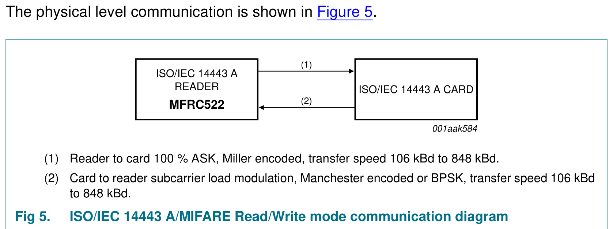

```
     READER / PCD (MFRC522)                                    CARD / PICC
   +------------------------+                               +----------------+
   |                        |        13.56 MHz RF Field      |                |
   | 1. Power Field On      | =============================> | Powers Up      |
   |                        |                                | Enters IDLE    |
   |                        |                                |                |
   | 2. Request (REQA 26h   |           REQA / WUPA          |                |
   |    or WUPA 52h)        | -----------------------------> | Enters READY   |
   |                        |                                |                |
   |                        |           ATQA (2 bytes)       |                |
   | 3. Read ATQA           | <----------------------------- | Transmits ATQA |
   |                        |                                |                |
   | 4. Anticollision Loop  |                                |                |
   |    Cascade Level 1:    |       ANTICOLLISION (93h 20h)  |                |
   |    Select Code 93h     | -----------------------------> | Returns UID CL1|
   |                        |         UID CL1 + BCC (5 bytes)|                |
   |                        | <----------------------------- |                |
   |    Select CL1          |          SELECT (93h 70h)      |                |
   |                        | -----------------------------> | SAK (Select ACK|
   |                        |           SAK (1 byte)         |                |
   |                        | <----------------------------- | Enters ACTIVE  |
   |                        |                                | (or CL2 if UID |
   |                        |                                |  is 7/10 bytes)|
   |                        |                                |                |
   | 5. Three-Pass Mutual   |                                |                |
   |    Authentication      |       MFAuthent (60h or 61h)   |                |
   |    (Key A or Key B)    | -----------------------------> | Card generates |
   |                        |                                | token (RB)     |
   |                        |           Challenge Token      |                |
   |                        | <----------------------------- |                |
   |    Crypto1 response    |       Encrypted Token (Token AB)|               |
   |                        | -----------------------------> | Card verifies  |
   |                        |                                | token, enters  |
   |                        |         Token BA (Encrypted)   | AUTHENTICATED  |
   |    Authenticated       | <----------------------------- |                |
   |                        |                                |                |
   | 6. Memory Operations   |                                |                |
   |    Read / Write / Val  |        Encrypted Command Frame |                |
   |    (Blocks in sector)  | -----------------------------> | Executes Op    |
   |                        |        Encrypted Data / ACK    |                |
   |                        | <----------------------------- | Returns Result |
   |                        |                                |                |
   | 7. Session Close       |          HALT Command (50h)    |                |
   |                        | -----------------------------> | Enters HALT    |
   +------------------------+                               +----------------+
```

#### Protocol Stages & Commands

1. **Request (REQA 26h / WUPA 52h):** 7-bit short frame polling for cards in field.
2. **Answer to Request (ATQA):** 16-bit response indicating anti-collision bit frame architecture and UID size.
3. **Anti-collision / Select:** Cascaded UID resolution (CL1 = 93h, CL2 = 95h, CL3 = 97h). Returns 4-byte UID + BCC checksum. Select command commits card to ACTIVE state.
4. **Three-Pass Authentication (MFAuthent):** Hardware Crypto1 authentication with sector Key A or Key B.
5. **Data Transfer:** Authenticated read (`30h`), write (`A0h`), increment (`C1h`), decrement (`C0h`), restore (`C2h`), transfer (`B0h`).
6. **Halt (`50h`):** Transitions card from ACTIVE/AUTHENTICATED to HALT state to allow discovery of remaining cards.

| Communication direction | Signal type | Transfer speed |  |  |  |
| --- | --- | --- | --- | --- | --- |
|  |  | 106 kBd | 212 kBd | 424 kBd | 848 kBd |
| Reader to card (send data from the MFRC522 to a card) | reader side modulation | 100 % ASK | 100 % ASK | 100 % ASK | 100 % ASK |
|  | bit encoding | modified Miller encoding | modified Miller encoding | modified Miller encoding | modified Miller encoding |
|  | bit length | 128 (13.56 µs) | 64 (13.56 µs) | 32 (13.56 µs) | 16 (13.56 µs) |
| Card to reader (MFRC522 receives data from a card) | card side modulation | subcarrier load modulation | subcarrier load modulation | subcarrier load modulation | subcarrier load modulation |
|  | subcarrier frequency | 13.56 MHz / 16 | 13.56 MHz / 16 | 13.56 MHz / 16 | 13.56 MHz / 16 |
|  | bit encoding | Manchester encoding | BPSK | BPSK | BPSK |

ISO/IEC 14443 A framing at 106 kBd

start

| 8-bit data |  | 8-bit data |  | 8-bit data |  |
| --- | --- | --- | --- | --- | --- |

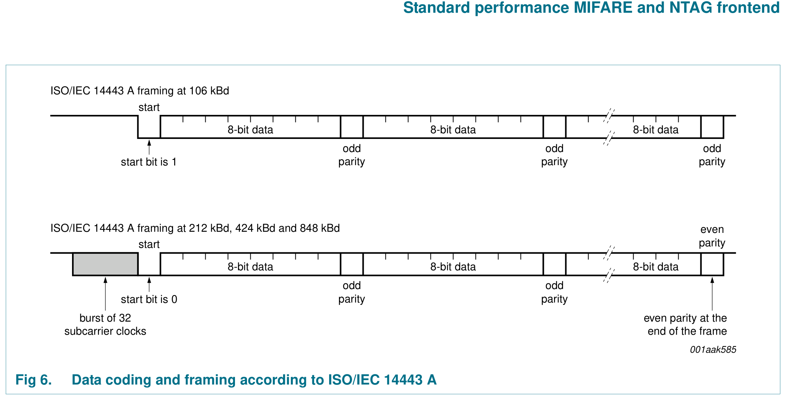

```
A. PCD -> PICC (Modified Miller Code, 100% ASK, 106 kBd):
   Bit Period T0 = 128 / 13.56 MHz = 9.44 us. Pause width tp = 2.0 to 3.0 us.

   Bit '1' (Sequence X):
   +-----------+     +-----+
   |           |     |     |
   |           +-----+     |   Pause occurs after 0.5 * T0 (at 4.72 us).
   |<-- 0.5 T0 ->| tp|     |
   |<--------- T0 -------->|

   Bit '0' preceded by '0' (Sequence Y):
   +--+        +-----------+
   |  |        |           |
   +--+        |           |   Pause occurs at the START of the bit period (0 to 0.25 * T0).
   |tp|<-- 0.5 T0 ->|      |
   |<--------- T0 -------->|

   Bit '0' preceded by '1' (Sequence Z):
   +-----------------------+
   |                       |
   |                       |   NO PAUSE occurs throughout the bit period.
   |                       |
   |<--------- T0 -------->|

   Start of Communication: Starts with a pause (Sequence Y or X depending on preamble).

B. PICC -> PCD (Manchester Code on Subcarrier, 106 kBd):
   Subcarrier fs = 848.48 kHz (16 carrier cycles). Bit period T0 = 9.44 us = 8 subcarrier cycles.

   Bit '1':
   |~|~|~|~|               |   Subcarrier burst during FIRST half (0 to 0.5 T0);
   |_|_|_|_|_______________|   Unmodulated during SECOND half (0.5 T0 to T0).
   |<-- 0.5 T0 ->|<-- 0.5 T0 ->|

   Bit '0':
   |               |~|~|~|~|   Unmodulated during FIRST half (0 to 0.5 T0);
   |_______________|_|_|_|_|   Subcarrier burst during SECOND half (0.5 T0 to T0).
   |<-- 0.5 T0 ->|<-- 0.5 T0 ->|
```

#### Modulation & Encoding Summary

- **PCD Transmission (106 kBd):** 100% ASK with modified Miller code guarantees continuous RF power delivery to passive transponders, because a pause never lasts more than 3 $\mu$s, preventing card power depletion.
- **PICC Transmission (106 kBd):** Manchester encoding on an 848 kHz subcarrier guarantees at least one state transition per bit period, facilitating precise bit synchronization in the receiver demodulator.

| 8-bit data |  | 8-bit data |  | 8-bit data |  |
| --- | --- | --- | --- | --- | --- |

#### Table 5: Connection protocol for detecting different interface types

| Pin | Interface type |  |  |
| --- | --- | --- | --- |
|  | UART (input) | SPI (output) | I2C-bus (I/O) |
| SDA | RX | NSS | SDA |
| I2C | 0 | 0 | 1 |
| EA | 0 | 1 | EA |
| D7 | TX | MISO | SCL |
| D6 | MX | MOSI | ADR 0 _ |
| D5 | DTRQ | SCK | ADR 1 _ |
| D4 | - | - | ADR 2 _ |
| D3 | - | - | ADR 3 _ |
| D2 | - | - | ADR 4 _ |
| D1 | - | - | ADR 5 _ |

### 8.1.2 Serial Peripheral Interface

A serial peripheral interface (SPI compatible) is supported to enable high-speed 
communication to the host. The interface can handle data speeds up to 10 Mbit/s. When 
communicating with a host, the MFRC522 acts as a slave, receiving data from the 
external host for register settings, sending and receiving data relevant for RF interface 
communication.

An interface compatible with SPI enables high-speed serial communication between the 
MFRC522 and a microcontroller. The implemented interface is in accordance with the SPI 
standard.

The timing specification is given in Section 14.1 on page 78.

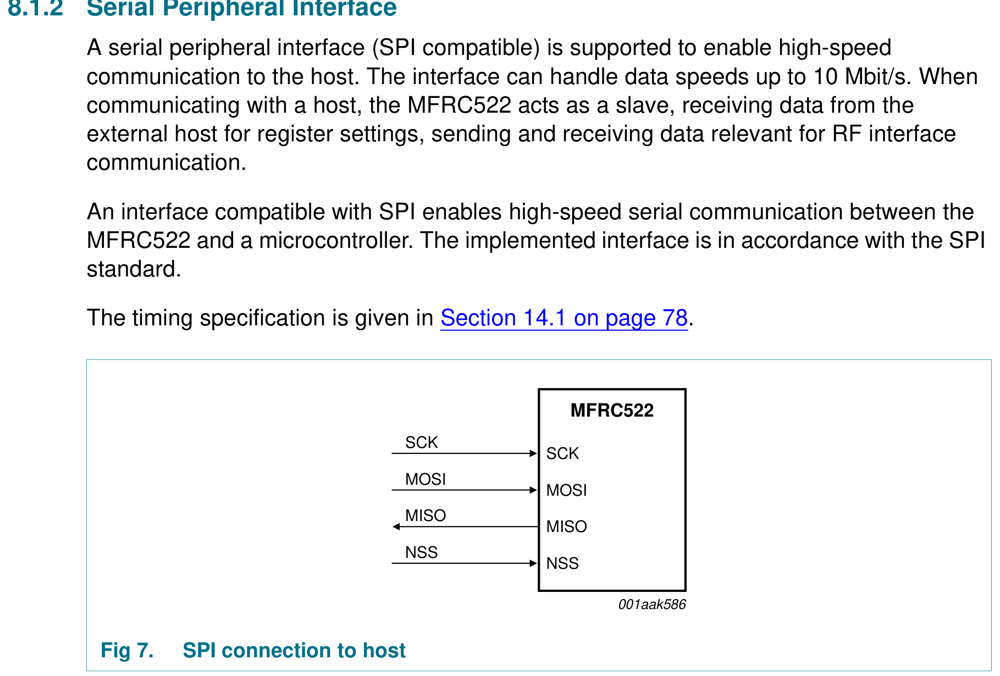

```
   HOST MICROCONTROLLER (e.g. ESP32)                   MFRC522
  +----------------------------------+          +--------------------+
  |                           SCK    | -------> | D5/SCK   (Pin 29)  |
  |                          MOSI    | -------> | D6/MOSI  (Pin 30)  |
  |                          MISO    | <------- | D7/MISO  (Pin 31)  |
  |                           NSS    | -------> | SDA/NSS  (Pin 24)  |
  |                     GPIO_NRST    | -------> | NRSTPD   (Pin 6)   |
  |                      GPIO_IRQ    | <------- | IRQ      (Pin 23)  |
  |                                  |          |                    |
  |                                  |          | I2C (Pin 1)  -> GND|  (Selects SPI)
  |                                  |          | EA  (Pin 32) -> GND|  (Selects SPI)
  +----------------------------------+          +--------------------+
```

#### SPI Connection Notes

- **Pin Configuration:** Pins `I2C` (1) and `EA` (32) must both be hardwired to `GND` (`VSS`) to configure the MFRC522 into SPI mode.
- **SPI Mode:** Operates strictly in SPI Mode 0 (CPOL = 0, CPHA = 0). Clock is LOW when inactive; data is sampled on the rising edge of SCK and shifted out on the falling edge.
- **Data Order:** MSB first on both MOSI and MISO lines. Max clock frequency is 10 MHz.
- **Chip Select (NSS):** Active LOW. Must remain LOW for the entire byte stream transaction.

#### 8.1.2.1 SPI read data

Reading data using SPI requires the byte order shown in Table 6 to be used. It is possible 
to read out up to n-data bytes.

The first byte sent defines both the mode and the address.

#### Table 6: MOSI and MISO byte order

| Line | Byte 0 | Byte 1 | Byte 2 | To | Byte n | Byte n + 1 |
| --- | --- | --- | --- | --- | --- | --- |
| MOSI | address 0 | address 1 | address 2 | ... | address n | 00 |
| MISO | X[1] | data 0 | data 1 | ... | data n - 1 | data n |

[1]
X = Do not care.

Remark: The MSB must be sent first.

#### 8.1.2.2 SPI write data

To write data to the MFRC522 using SPI requires the byte order shown in Table 7. It is 
possible to write up to n data bytes by only sending one address byte.

The first send byte defines both the mode and the address byte.

#### Table 7: MOSI and MISO byte order

| Line | Byte 0 | Byte 1 | Byte 2 | To | Byte n | Byte n + 1 |
| --- | --- | --- | --- | --- | --- | --- |
| MOSI | address 0 | data 0 | data 1 | ... | data n - 1 | data n |
| MISO | X[1] | X[1] | X[1] | ... | X[1] | X[1] |

[1]
X = Do not care.

Remark: The MSB must be sent first.

#### 8.1.2.3 SPI address byte

The address byte must meet the following format.

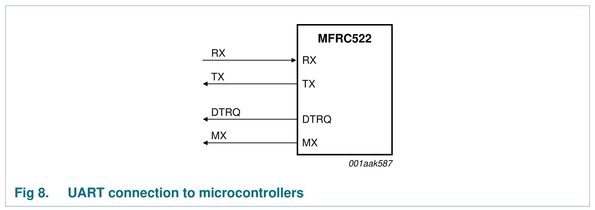

```
   HOST MICROCONTROLLER                                MFRC522
  +----------------------------------+          +--------------------+
  |                           TXD    | -------> | RX       (Pin 24)  |
  |                           RXD    | <------- | TX       (Pin 31)  |
  |                     GPIO_NRST    | -------> | NRSTPD   (Pin 6)   |
  |                      GPIO_IRQ    | <------- | IRQ      (Pin 23)  |
  |                                  |          |                    |
  |                                  |          | I2C (Pin 1)  -> GND|  (Selects UART)
  |                                  |          | EA  (Pin 32) -> VDD|  (Selects UART)
  +----------------------------------+          +--------------------+
```

#### UART Connection Notes

- **Hardware Strapping:** `I2C` (Pin 1) must be connected to `GND`, and `EA` (Pin 32) connected to `VDD` (`PVDD`) to force the internal interface multiplexer into Serial UART mode.
- **Pins:** Pin 24 (`SDA/NSS/RX`) acts as serial input (RX); Pin 31 (`D7/MISO/TX`) acts as serial output (TX).
- **Default Speed:** Resets to 9600 Baud. Configurable from 9.6 kBd up to 1228.8 kBd via `SerialSpeedReg` (1Fh).

| 7 (MSB) | 6 | 5 | 4 | 3 | 2 | 1 | 0 (LSB) |
| --- | --- | --- | --- | --- | --- | --- | --- |
| 1 = read 0 = write | address |  |  |  |  |  | 0 |

TX
TX

DTRQ
DTRQ

MX
MX

001aak587

Fig 8.
UART connection to microcontrollers

Remark:  Signals DTRQ and MX can be disabled by clearing TestPinEnReg register’s 
RS232LineEn bit.

#### 8.1.3.2 Selectable UART transfer speeds

The internal UART interface is compatible with an RS232 serial interface.

The default transfer speed is 9.6 kBd. To change the transfer speed, the host controller 
must write a value for the new transfer speed to the SerialSpeedReg register. Bits 
BR_T0[2:0] and BR_T1[4:0] define the factors for setting the transfer speed in the 
SerialSpeedReg register.

The BR_T0[2:0] and BR_T1[4:0] settings are described in Table 9. Examples of different 
transfer speeds and the relevant register settings are given in Table 10.

#### Table 9: BR_T0 and BR_T1 settings

| BR Tn _ | Bit 0 | Bit 1 | Bit 2 | Bit 3 | Bit 4 | Bit 5 | Bit 6 | Bit 7 |
| --- | --- | --- | --- | --- | --- | --- | --- | --- |
| BR T0 factor _ | 1 | 1 | 2 | 4 | 8 | 16 | 32 | 64 |
| BR T1 range _ | 1 to 32 | 33 to 64 | 33 to 64 | 33 to 64 | 33 to 64 | 33 to 64 | 33 to 64 | 33 to 64 |

#### Table 10: Selectable UART transfer speeds

| Transfer speed (kBd) | SerialSpeedReg value |  | Transfer speed accuracy (%)[1] |
| --- | --- | --- | --- |
|  | Decimal | Hexadecimal |  |
| 7.2 | 250 | FAh | -0.25 |
| 9.6 | 235 | EBh | 0.32 |
| 14.4 | 218 | DAh | -0.25 |
| 19.2 | 203 | CBh | 0.32 |
| 38.4 | 171 | ABh | 0.32 |
| 57.6 | 154 | 9Ah | -0.25 |
| 115.2 | 122 | 7Ah | -0.25 |
| 128 | 116 | 74h | -0.06 |
| 230.4 | 90 | 5Ah | -0.25 |
| 460.8 | 58 | 3Ah | -0.25 |
| 921.6 | 28 | 1Ch | 1.45 |
| 1228.8 | 21 | 15h | 0.32 |

[1]
The resulting transfer speed error is less than 1.5 % for all described transfer speeds.

The selectable transfer speeds shown in Table 10 are calculated according to the 
following equations:

If BR_T0[2:0] = 0:

transfer speed
27.12
106
 × 
BR_T0
1
+
(
)
-------------------------------
=

(1)

If BR_T0[2:0] > 0:

transfer speed
27.12
106
 × 
BR_T1
33
+
(
)

2 BR_T0
1
–
(
)
----------------------------------
----------------------------------

(2)

=

Remark: Transfer speeds above 1228.8 kBd are not supported.

#### 8.1.3.3 UART framing

#### Table 11: UART framing

| Bit | Length | Value |
| --- | --- | --- |
| Start | 1-bit | 0 |
| Data | 8 bits | data |
| Stop | 1-bit | 1 |

Remark: The LSB for data and address bytes must be sent first. No parity bit is used 
during transmission.

Read data: To read data using the UART interface, the flow shown in Table 12 must be 
used. The first byte sent defines both the mode and the address.

#### Table 12: Read data byte order

| Pin | Byte 0 | Byte 1 |
| --- | --- | --- |
| RX (pin 24) | address | - |
| TX (pin 31) | - | data 0 |

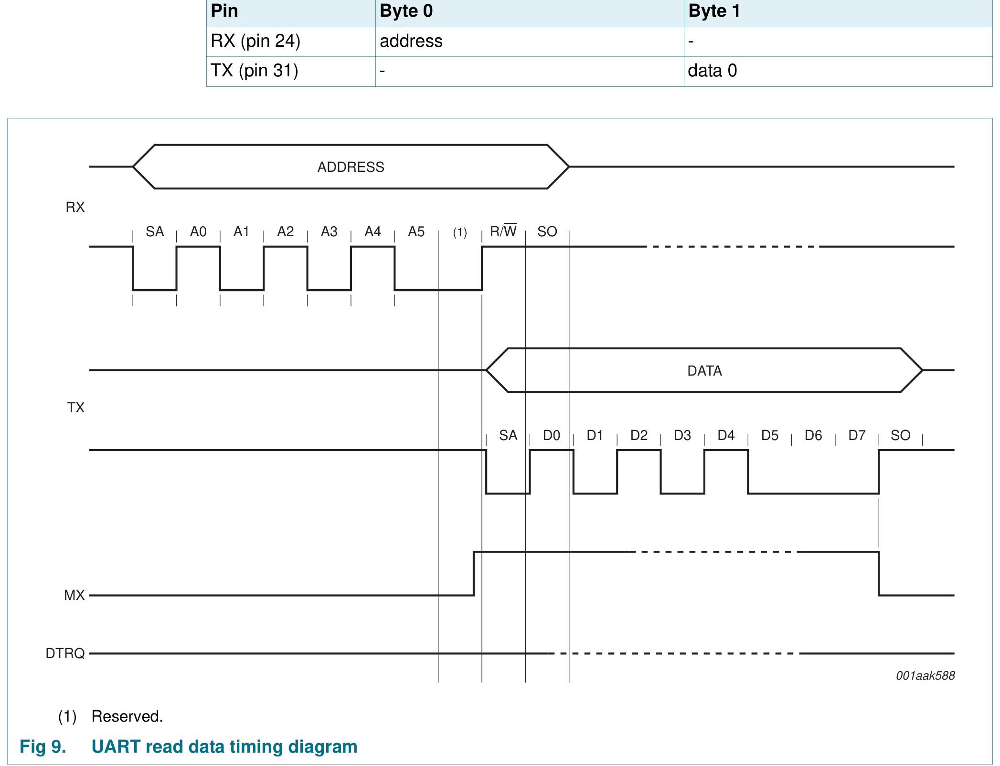

```
Pin RX (Host -> MFRC522 Address Byte):
     +---+     +---+     +---+     +---+     +---+     +---+     +---+     +---+
 ... | 1 |  0  | 1 |DTRQ | A0| A1| A2| A3| A4| A5|  1  | 1 | ...
     +---+-----+---+-----+---+---+---+---+---+---+-----+---+
       IDLE  START   MX     DTRQ     Address [A5:A0]    STOP  IDLE
            (Bit 0)(Bit 1) (Bit 2)    (Bits 3 to 8)    (Bit 9)
             LOW   HIGH=Rd

Pin TX (MFRC522 -> Host Data Byte Response):
               |<-- trecv -->|
                             +---+---+---+---+---+---+---+---+---+---+
 ... ------------------------| 0 | D0| D1| D2| D3| D4| D5| D6| D7| 1 | ...
                             +---+---+---+---+---+---+---+---+---+---+
                              START       Data Bits [D0:D7]       STOP
                              (Bit 0)         (Bits 1 to 8)      (Bit 9)
                               LOW               LSB first        HIGH
```

#### UART Read Frame Parameters

1. **Byte 0 (Address on RX pin):**
   - Start bit: logic 0.
   - Mode bit (MX): logic 1 indicates a READ operation.
   - DTRQ bit: Data Terminal Ready Request bit.
   - Register address bits A0 to A5: specifies target register (00h to 3Fh).
   - Stop bit: logic 1.
2. **Response Latency ($t_{	ext{recv}}$):** Gap between reception of stop bit on RX and start bit transmission on TX.
3. **Byte 1 (Data on TX pin):**
   - Start bit: logic 0.
   - Data bits D0 to D7: register contents, LSB first.
   - Stop bit: logic 1.

|  | SA |  |
| --- | --- | --- |
|  |  | D0 |

Write data: To write data to the MFRC522 using the UART interface, the structure shown 
in Table 13 must be used.

The first byte sent defines both the mode and the address.

#### Table 13: Write data byte order

| Pin | Byte 0 | Byte 1 |
| --- | --- | --- |
| RX (pin 24) | address 0 | data 0 |
| TX (pin 31) | - | address 0 |

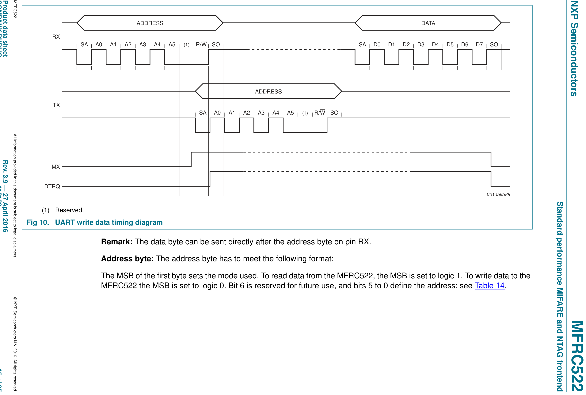

```
Pin RX (Host -> MFRC522 Write Frame):
     +---+                                             +---+     +---+
 ... | 1 |  0  | 0 |DTRQ | A0| A1| A2| A3| A4| A5|  1  | 0 | D0| D1| D2| D3| D4| D5| D6| D7|  1  | ...
     +---+-----+---+-----+---+---+---+---+---+---+-----+---+-----+---+---+---+---+---+---+---+-----+
       IDLE  START   MX     DTRQ     Address [A5:A0]    STOP  START            Data 0             STOP
            (Bit 0)(Bit 1) (Bit 2)    (Bits 3 to 8)    (Bit 9) (Bit 0)        (Bits 1 to 8)       (Bit 9)
             LOW   LOW=Wr                              HIGH    LOW             LSB first          HIGH
            |<---------- Byte 0 (Address) ----------->|       |<----------- Byte 1 (Data) ------------>|
```

#### UART Write Frame Parameters

1. **Address Byte (Byte 0 on RX pin):**
   - Start bit: logic 0.
   - Mode bit (MX): logic 0 indicates a WRITE operation.
   - DTRQ bit: Data Terminal Ready Request.
   - Register address bits A0 to A5: specifies destination register (00h to 3Fh).
   - Stop bit: logic 1.
2. **Data Byte (Byte 1 on RX pin):** Transmitted immediately following the address byte stop bit.
   - Start bit: logic 0.
   - Data bits D0 to D7: byte to write into the targeted register, LSB first.
   - Stop bit: logic 1.
3. **Streaming Data Bytes:** Consecutive data bytes can be streamed continuously to sequential addresses or into the FIFO data register (`FIFODataReg`) without sending intermediate address bytes.

|  | SA |  |
| --- | --- | --- |
|  |  | A0 |

xxxxxxxxxxxxxxxxxxxxx xxxxxxxxxxxxxxxxxxxxxxxxxx xxxxxxx x x x xxxxxxxxxxxxxxxxxxxxxxxxxxxxxx xxxxxxxxxxxxxxxxxxx xx xx xxxxx

xxxxxxxxxxxxxxxxxxxxx xxxxxxxxxxxxxxxxxxxxxxxxxxxxxx xxxxx xxxxxxxxxxxxxxxxxxxxxxxxxxxxxxxxxxxxxxxxxxxxxxxxxx xxxxxxxx

xxxxxxxxxxxxxxxxxxxxxxxxxxx xxxxxxxxxxxxxxxxxxx xxxxxx xxxxxxxxxxxxxxxxxxxxxxxxxxxxxxxxxxx xxxxxxxxxxxx x x

xxxxxxxxxxxxxxxxxxxxxxxxx xxxxxxxxxxxxxxxxxxxx xxx

#### Table 14: Address byte 0 register; address MOSI

| 7 (MSB) | 6 | 5 | 4 | 3 | 2 | 1 | 0 (LSB) |
| --- | --- | --- | --- | --- | --- | --- | --- |
| 1 = read 0 = write | reserved | address |  |  |  |  |  |

### 8.1.4 I2C-bus interface

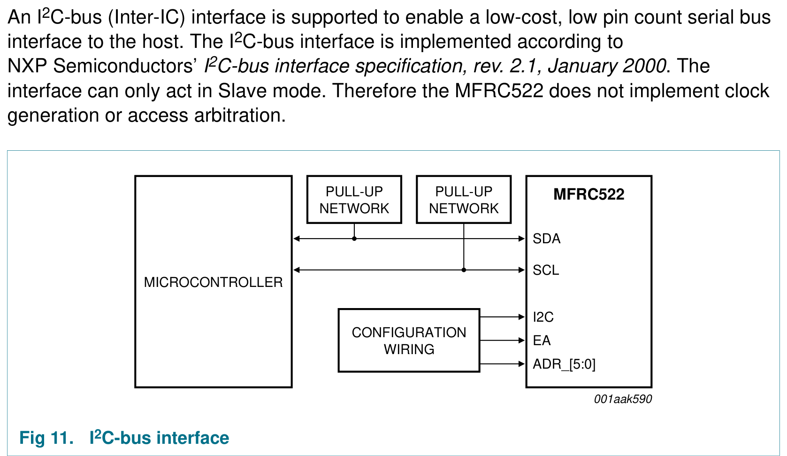

```
   HOST MICROCONTROLLER (I2C Master)                   MFRC522 (I2C Slave)
  +----------------------------------+          +--------------------+
  |                           SDA    | <------> | SDA/NSS  (Pin 24)  |
  |                           SCL    | -------> | D5/SCK   (Pin 29)  |
  |                     GPIO_NRST    | -------> | NRSTPD   (Pin 6)   |
  |                      GPIO_IRQ    | <------- | IRQ      (Pin 23)  |
  |                                  |          |                    |
  |               +3.3V              |          | I2C (Pin 1)  -> VDD|  (Selects I2C)
  |                 |                |          | EA  (Pin 32) -> VDD|  (Selects I2C)
  |               [4k7] [4k7]        |          +--------------------+
  |                 |     |          |
  |      SDA -------+     |          |
  |      SCL -------------+          |
  +----------------------------------+
```

#### I2C-Bus Interface Characteristics

- **Hardware Strapping:** Pin `I2C` (Pin 1) connected to `VDD` (`PVDD`) enables I2C mode. Pin `EA` (Pin 32) should also be tied HIGH or LOW.
- **I2C Slave Address:** 7-bit base address is `0101000b` (`28h` / `0x28`). Write address is `50h`, Read address is `51h`.
- **Operating Speeds:**
  - Standard Mode: up to 100 kbit/s.
  - Fast Mode: up to 400 kbit/s.
  - High-Speed Mode (HS): up to 3.4 Mbit/s.
- **Pull-ups:** External 2.2 k$\Omega$ to 4.7 k$\Omega$ pull-up resistors required on both SDA and SCL lines.

The MFRC522 can act either as a slave receiver or slave transmitter in Standard mode, 
Fast mode and High-speed mode.

SDA is a bidirectional line connected to a positive supply voltage using a current source or 
a pull-up resistor. Both SDA and SCL lines are set HIGH when data is not transmitted. The 
MFRC522 has a 3-state output stage to perform the wired-AND function. Data on the 
I2C-bus can be transferred at data rates of up to 100 kBd in Standard mode, up to 
400 kBd in Fast mode or up to 3.4 Mbit/s in High-speed mode.

If the I2C-bus interface is selected, spike suppression is activated on lines SCL and SDA 
as defined in the I2C-bus interface specification.

See Table 155 on page 79 for timing requirements.

#### 8.1.4.1 Data validity

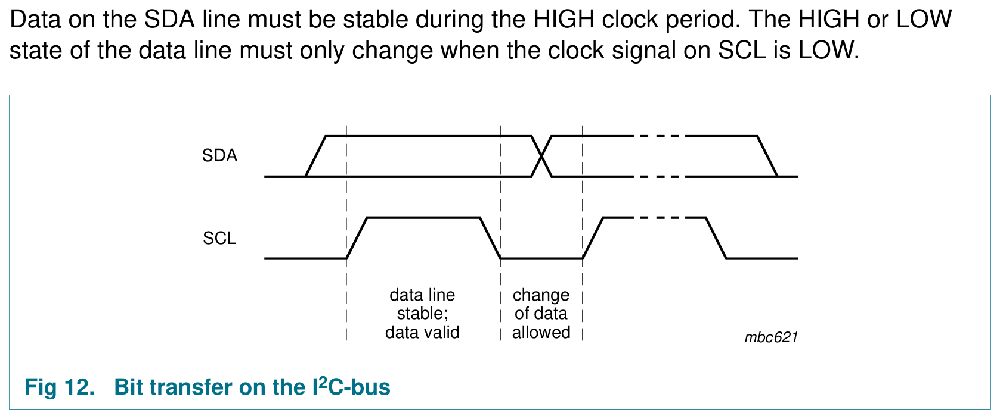

```
               |<- Data Stable ->|                     |<- Data Stable ->|
SDA:  ---------+                 +---------------------+                 +-------
               |   Valid Data    |  Data Change Window |   Valid Data    |
      ---------+                 +---------------------+                 +-------
                       +-----------------+                     +-----------------+
SCL:  -----------------+                 +---------------------+                 +
                       |    SCL HIGH     |      SCL LOW        |    SCL HIGH     |
      -----------------+                 +---------------------+                 +
```

#### I2C Bit Transfer Validity Rules

1. **Data Line Stability:** The data line (`SDA`) MUST remain stable (no transitions) whenever the clock line (`SCL`) is HIGH. The HIGH or LOW state of the data line during SCL HIGH represents the valid transmitted data bit.
2. **Data Change Window:** Changes in the state of the data line (`SDA`) are ONLY permitted when the clock line (`SCL`) is LOW. Any state change on SDA while SCL is HIGH will be interpreted by hardware as a START or STOP condition.

#### 8.1.4.2 START and STOP conditions

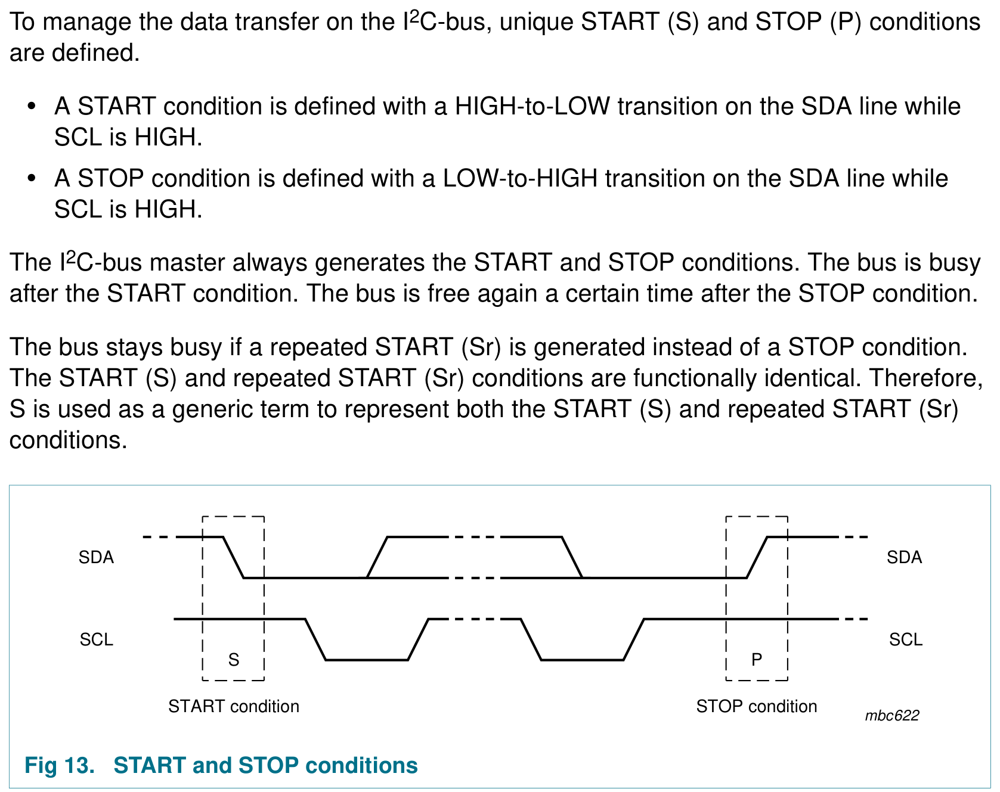

```
                  START Condition (S)                    STOP Condition (P)
               +---------+                            +------------------
SDA:  ---------+         \                            |         +--------
                          \                           |        /
                           +--------------------------+-------+
               +--------------------------------------+       +----------
SCL:  ---------+                                      +-------+
               |               SCL HIGH               |       | SCL HIGH
      ---------+                                      +-------+
```

#### START and STOP Condition Definitions

1. **START Condition (S):** A HIGH-to-LOW transition on the `SDA` line while `SCL` is HIGH defines a START condition.
   - Indicates that the bus is now busy. Generated by the I2C master.
2. **STOP Condition (P):** A LOW-to-HIGH transition on the `SDA` line while `SCL` is HIGH defines a STOP condition.
   - Releases the bus to IDLE state.
3. **Repeated START Condition (Sr):** A START condition generated after another byte without a prior STOP condition. Keeps the bus in active master ownership without releasing it.

#### 8.1.4.3 Byte format

Each byte must be followed by an acknowledge bit. Data is transferred with the MSB first; 
see Figure 16. The number of transmitted bytes during one data transfer is unrestricted 
but must meet the read/write cycle format.

#### 8.1.4.4 Acknowledge

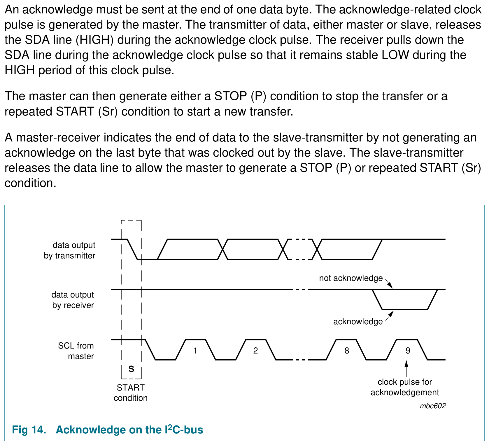

```
                 Clock Pulse 1 to 8 (Data Bits)         Clock Pulse 9 (Acknowledge)
               +--------------------------------+     +-------------------------+
SCL:  ---------+ 1 | 2 | 3 | 4 | 5 | 6 | 7 | 8  +-----+            9            +
               +--------------------------------+     +-------------------------+
                                                      |<-- ACK Sampling Window ->|

SDA:  ---------+---------+---------+-----+------+-----+
Transmitter    |   MSB   |  Bit 6  | ... | LSB  | (Transmitter releases SDA to HIGH)
(Master/Slave) +---------+---------+-----+------+--                                                    \ +-------------------------+
SDA Receiver:  --------------------------------------+                          +
(Slave/Master)                                       |    PULLS SDA LOW (ACK)   |
                                                     +--------------------------+
```

#### Acknowledge (ACK / NACK) Rules

1. **Acknowledge Clock Pulse:** The master generates the 9th clock pulse on SCL.
2. **Transmitter Action:** The transmitting device releases the SDA line during the 9th clock pulse (allowing it to float HIGH via the pull-up resistor).
3. **Receiver Action:**
   - **ACK (Acknowledge):** The receiving device pulls the SDA line LOW, holding it stable LOW during the entire HIGH period of the 9th SCL clock pulse.
   - **NACK (Not Acknowledge):** If the receiver leaves SDA HIGH during the 9th clock pulse, a Not Acknowledge condition is detected, causing the master to generate either a STOP condition or repeated START.

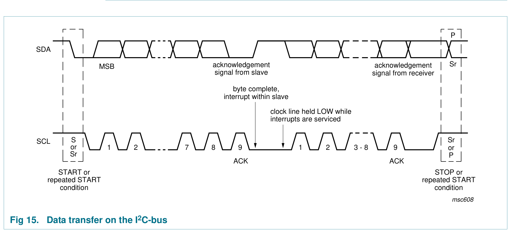

```
+---+ +---------------------------------+ +---+ +---------------------------------+ +---+ +---+
| S | | Byte 1 (Address / Register)     | | A | | Byte 2 (Data / Parameter)       | | A | | P |
+---+ +---------------------------------+ +---+ +---------------------------------+ +---+ +---+
  |   | 1 | 2 | 3 | 4 | 5 | 6 | 7 | 8   |   9   | 1 | 2 | 3 | 4 | 5 | 6 | 7 | 8   |   9     |
START | MSB                         LSB |  ACK  | MSB                         LSB |  ACK  STOP
```

#### Frame Sequencing on I2C Bus

1. **START Procedure:** Master initiates transfer with START (S) or repeated START (Sr).
2. **Byte Length:** Each transmitted byte consists of exactly 8 bits, transmitted Most Significant Bit (MSB) first.
3. **Acknowledge Handshake:** Every byte transmitted must be acknowledged with an ACK bit on clock pulse 9.
4. **Data Stream Length:** An unrestricted number of data bytes may be transmitted in a single session between START and STOP conditions.
5. **Bus Termination:** Transaction terminates with a STOP condition (P) or switches context via repeated START (Sr).

#### 8.1.4.5 7-Bit addressing

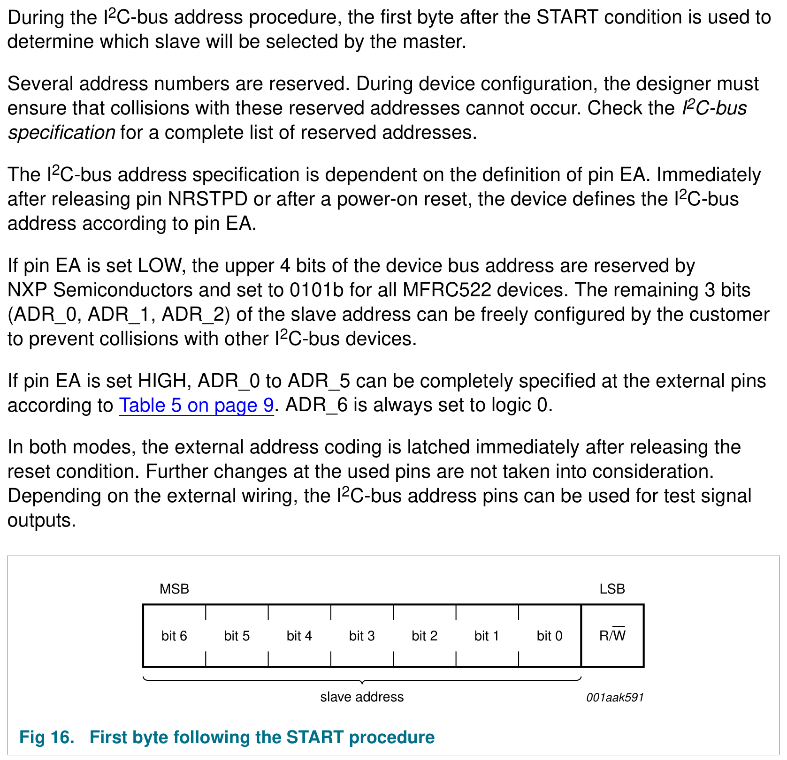

```
  Bit 7      Bit 6      Bit 5      Bit 4      Bit 3      Bit 2      Bit 1      Bit 0
+----------+----------+----------+----------+----------+----------+----------+----------+
|    0     |    1     |    0     |    1     |    0     |    0     |    0     |   R/W    |
+----------+----------+----------+----------+----------+----------+----------+----------+
|<----------------- 7-Bit Slave Address (28h) -------------------------->| 0=Wr,1=Rd
```

#### MFRC522 Slave Address Structure

- **Bits [7:1] — Slave Address:** Hardcoded to `0101000b` (`28h`).
- **Bit [0] — Direction Bit (R/W):**
  - Logic 0 (`W`): Master writes data to MFRC522. Address byte sent is `50h`.
  - Logic 1 (`R`): Master reads data from MFRC522. Address byte sent is `51h`.
- **Acknowledge:** The MFRC522 monitors the address bits and pulls SDA LOW (ACK) during the 9th clock pulse if the address matches `0101000b`.

| bit 6 bit 5 bit 4 bit 3 bit 2 bit 1 bit 0 | R/W |
| --- | --- |

#### 8.1.4.6 Register write access

To write data from the host controller using the I2C-bus to a specific register in the 
MFRC522 the following frame format must be used.

• The first byte of a frame indicates the device address according to the I2C-bus rules. 
• The second byte indicates the register address followed by up to n-data bytes.

In one frame all data bytes are written to the same register address. This enables fast 
FIFO buffer access. The Read/Write (R/W) bit is set to logic 0.

#### 8.1.4.7 Register read access

To read out data from a specific register address in the MFRC522, the host controller must 
use the following procedure:

• Firstly, a write access to the specific register address must be performed as indicated 
in the frame that follows
• The first byte of a frame indicates the device address according to the I2C-bus rules
• The second byte indicates the register address. No data bytes are added
• The Read/Write bit is 0

After the write access, read access can start. The host sends the device address of the 
MFRC522. In response, the MFRC522 sends the content of the read access register. In 
one frame all data bytes can be read from the same register address. This enables fast 
FIFO buffer access or register polling.

The Read/Write (R/W) bit is set to logic 1.

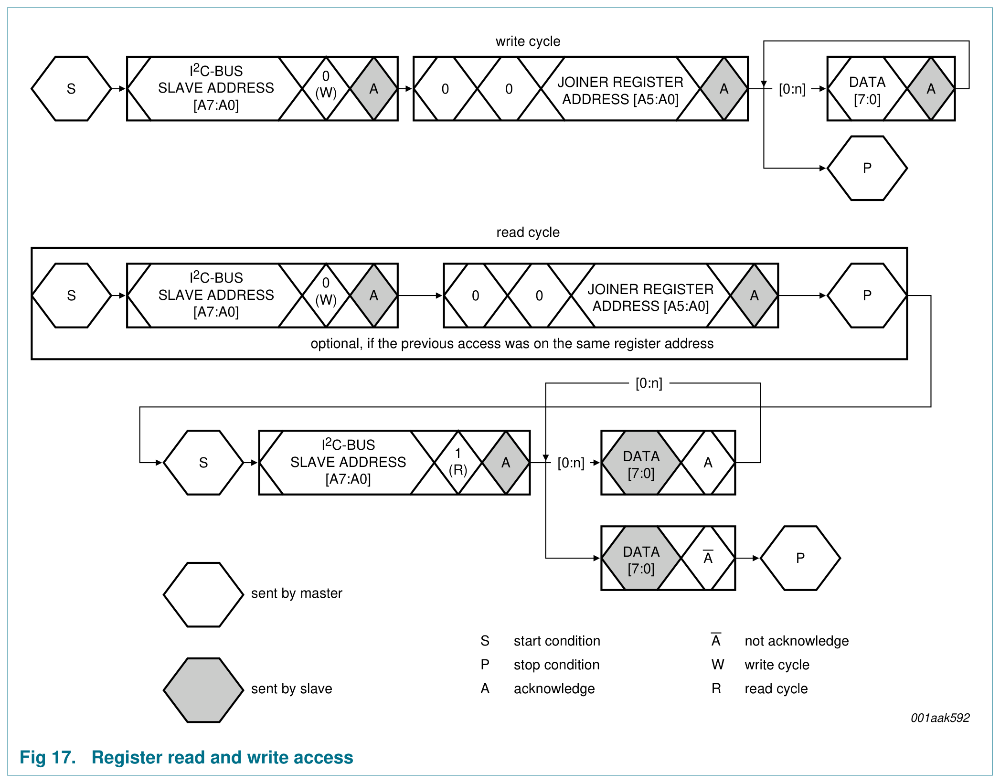

```
1. I2C Register WRITE Access Sequence:
+---+ +--------------------+ +---+ +--------------------+ +---+ +--------------------+ +---+ +---+
| S | | Slave Addr + W(0)  | | A | | Reg Address [A5:A0]| | A | | Data Byte 0       | | A | | P |
+---+ +--------------------+ +---+ +--------------------+ +---+ +--------------------+ +---+ +---+
      | 0 1 0 1 0 0 0 | 0  |       | 0 0 A5 A4 A3 A2 A1A0 |       | D7 D6 D5 D4 D3...  |
      |<-- from Master --->| |<-M| |<--- from Master --->| |<-M| |<--- from Master --->| |<-M| | M |
                             FRC                             FRC                             FRC

2. I2C Register READ Access Sequence:
+---+ +--------------------+ +---+ +--------------------+ +---+
| S | | Slave Addr + W(0)  | | A | | Reg Address [A5:A0]| | A |
+---+ +--------------------+ +---+ +--------------------+ +---+
      |<-- from Master --->| |<-M| |<--- from Master --->| |<-M|
                             FRC                             FRC
+----+ +--------------------+ +---+ +--------------------+ +----+ +---+
| Sr | | Slave Addr + R(1)  | | A | | Data Byte 0 Read   | | NA | | P |
+----+ +--------------------+ +---+ +--------------------+ +----+ +---+
       | 0 1 0 1 0 0 0 | 1  |       | D7 D6 D5 D4 D3...  |
       |<-- from Master --->| |<-M| |<--- from MFRC522 ->| |<--M| | M |
                              FRC                             ast
```

#### Detailed Transaction Steps

- **Write Cycle:**
  1. Master issues START condition (`S`).
  2. Master transmits slave address with write bit: `01010000b` (`50h`). MFRC522 responds with ACK (`A`).
  3. Master transmits targeted register address `[A5:A0]`. MFRC522 responds with ACK (`A`).
  4. Master transmits data byte(s) to write. MFRC522 responds with ACK after each byte.
  5. Master issues STOP condition (`P`).
- **Read Cycle:**
  1. Master issues START (`S`), slave write address `50h`, and targeted register address `[A5:A0]`.
  2. Master issues Repeated START (`Sr`) without releasing the bus.
  3. Master transmits slave address with read bit: `01010001b` (`51h`). MFRC522 responds with ACK (`A`).
  4. MFRC522 transmits data byte from the selected register.
  5. Master responds with Not-Acknowledge (`NA`) on the final byte and generates STOP (`P`).

#### 8.1.4.8 High-speed mode

In High-speed mode (HS mode), the device can transfer information at data rates of up to 
3.4 Mbit/s, while remaining fully downward-compatible with Fast or Standard mode 
(F/S mode) for bidirectional communication in a mixed-speed bus system.

#### 8.1.4.9 High-speed transfer

To achieve data rates of up to 3.4 Mbit/s the following improvements have been made to 
I2C-bus operation.

• The inputs of the device in HS mode incorporate spike suppression, a Schmitt trigger 
on the SDA and SCL inputs and different timing constants when compared to 
F/S mode
• The output buffers of the device in HS mode incorporate slope control of the falling 
edges of the SDA and SCL signals with different fall times compared to F/S mode

#### 8.1.4.10 Serial data transfer format in HS mode

The HS mode serial data transfer format meets the Standard mode I2C-bus specification. 
HS mode can only start after all of the following conditions (all of which are in F/S mode):

1. START condition (S)

2. 8-bit master code (00001XXXb)

3. Not-acknowledge bit (A)

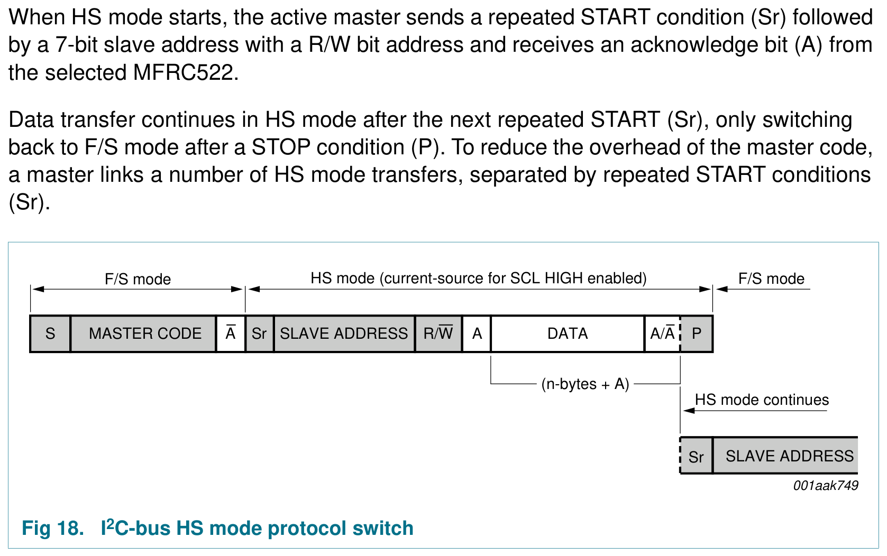

```
           Fast / Standard Mode (<= 400 kBd)         |   High-Speed Mode (<= 3.4 MBd)
+---+ +------------------------------+ +----+ +----+ | +----+ +--------------------+ +---+
| S | | Master Code (0000 1XXX)      | | NA | | Sr | | | Sr | | Slave Addr + R/W   | | A | ...
+---+ +------------------------------+ +----+ +----+ | +----+ +--------------------+ +---+
      |<------- from Master -------->| | no |        |        |<-- from Master --->| |<-M|
                                        slave                                        FRC
                                        drives
                                        SDA (HIGH)
```

#### High-Speed Mode Protocol Switch Mechanism

1. **Master Code Transmission:** Communication starts in Fast/Standard mode (up to 400 kbit/s). The master sends a START condition (`S`), followed by the 8-bit master code `0000 1xxx` (where `xxx` is master-specific).
2. **NACK Confirmation:** No slave device is permitted to acknowledge the master code; the `SDA` line remains HIGH during the 9th clock pulse (`NA`).
3. **Mode Transition:** Upon observing the master code and NACK, all HS-mode capable devices (including MFRC522) disable internal current-source pull-ups and configure input filters for High-Speed operation.
4. **HS Operation:** The master immediately issues a Repeated START (`Sr`) at HS clock speeds (up to 3.4 Mbit/s) and transmits the MFRC522 address.
5. **Mode Reset:** HS mode remains active across repeated STARTs (`Sr`) and resets back to Fast/Standard mode only upon receipt of a STOP condition (`P`).

| S | MASTER CODE | A | Sr | SLAVE ADDRESS | R/W | A | DATA | A/A | P |
| --- | --- | --- | --- | --- | --- | --- | --- | --- | --- |

| Sr | SLAVE ADDRESS |
| --- | --- |

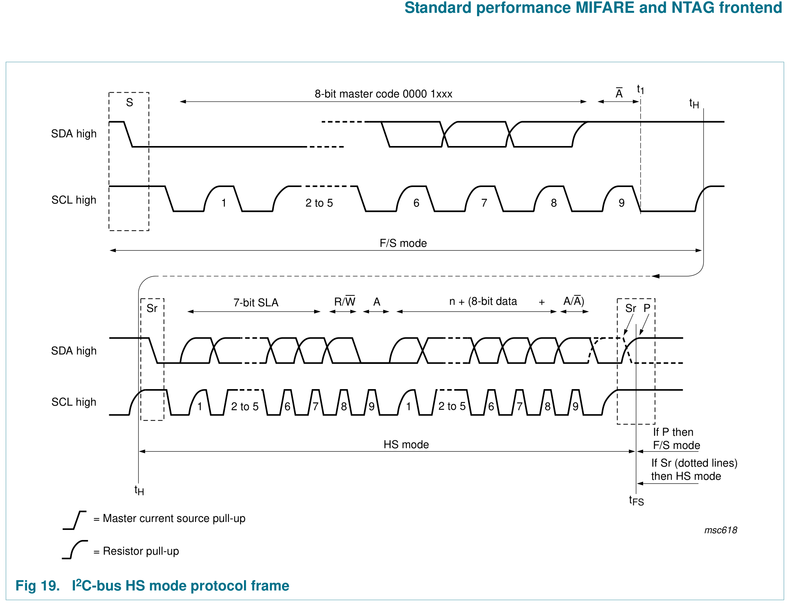

```
                      F/S Mode                                  HS Mode
           |<------------------------->|<--------------------------------------------------->|
SCL:  -----+---+---+---+---+---+---+---+---+---+---+- - - -+---+---+---+---+---+---+---+---+---+
           | 1 | 2 | 3 | 4 | 5 | 6 | 7 | 8 | 9 |   |       | 1 | 2 | 3 | 4 | 5 | 6 | 7 | 8 | 9 |
           +---+---+---+---+---+---+---+---+---+---+       +---+---+---+---+---+---+---+---+---+
                                               |           |<-- tH -->|
                                               v                      |<-- t1 -->|
SDA:  -----+-------+-------+-------+-----------+-----------+----------+----------+-------------+
           | Master Code: 0 0 0 0 1 x x x      | NACK (1)  | HS Repeated START   | Slave Addr  |
      -----+-------+-------+-------+-----------+-----------+---------------------+-------------+
                                                           | If STOP (P): back to F/S mode     |
                                                           | If Sr: remains in HS mode         |
```

#### HS-Mode Frame Characteristics

- **Bit Timing Parameters:** Shows high-frequency clock requirements in HS mode with $t_H$ (clock HIGH time $\ge 60	ext{ ns}$) and $t_1$ (clock LOW time $\ge 160	ext{ ns}$).
- **Spike Suppression:** Internal spike suppression filters adapt dynamically between F/S mode ($\le 50	ext{ ns}$) and HS mode ($\le 10	ext{ ns}$).
- **Current Sources:** Active pull-up current sources on master pull SDA HIGH rapidly to achieve 3.4 Mbit/s edge rates despite bus capacitance.

#### 8.1.4.11 Switching between F/S mode and HS mode

After reset and initialization, the MFRC522 is in Fast mode (which is in effect F/S mode as 
Fast mode is downward-compatible with Standard mode). The connected MFRC522 
recognizes the “S 00001XXX A” sequence and switches its internal circuitry from the Fast 
mode setting to the HS mode setting.

The following actions are taken:

1. Adapt the SDA and SCL input filters according to the spike suppression requirement 
in HS mode.

2. Adapt the slope control of the SDA output stages.

It is possible for system configurations that do not have other I2C-bus devices involved in 
the communication to switch to HS mode permanently. This is implemented by setting 
Status2Reg register’s I2CForceHS bit to logic 1. In permanent HS mode, the master code 
is not required to be sent. This is not defined in the specification and must only be used 
when no other devices are connected on the bus. In addition, spikes on the I2C-bus lines 
must be avoided because of the reduced spike suppression.

#### 8.1.4.12 MFRC522 at lower speed modes

MFRC522 is fully downward-compatible and can be connected to an F/S mode I2C-bus 
system. The device stays in F/S mode and communicates at F/S mode speeds because a 
master code is not transmitted in this configuration.

## 8.2 Analog interface and contactless UART

### 8.2.1 General

The integrated contactless UART supports the external host online with framing and error 
checking of the protocol requirements up to 848 kBd. An external circuit can be connected 
to the communication interface pins MFIN and MFOUT to modulate and demodulate the 
data.

The contactless UART handles the protocol requirements for the communication 
protocols in cooperation with the host. Protocol handling generates bit and byte-oriented 
framing. In addition, it handles error detection such as parity and CRC, based on the 
various supported contactless communication protocols.

Remark: The size and tuning of the antenna and the power supply voltage have an 
important impact on the achievable operating distance.

### 8.2.2 TX p-driver

The signal on pins TX1 and TX2 is the 13.56 MHz energy carrier modulated by an 
envelope signal. It can be used to drive an antenna directly using a few passive 
components for matching and filtering; see Section 15 on page 81. The signal on pins TX1 
and TX2 can be configured using the TxControlReg register; see Section 9.3.2.5 on 
page 50.

The modulation index can be set by adjusting the impedance of the drivers. The 
impedance of the p-driver can be configured using registers CWGsPReg and 
ModGsPReg. The impedance of the n-driver can be configured using the GsNReg 
register. The modulation index also depends on the antenna design and tuning.

The TxModeReg and TxSelReg registers control the data rate and framing during 
transmission and the antenna driver setting to support the different requirements at the 
different modes and transfer speeds.

#### Table 15: Register and bit settings controlling the signal on pin TX1

| Bit Tx1RFEn | Bit Force 100ASK | Bit InvTx1RFOn | Bit InvTx1RFOff | Envelope | Pin TX1 | GSPMos | GSNMos | Remarks |
| --- | --- | --- | --- | --- | --- | --- | --- | --- |
| 0 | X[1] | X[1] | X[1] | X[1] | X[1] | X[1] | X[1] | not specified if RF is switched off |
| 1 | 0 | 0 | X[1] | 0 | RF | pMod | nMod | 100 % ASK: pin TX1 pulled to logic 0, independent of the InvTx1RFOff bit |
|  |  |  |  | 1 | RF | pCW | nCW |  |
|  | 0 | 1 | X[1] | 0 | RF | pMod | nMod |  |
|  |  |  |  | 1 | RF | pCW | nCW |  |
|  | 1 | 1 | X[1] | 0 | 0 | pMod | nMod |  |
|  |  |  |  | 1 | RF n _ | pCW | nCW |  |

[1]
X = Do not care.

#### Table 16: Register and bit settings controlling the signal on pin TX2

| Bit Tx1RFEn | Bit Force 100ASK | Bit Tx2CW | Bit InvTx2RFOn | Bit InvTx2RFOff | Envelope | Pin TX2 | GSPMos | GSNMos | Remarks |
| --- | --- | --- | --- | --- | --- | --- | --- | --- | --- |
| 0 | X[1] | X[1] | X[1] | X[1] | X[1] | X[1] | X[1] | X[1] | not specified if RF is switched off |
| 1 | 0 | 0 | 0 | X[1] | 0 | RF | pMod | nMod | - |
|  |  |  |  |  | 1 | RF | pCW | nCW |  |
|  |  |  | 1 | X[1] | 0 | RF n _ | pMod | nMod |  |
|  |  |  |  |  | 1 | RF n _ | pCW | nCW |  |
|  |  | 1 | 0 | X[1] | X[1] | RF | pCW | nCW | conductance always CW for the Tx2CW bit |
|  |  |  | 1 | X[1] | X[1] | RF n _ | pCW | nCW |  |
|  | 1 | 0 | 0 | X[1] | 0 | 0 | pMod | nMod | 100 % ASK: pin TX2 pulled to logic 0 (independent of the InvTx2RFOn/Inv Tx2RFOff bits) |
|  |  |  |  |  | 1 | RF | pCW | nCW |  |
|  |  |  | 1 | X[1] | 0 | 0 | pMod | nMod |  |
|  |  |  |  |  | 1 | RF n _ | pCW | nCW |  |
|  |  | 1 | 0 | X[1] | X[1] | RF | pCW | nCW |  |
|  |  |  | 1 | X[1] | X[1] | RF n _ | pCW | nCW |  |

[1]
X = Do not care.

The following abbreviations have been used in Table 15 and Table 16:

• RF: 13.56 MHz clock derived from 27.12 MHz quartz crystal oscillator divided by 2
• RF_n: inverted 13.56 MHz clock
• GSPMos: conductance, configuration of the PMOS array
• GSNMos: conductance, configuration of the NMOS array
• pCW: PMOS conductance value for continuous wave defined by the CWGsPReg 
register
• pMod: PMOS conductance value for modulation defined by the ModGsPReg register
• nCW: NMOS conductance value for continuous wave defined by the GsNReg 
register’s CWGsN[3:0] bits
• nMod: NMOS conductance value for modulation defined by the GsNReg register’s 
ModGsN[3:0] bits
• X = do not care.

Remark: If only one driver is switched on, the values for CWGsPReg, ModGsPReg and 
GsNReg registers are used for both drivers.

### 8.2.3 Serial data switch

Two main blocks are implemented in the MFRC522. The digital block comprises the state 
machines, encoder/decoder logic. The analog block comprises the modulator and 
antenna drivers, the receiver and amplifiers. It is possible for the interface between these 
two blocks to be configured so that the interfacing signals are routed to pins MFIN and 
MFOUT.

This topology allows the analog block of the MFRC522 to be connected to the digital block 
of another device.

The serial signal switch is controlled by the TxSelReg and RxSelReg registers.

Figure 20 shows the serial data switch for p-driver TX1 and TX2.

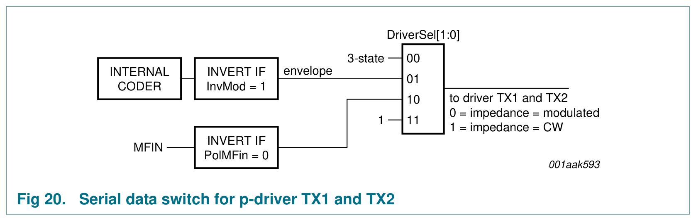

```
                          DriverSel[1:0]
                               |
                               v
                       +---------------+
   Constant LOW  [10] -| 00: 3-state   |
   Constant HIGH [11] -| 01: Modulated |
                       | 10: LOW       |------> Output to Gate of p-Driver
   Internal Coder ---->| 11: HIGH (CW) |        (Pins TX1 and TX2)
        |              +---------------+
        v InvMod = 1
    [Inverter]
```

#### Serial Data Switch Operation

- **Inputs:** Internal serial encoder bitstream, inverted encoder signal (selected when `InvMod = 1`), logic LOW, logic HIGH.
- **Multiplexer Control:** Controlled by bitfields `DriverSel[1:0]` in registers `TxSelReg` (16h) and `TxControlReg` (14h).
- **Driver States:**
  - `00` — High-impedance (3-state / disconnected).
  - `01` — Modulated transmit carrier (envelope-switched RF output).
  - `10` — Low-impedance pulled to GND (continuous LOW).
  - `11` — Continuous Wave (CW) unmodulated carrier drive (continuous HIGH).

### 8.2.4 MFIN and MFOUT interface support

The MFRC522 is divided into a digital circuit block and an analog circuit block. The digital 
block contains state machines, encoder and decoder logic and so on. The analog block 
contains the modulator and antenna drivers, receiver and amplifiers. The interface 
between these two blocks can be configured so that the interfacing signals can be routed 
to pins MFIN and MFOUT; see Figure 21 on page 28. This configuration is implemented 
using TxSelReg register’s MFOutSel[3:0] and DriverSel[1:0] bits and RxSelReg register’s 
UARTSel[1:0] bits.

This topology allows some parts of the analog block to be connected to the digital block of 
another device.

Switch MFOutSel in the TxSelReg register can be used to measure MIFARE and 
ISO/IEC14443 A related signals. This is especially important during the design-in phase 
or for test purposes as it enables checking of the transmitted and received data.

The most important use of pins MFIN and MFOUT is found in the active antenna concept. 
An external active antenna circuit can be connected to the MFRC522’s digital block. 
Switch MFOutSel must be configured so that the internal Miller encoded signal is sent to 
pin MFOUT (MFOutSel = 100b). UARTSel[1:0] must be configured to receive a 
Manchester signal with subcarrier from pin MFIN (UARTSel[1:0] = 01).

It is possible to connect a passive antenna to pins TX1, TX2 and RX (using the 
appropriate filter and matching circuit) and an active antenna to pins MFOUT and MFIN at 
the same time. In this configuration, two RF circuits can be driven (one after another) by a 
single host processor.

Remark: Pins MFIN and MFOUT have a dedicated supply on pin SVDD with the ground 
on pin PVSS. If pin MFIN is not used it must be connected to either pin SVDD or pin 
PVSS. If pin SVDD is not used it must be connected to either pin DVDD, pin PVDD or any 
other voltage supply pin.

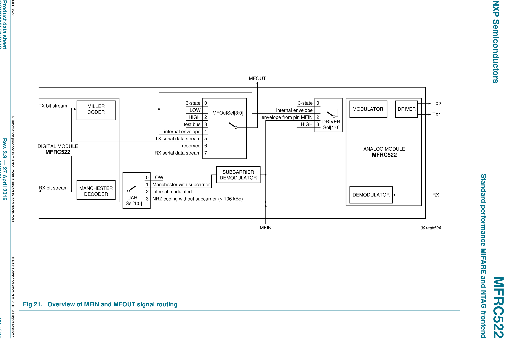

```
                               MFOutSel[3:0]
                                     |
                                     v
                             +---------------+
       High-Z (3-state) [00] | 0: 3-state    |
       Constant LOW     [01] | 1: LOW        |
       Constant HIGH    [02] | 2: HIGH       |
       Internal TestBus [03] | 3: TestBus    |------> Output Pin MFOUT (Pin 8)
       Internal Envelope[04] | 4: Envelope   |
       Contactless UART [05] | 5: SerialData |
       Miller Encoded   [06] | 6: MillerData |
       Manchester Enc   [07] | 7: ManchestData
                             +---------------+

   External Input Pin MFIN (Pin 7) ------> Routing Mux ------> Demodulator / Decoder
```

#### MFIN and MFOUT Routing Capabilities

- **MFOUT Pin (Pin 8):** Multi-purpose diagnostic and bridge output. Controlled via `MFOutSel[3:0]` in `TxSelReg` (16h).
  - Enables routing of raw Miller or Manchester encoded baseband signals to an external SAM or host processor.
  - Can expose internal test bus channels for RF envelope monitoring without loading sensitive RF nodes.
- **MFIN Pin (Pin 7):** Auxiliary baseband input pin. Allows an external RF receiver or SAM to inject baseband signals directly into the internal contactless UART decoder.

xxxxxxxxxxxxxxxxxxxxx xxxxxxxxxxxxxxxxxxxxxxxxxx xxxxxxx x x x xxxxxxxxxxxxxxxxxxxxxxxxxxxxxx xxxxxxxxxxxxxxxxxxx xx xx xxxxx

xxxxxxxxxxxxxxxxxxxxx xxxxxxxxxxxxxxxxxxxxxxxxxxxxxx xxxxx xxxxxxxxxxxxxxxxxxxxxxxxxxxxxxxxxxxxxxxxxxxxxxxxxx xxxxxxxx

xxxxxxxxxxxxxxxxxxxxxxxxxxx xxxxxxxxxxxxxxxxxxx xxxxxx xxxxxxxxxxxxxxxxxxxxxxxxxxxxxxxxxxx xxxxxxxxxxxx x x

xxxxxxxxxxxxxxxxxxxxxxxxx xxxxxxxxxxxxxxxxxxxx xxx

### 8.2.5 CRC coprocessor

The following CRC coprocessor parameters can be configured:

• The CRC preset value can be either 0000h, 6363h, A671h or FFFFh depending on 
the ModeReg register’s CRCPreset[1:0] bits setting
• The CRC polynomial for the 16-bit CRC is fixed to x16 + x12 + x5 + 1
• The CRCResultReg register indicates the result of the CRC calculation. This register 
is split into two 8-bit registers representing the higher and lower bytes.
• The ModeReg register’s MSBFirst bit indicates that data will be loaded with the MSB 
first.

#### Table 17: CRC coprocessor parameters

| Parameter | Value |
| --- | --- |
| CRC register length | 16-bit CRC |
| CRC algorithm | algorithm according to ISO/IEC 14443 A and ITU-T |
| CRC preset value | 0000h, 6363h, A671h or FFFFh depending on the setting of the ModeReg register’s CRCPreset[1:0] bits |

## 8.3 FIFO buffer

An 8  × 64 bit FIFO buffer is used in the MFRC522. It buffers the input and output data 
stream between the host and the MFRC522’s internal state machine. This makes it 
possible to manage data streams up to 64 bytes long without the need to take timing 
constraints into account.

### 8.3.1 Accessing the FIFO buffer

The FIFO buffer input and output data bus is connected to the FIFODataReg register. 
Writing to this register stores one byte in the FIFO buffer and increments the internal FIFO 
buffer write pointer. Reading from this register shows the FIFO buffer contents stored in 
the FIFO buffer read pointer and decrements the FIFO buffer read pointer. The distance 
between the write and read pointer can be obtained by reading the FIFOLevelReg 
register.

When the microcontroller starts a command, the MFRC522 can, while the command is in 
progress, access the FIFO buffer according to that command. Only one FIFO buffer has 
been implemented which can be used for input and output. The microcontroller must 
ensure that there are not any unintentional FIFO buffer accesses.

### 8.3.2 Controlling the FIFO buffer

The FIFO buffer pointers can be reset by setting FIFOLevelReg register’s FlushBuffer bit 
to logic 1. Consequently, the FIFOLevel[6:0] bits are all set to logic 0 and the ErrorReg 
register’s BufferOvfl bit is cleared. The bytes stored in the FIFO buffer are no longer 
accessible allowing the FIFO buffer to be filled with another 64 bytes.

### 8.3.3 FIFO buffer status information

The host can get the following FIFO buffer status information:

• Number of bytes stored in the FIFO buffer: FIFOLevelReg register’s FIFOLevel[6:0]
• FIFO buffer almost full warning: Status1Reg register’s HiAlert bit

• FIFO buffer almost empty warning: Status1Reg register’s LoAlert bit
• FIFO buffer overflow warning: ErrorReg register’s BufferOvfl bit. The BufferOvfl bit 
can only be cleared by setting the FIFOLevelReg register’s FlushBuffer bit.

The MFRC522 can generate an interrupt signal when:

• ComIEnReg register’s LoAlertIEn bit is set to logic 1. It activates pin IRQ when 
Status1Reg register’s LoAlert bit changes to logic 1.
• ComIEnReg register’s HiAlertIEn bit is set to logic 1. It activates pin IRQ when 
Status1Reg register’s HiAlert bit changes to logic 1.

If the maximum number of WaterLevel bytes (as set in the WaterLevelReg register) or less 
are stored in the FIFO buffer, the HiAlert bit is set to logic 1. It is generated according to 
Equation 3:

HiAlert
64
FIFOLength
–
(
)
WaterLevel
 ≤ 
=

(3)

If the number of WaterLevel bytes (as set in the WaterLevelReg register) or less are 
stored in the FIFO buffer, the LoAlert bit is set to logic 1. It is generated according to 
Equation 4:

LoAlert
FIFOLength
WaterLevel
 ≤ 
=

(4)

## 8.4 Interrupt request system

The MFRC522 indicates certain events by setting the Status1Reg register’s IRq bit and, if 
activated, by pin IRQ. The signal on pin IRQ can be used to interrupt the host using its 
interrupt handling capabilities. This allows the implementation of efficient host software.

### 8.4.1 Interrupt sources overview

Table 18 shows the available interrupt bits, the corresponding source and the condition for 
its activation. The ComIrqReg register’s TimerIRq interrupt bit indicates an interrupt set by 
the timer unit which is set when the timer decrements from 1 to 0.

The ComIrqReg register’s TxIRq bit indicates that the transmitter has finished. If the state 
changes from sending data to transmitting the end of the frame pattern, the transmitter 
unit automatically sets the interrupt bit. The CRC coprocessor sets the DivIrqReg 
register’s CRCIRq bit after processing all the FIFO buffer data which is indicated by 
CRCReady bit = 1.

The ComIrqReg register’s RxIRq bit indicates an interrupt when the end of the received 
data is detected. The ComIrqReg register’s IdleIRq bit is set if a command finishes and 
the Command[3:0] value in the CommandReg register changes to idle (see Table 149 on 
page 70).

The ComIrqReg register’s HiAlertIRq bit is set to logic 1 when the Status1Reg register’s 
HiAlert bit is set to logic 1 which means that the FIFO buffer has reached the level 
indicated by the WaterLevel[5:0] bits.

The ComIrqReg register’s LoAlertIRq bit is set to logic 1 when the Status1Reg register’s 
LoAlert bit is set to logic 1 which means that the FIFO buffer has reached the level 
indicated by the WaterLevel[5:0] bits.

The ComIrqReg register’s ErrIRq bit indicates an error detected by the contactless UART 
during send or receive. This is indicated when any bit is set to logic 1 in register ErrorReg.

#### Table 18: Interrupt sources

| Interrupt flag | Interrupt source | Trigger action |
| --- | --- | --- |
| IRq | timer unit | the timer counts from 1 to 0 |
| TxIRq | transmitter | a transmitted data stream ends |
| CRCIRq | CRC coprocessor | all data from the FIFO buffer has been processed |
| RxIRq | receiver | a received data stream ends |
| IdleIRq | ComIrqReg register | command execution finishes |
| HiAlertIRq | FIFO buffer | the FIFO buffer is almost full |
| LoAlertIRq | FIFO buffer | the FIFO buffer is almost empty |
| ErrIRq | contactless UART | an error is detected |

## 8.5 Timer unit

The MFRC522A has a timer unit which the external host can use to manage timing tasks. 
The timer unit can be used in one of the following timer/counter configurations:

• Timeout counter
• Watchdog counter
• Stop watch
• Programmable one shot
• Periodical trigger

The timer unit can be used to measure the time interval between two events or to indicate 
that a specific event occurred after a specific time. The timer can be triggered by events 
explained in the paragraphs below. The timer does not influence any internal events, for 
example, a time-out during data reception does not automatically influence the reception 
process. Furthermore, several timer-related bits can be used to generate an interrupt.

The timer has an input clock of 13.56 MHz derived from the 27.12 MHz quartz crystal 
oscillator. The timer consists of two stages: prescaler and counter.

The prescaler (TPrescaler) is a 12-bit counter. The reload values (TReloadVal_Hi[7:0] and 
TReloadVal_Lo[7:0]) for TPrescaler can be set between 0 and 4095 in the TModeReg 
register’s TPrescaler_Hi[3:0] bits and TPrescalerReg register’s TPrescaler_Lo[7:0] bits.

The reload value for the counter is defined by 16 bits between 0 and 65535 in the 
TReloadReg register.

The current value of the timer is indicated in the TCounterValReg register.

When the counter reaches 0, an interrupt is automatically generated, indicated by the 
ComIrqReg register’s TimerIRq bit setting. If enabled, this event can be indicated on 
pin IRQ. The TimerIRq bit can be set and reset by the host. Depending on the 
configuration, the timer will stop at 0 or restart with the value set in the TReloadReg 
register.

The timer status is indicated by the Status1Reg register’s TRunning bit.

The timer can be started manually using the ControlReg register’s TStartNow bit and 
stopped using the ControlReg register’s TStopNow bit.

The timer can also be activated automatically to meet any dedicated protocol 
requirements by setting the TModeReg register’s TAuto bit to logic 1.

The delay time of a timer stage is set by the reload value + 1. The total delay time (td1) is 
calculated using Equation 5:

TPrescaler
2
1
+
 × 
(
)
TReloadVal
1
+
(
)
 × 
13.56 MHz
---------------------------------------------------------------------------------------------------------
=

(5)

td1

An example of calculating total delay time (td) is shown in Equation 6, where the 
TPrescaler value = 4095 and TReloadVal = 65535:

39.59 s
4095
2
1
+
 × 
(
)
65535
1
+
(
)
 × 
13.56 MHz
----------------------------------------------------------------------
=

(6)

Example: To give a delay time of 25 µs requires 339 clock cycles to be counted and a 
TPrescaler value of 169. This configures the timer to count up to 65535 time-slots for 
every 25 µs period.

The MFRC522 version 2.0 offers in addition a second prescaler timer. Due to the fact that 
the prescaler counts down to 0 the prescaler period always count an odd number of 
clocks (1, 3, 5, ..). This may lead to inaccuracy. The second available prescaler timer 
implements the possibility to change the prescaler reload value to odd numbers, which 
results in an even prescaler period. This new prescaler can be enabled only in version 2.0 
using the register bit DemodeReg, see Table 72. Within this option, the total delay time 
(td2) is calculated using Equation 5:

TPrescaler
2
2
+
 × 
(
)
TReloadVal
1
+
(
)
 × 
13.56 MHz
---------------------------------------------------------------------------------------------------------
=

(7)

td2

## 8.6 Power reduction modes

### 8.6.1 Hard power-down

Hard power-down is enabled when pin NRSTPD is LOW. This turns off all internal current 
sinks including the oscillator. All digital input buffers are separated from the input pins and 
clamped internally (except pin NRSTPD). The output pins are frozen at either a HIGH or 
LOW level.

### 8.6.2 Soft power-down mode

Soft Power-down mode is entered immediately after the CommandReg register’s 
PowerDown bit is set to logic 1. All internal current sinks are switched off, including the 
oscillator buffer. However, the digital input buffers are not separated from the input pins 
and keep their functionality. The digital output pins do not change their state.

During soft power-down, all register values, the FIFO buffer content and the configuration 
keep their current contents.

After setting the PowerDown bit to logic 0, it takes 1024 clocks until the Soft power-down 
mode is exited indicated by the PowerDown bit. Setting it to logic 0 does not immediately 
clear it. It is cleared automatically by the MFRC522 when Soft power-down mode is 
exited.

Remark: If the internal oscillator is used, you must take into account that it is supplied by 
pin AVDD and it will take a certain time (tosc) until the oscillator is stable and the clock 
cycles can be detected by the internal logic. It is recommended for the serial UART, to first 
send the value 55h to the MFRC522. The oscillator must be stable for further access to 
the registers. To ensure this, perform a read access to address 0 until the MFRC522 
answers to the last read command with the register content of address 0. This indicates 
that the MFRC522 is ready.

### 8.6.3 Transmitter power-down mode

The Transmitter Power-down mode switches off the internal antenna drivers thereby, 
turning off the RF field. Transmitter power-down mode is entered by setting either the 
TxControlReg register’s Tx1RFEn bit or Tx2RFEn bit to logic 0.

## 8.7 Oscillator circuit

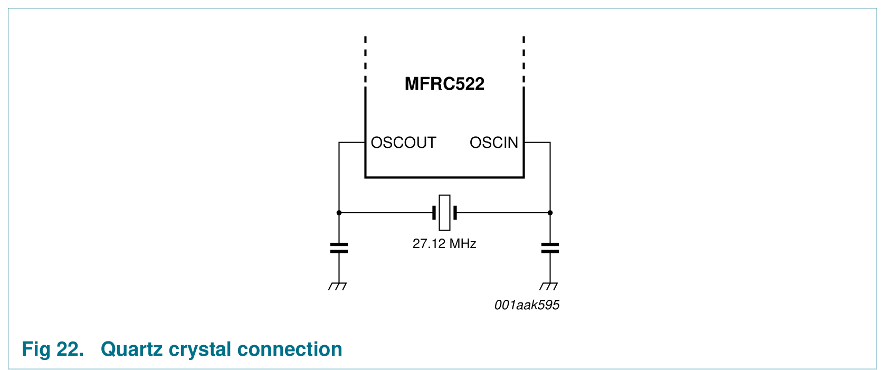

```
           +--------------------------+
           |         MFRC522          |
           |                          |
           |  OSCIN [21]  OSCOUT [22] |
           +-----+------------+-------+
                 |            |
                 +---+    +---+
                     |    |
                   +-+----+--+
                   |  27.12  |
                   |   MHz   |
                   +-+----+--+
                     |    |
                    [C1] [C2]
                     |    |
                    GND  GND
```

#### Crystal Oscillator Specifications

- **Resonant Frequency:** 27.12 MHz fundamental mode quartz crystal.
- **Tuning Capacitors (C1, C2):** Typically 15 pF to 22 pF (dependent on crystal load capacitance $C_L$ specification, target $C_L pprox 10	ext{-}15	ext{ pF}$).
- **Oscillation Tolerance:** Absolute frequency tolerance $\le \pm 50	ext{ ppm}$ required to satisfy ISO/IEC 14443 A RF carrier specifications (13.56 MHz $\pm 7	ext{ kHz}$).

The clock applied to the MFRC522 provides a time basis for the synchronous system’s 
encoder and decoder. The stability of the clock frequency, therefore, is an important factor 
for correct operation. To obtain optimum performance, clock jitter must be reduced as 
much as possible. This is best achieved using the internal oscillator buffer with the 
recommended circuitry.

If an external clock source is used, the clock signal must be applied to pin OSCIN. In this 
case, special care must be taken with the clock duty cycle and clock jitter and the clock 
quality must be verified.

## 8.8 Reset and oscillator start-up time

### 8.8.1 Reset timing requirements

The reset signal is filtered by a hysteresis circuit and a spike filter before it enters the 
digital circuit. The spike filter rejects signals shorter than 10 ns. In order to perform a reset, 
the signal must be LOW for at least 100 ns.

### 8.8.2 Oscillator start-up time

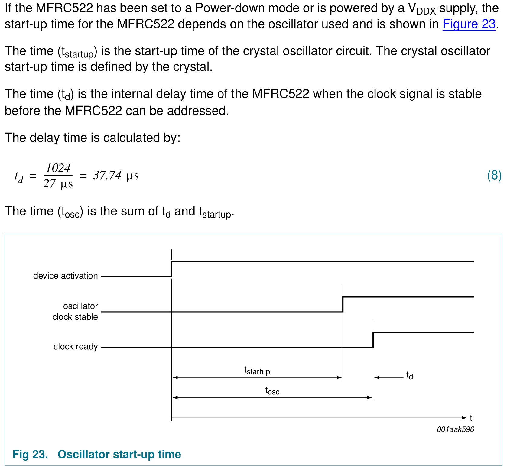

```
NRSTPD Pin:
  LOW (Reset / Power-down)
  +--------------------------+
                                                           +--------------------------------------------- (HIGH: Operational)

Crystal Oscillation Amplitude (OSCIN / OSCOUT):
                             |<-------- tstartup --------->|
                                            _   _   _   _    _ _ _ _ _ _ _ _
  No oscillation             .  .  .  . _ - - - - - - - - - ================= (Full 27.12 MHz
  ---------------------------                                                  Amplitude)
                             |                             |
                             NRSTPD released               Oscillator stable;
                                                           Command execution enabled
```

#### Start-Up Timing Parameters

- **Reset Release:** When `NRSTPD` transitions from LOW to HIGH, the internal bias circuits activate and the 27.12 MHz crystal oscillator initiates oscillation.
- **Start-Up Time ($t_{	ext{startup}}$):** Typically 1.0 ms to 3.0 ms, governed by crystal equivalent series resistance ($ESR$), load capacitors $C_1/C_2$, and loop gain.
- **Host Waiting Requirement:** Microcontroller firmware must wait at least 3 ms (or poll `Status1Reg` bit `CRCOk` / command registers) after deasserting `NRSTPD` before issuing serial commands.

# 9. MFRC522 registers

## 9.1 Register bit behavior

Depending on the functionality of a register, the access conditions to the register can vary. 
In principle, bits with same behavior are grouped in common registers. The access 
conditions are described in Table 19.

#### Table 19: Behavior of register bits and their designation

| Abbreviation | Behavior | Description |
| --- | --- | --- |
| R/W | read and write | These bits can be written and read by the microcontroller. Since they are used only for control purposes, their content is not influenced by internal state machines, for example the ComIEnReg register can be written and read by the microcontroller. It will also be read by internal state machines but never changed by them. |
| D | dynamic | These bits can be written and read by the microcontroller. Nevertheless, they can also be written automatically by internal state machines, for example the CommandReg register changes its value automatically after the execution of the command. |
| R | read only | These register bits hold values which are determined by internal states only, for example the CRCReady bit cannot be written externally but shows internal states. |
| W | write only | Reading these register bits always returns zero. |
| reserved | - | These registers are reserved for future use and must not be changed. In case of a write access, it is recommended to always write the value “0”. |
| RFT | - | These register bits are reserved for future use or are for production tests and must not be changed. |

## 9.2 Register overview

#### Table 20: MFRC522 register overview

| Address (hex) | Register name | Function | Refer to |
| --- | --- | --- | --- |
| Page 0: Command and status |  |  |  |
| 00h | Reserved | reserved for future use | Table 21 on page 38 |
| 01h | CommandReg | starts and stops command execution | Table 23 on page 38 |
| 02h | ComlEnReg | enable and disable interrupt request control bits | Table 25 on page 38 |
| 03h | DivlEnReg | enable and disable interrupt request control bits | Table 27 on page 39 |
| 04h | ComIrqReg | interrupt request bits | Table 29 on page 39 |
| 05h | DivIrqReg | interrupt request bits | Table 31 on page 40 |
| 06h | ErrorReg | error bits showing the error status of the last command executed | Table 33 on page 41 |
| 07h | Status1Reg | communication status bits | Table 35 on page 42 |
| 08h | Status2Reg | receiver and transmitter status bits | Table 37 on page 43 |
| 09h | FIFODataReg | input and output of 64 byte FIFO buffer | Table 39 on page 44 |
| 0Ah | FIFOLevelReg | number of bytes stored in the FIFO buffer | Table 41 on page 44 |
| 0Bh | WaterLevelReg | level for FIFO underflow and overflow warning | Table 43 on page 44 |
| 0Ch | ControlReg | miscellaneous control registers | Table 45 on page 45 |
| 0Dh | BitFramingReg | adjustments for bit-oriented frames | Table 47 on page 46 |
| 0Eh | CollReg | bit position of the first bit-collision detected on the RF interface | Table 49 on page 46 |
| 0Fh | Reserved | reserved for future use | Table 51 on page 47 |
| Page 1: Command |  |  |  |
| 10h | Reserved | reserved for future use | Table 53 on page 47 |
| 11h | ModeReg | defines general modes for transmitting and receiving | Table 55 on page 48 |
| 12h | TxModeReg | defines transmission data rate and framing | Table 57 on page 48 |
| 13h | RxModeReg | defines reception data rate and framing | Table 59 on page 49 |
| 14h | TxControlReg | controls the logical behavior of the antenna driver pins TX1 and TX2 | Table 61 on page 50 |
| 15h | TxASKReg | controls the setting of the transmission modulation | Table 63 on page 51 |
| 16h | TxSelReg | selects the internal sources for the antenna driver | Table 65 on page 51 |
| 17h | RxSelReg | selects internal receiver settings | Table 67 on page 52 |
| 18h | RxThresholdReg | selects thresholds for the bit decoder | Table 69 on page 53 |
| 19h | DemodReg | defines demodulator settings | Table 71 on page 53 |
| 1Ah | Reserved | reserved for future use | Table 73 on page 54 |
| 1Bh | Reserved | reserved for future use | Table 75 on page 54 |
| 1Ch | MfTxReg | controls some MIFARE communication transmit parameters | Table 77 on page 55 |
| 1Dh | MfRxReg | controls some MIFARE communication receive parameters | Table 79 on page 55 |
| 1Eh | Reserved | reserved for future use | Table 81 on page 55 |
| 1Fh | SerialSpeedReg | selects the speed of the serial UART interface | Table 83 on page 55 |
| Page 2: Configuration |  |  |  |
| 20h | Reserved | reserved for future use | Table 85 on page 57 |

#### Table 20: MFRC522 register overview …continued

| Address (hex) | Register name | Function | Refer to |
| --- | --- | --- | --- |
| 21h | CRCResultReg | shows the MSB and LSB values of the CRC calculation | Table 87 on page 57 |
| 22h |  |  | Table 89 on page 57 |
| 23h | Reserved | reserved for future use | Table 91 on page 58 |
| 24h | ModWidthReg | controls the ModWidth setting | Table 93 on page 58 |
| 25h | Reserved | reserved for future use | Table 95 on page 58 |
| 26h | RFCfgReg | configures the receiver gain | Table 97 on page 59 |
| 27h | GsNReg | selects the conductance of the antenna driver pins TX1 and TX2 for modulation | Table 99 on page 59 |
| 28h | CWGsPReg | defines the conductance of the p-driver output during periods of no modulation | Table 101 on page 60 |
| 29h | ModGsPReg | defines the conductance of the p-driver output during periods of modulation | Table 103 on page 60 |
| 2Ah | TModeReg | defines settings for the internal timer | Table 105 on page 60 |
| 2Bh | TPrescalerReg |  | Table 107 on page 61 |
| 2Ch | TReloadReg | defines the 16-bit timer reload value | Table 109 on page 62 |
| 2Dh |  |  | Table 111 on page 62 |
| 2Eh | TCounterValReg | shows the 16-bit timer value | Table 113 on page 63 |
| 2Fh |  |  | Table 115 on page 63 |
| Page 3: Test register |  |  |  |
| 30h | Reserved | reserved for future use | Table 117 on page 63 |
| 31h | TestSel1Reg | general test signal configuration | Table 119 on page 63 |
| 32h | TestSel2Reg | general test signal configuration and PRBS control | Table 121 on page 64 |
| 33h | TestPinEnReg | enables pin output driver on pins D1 to D7 | Table 123 on page 64 |
| 34h | TestPinValueReg | defines the values for D1 to D7 when it is used as an I/O bus | Table 125 on page 65 |
| 35h | TestBusReg | shows the status of the internal test bus | Table 127 on page 65 |
| 36h | AutoTestReg | controls the digital self test | Table 129 on page 66 |
| 37h | VersionReg | shows the software version | Table 131 on page 66 |
| 38h | AnalogTestReg | controls the pins AUX1 and AUX2 | Table 133 on page 67 |
| 39h | TestDAC1Reg | defines the test value for TestDAC1 | Table 135 on page 68 |
| 3Ah | TestDAC2Reg | defines the test value for TestDAC2 | Table 137 on page 68 |
| 3Bh | TestADCReg | shows the value of ADC I and Q channels | Table 139 on page 68 |
| 3Ch to 3Fh | Reserved | reserved for production tests | Table 141 to Table 147 on page 69 |

## 9.3 Register descriptions

### 9.3.1 Page 0: Command and status

#### 9.3.1.1 Reserved register 00h

Functionality is reserved for future use.

#### Table 21: Reserved register (address 00h); reset value: 00h bit allocation

| Bit | 7 | 6 | 5 | 4 | 3 | 2 | 1 | 0 |
| --- | --- | --- | --- | --- | --- | --- | --- | --- |
| Symbol | reserved |  |  |  |  |  |  |  |
| Access | - |  |  |  |  |  |  |  |

#### Table 22: Reserved register bit descriptions

| Bit | Symbol | Description |
| --- | --- | --- |
| 7 to 0 | - | reserved |

#### 9.3.1.2 CommandReg register

Starts and stops command execution.

#### Table 23: CommandReg register (address 01h); reset value: 20h bit allocation

| Bit | 7 | 6 | 5 | 4 | 3 | 2 | 1 | 0 |
| --- | --- | --- | --- | --- | --- | --- | --- | --- |
| Symbol: | reserved |  | RcvOff | PowerDown | Command[3:0] |  |  |  |
| Access: | - |  | R/W | D | D |  |  |  |

#### Table 24: CommandReg register bit descriptions

| Bit | Symbol | Value | Description |
| --- | --- | --- | --- |
| 7 to 6 | reserved | - | reserved for future use |
| 5 | RcvOff | 1 | analog part of the receiver is switched off |
| 4 | PowerDown | 1 | Soft power-down mode entered |
|  |  | 0 | MFRC522 starts the wake up procedure during which this bit is read as a logic 1; it is read as a logic 0 when the MFRC522 is ready; see Section 8.6.2 on page 33 Remark: The PowerDown bit cannot be set when the SoftReset command is activated |
| 3 to 0 | Command[3:0] | - | activates a command based on the Command value; reading this register shows which command is executed; see Section 10.3 on page 70 |

#### 9.3.1.3 ComIEnReg register

Control bits to enable and disable the passing of interrupt requests.

#### Table 25: ComIEnReg register (address 02h); reset value: 80h bit allocation

| Bit | 7 | 6 | 5 | 4 | 3 | 2 | 1 | 0 |
| --- | --- | --- | --- | --- | --- | --- | --- | --- |
| Symbol | IRqInv | TxIEn | RxIEn | IdleIEn | HiAlertIEn | LoAlertIEn | ErrIEn | TimerIEn |
| Access | R/W | R/W | R/W | R/W | R/W | R/W | R/W | R/W |

#### Table 26: ComIEnReg register bit descriptions

| Bit | Symbol | Value | Description |
| --- | --- | --- | --- |
| 7 | IRqInv | 1 | signal on pin IRQ is inverted with respect to the Status1Reg register’s IRq bit |
|  |  | 0 | signal on pin IRQ is equal to the IRq bit; in combination with the DivIEnReg register’s IRqPushPull bit, the default value of logic 1 ensures that the output level on pin IRQ is 3-state |
| 6 | TxIEn | - | allows the transmitter interrupt request (TxIRq bit) to be propagated to pin IRQ |
| 5 | RxIEn | - | allows the receiver interrupt request (RxIRq bit) to be propagated to pin IRQ |
| 4 | IdleIEn | - | allows the idle interrupt request (IdleIRq bit) to be propagated to pin IRQ |
| 3 | HiAlertIEn | - | allows the high alert interrupt request (HiAlertIRq bit) to be propagated to pin IRQ |
| 2 | LoAlertIEn | - | allows the low alert interrupt request (LoAlertIRq bit) to be propagated to pin IRQ |
| 1 | ErrIEn | - | allows the error interrupt request (ErrIRq bit) to be propagated to pin IRQ |
| 0 | TimerIEn | - | allows the timer interrupt request (TimerIRq bit) to be propagated to pin IRQ |

#### 9.3.1.4 DivIEnReg register

Control bits to enable and disable the passing of interrupt requests.

#### Table 27: DivIEnReg register (address 03h); reset value: 00h bit allocation

| Bit | 7 | 6 | 5 | 4 | 3 | 2 | 1 | 0 |
| --- | --- | --- | --- | --- | --- | --- | --- | --- |
| Symbol | IRQPushPull | reserved |  | MfinActIEn | reserved | CRCIEn | reserved |  |
| Access | R/W | - |  | R/W | - | R/W | - |  |

#### Table 28: DivIEnReg register bit descriptions

| Bit | Symbol | Value | Description |
| --- | --- | --- | --- |
| 7 | IRQPushPull | 1 | pin IRQ is a standard CMOS output pin |
|  |  | 0 | pin IRQ is an open-drain output pin |
| 6 to 5 | reserved | - | reserved for future use |
| 4 | MfinActIEn | - | allows the MFIN active interrupt request to be propagated to pin IRQ |
| 3 | reserved | - | reserved for future use |
| 2 | CRCIEn | - | allows the CRC interrupt request, indicated by the DivIrqReg register’s CRCIRq bit, to be propagated to pin IRQ |
| 1 to 0 | reserved | - | reserved for future use |

#### 9.3.1.5 ComIrqReg register

Interrupt request bits.

#### Table 29: ComIrqReg register (address 04h); reset value: 14h bit allocation

| Bit | 7 | 6 | 5 | 4 | 3 | 2 | 1 | 0 |
| --- | --- | --- | --- | --- | --- | --- | --- | --- |
| Symbol | Set1 | TxIRq | RxIRq | IdleIRq | HiAlertIRq | LoAlertIRq | ErrIRq | TimerIRq |
| Access | W | D | D | D | D | D | D | D |

#### Table 30: ComIrqReg register bit descriptions

All bits in the ComIrqReg register are cleared by software.

| Bit | Symbol | Value | Description |
| --- | --- | --- | --- |
| 7 | Set1 | 1 | indicates that the marked bits in the ComIrqReg register are set |
|  |  | 0 | indicates that the marked bits in the ComIrqReg register are cleared |
| 6 | TxIRq | 1 | set immediately after the last bit of the transmitted data was sent out |
| 5 | RxIRq | 1 | receiver has detected the end of a valid data stream if the RxModeReg register’s RxNoErr bit is set to logic 1, the RxIRq bit is only set to logic 1 when data bytes are available in the FIFO |
| 4 | IdleIRq | 1 | If a command terminates, for example, when the CommandReg changes its value from any command to the Idle command (see Table 149 on page 70) if an unknown command is started, the CommandReg register Command[3:0] value changes to the idle state and the IdleIRq bit is set The microcontroller starting the Idle command does not set the IdleIRq bit |
| 3 | HiAlertIRq | 1 | the Status1Reg register’s HiAlert bit is set in opposition to the HiAlert bit, the HiAlertIRq bit stores this event and can only be reset as indicated by the Set1 bit in this register |
| 2 | LoAlertIRq | 1 | Status1Reg register’s LoAlert bit is set in opposition to the LoAlert bit, the LoAlertIRq bit stores this event and can only be reset as indicated by the Set1 bit in this register |
| 1 | ErrIRq | 1 | any error bit in the ErrorReg register is set |
| 0 | TimerIRq | 1 | the timer decrements the timer value in register TCounterValReg to zero |

#### 9.3.1.6 DivIrqReg register

Interrupt request bits.

#### Table 31: DivIrqReg register (address 05h); reset value: x0h bit allocation

| Bit | 7 | 6 | 5 | 4 | 3 | 2 | 1 | 0 |
| --- | --- | --- | --- | --- | --- | --- | --- | --- |
| Symbol | Set2 | reserved |  | MfinActIRq | reserved | CRCIRq | reserved |  |
| Access | W | - |  | D | - | D | - |  |

#### Table 32: DivIrqReg register bit descriptions

All bits in the DivIrqReg register are cleared by software.

| Bit | Symbol | Value | Description |
| --- | --- | --- | --- |
| 7 | Set2 | 1 | indicates that the marked bits in the DivIrqReg register are set |
|  |  | 0 | indicates that the marked bits in the DivIrqReg register are cleared |
| 6 to 5 | reserved | - | reserved for future use |
| 4 | MfinActIRq | 1 | MFIN is active this interrupt is set when either a rising or falling signal edge is detected |
| 3 | reserved | - | reserved for future use |
| 2 | CRCIRq | 1 | the CalcCRC command is active and all data is processed |
| 1 to 0 | reserved | - | reserved for future use |

#### 9.3.1.7 ErrorReg register

Error bit register showing the error status of the last command executed.

#### Table 33: ErrorReg register (address 06h); reset value: 00h bit allocation

| Bit | 7 | 6 | 5 | 4 | 3 | 2 | 1 | 0 |
| --- | --- | --- | --- | --- | --- | --- | --- | --- |
| Symbol | WrErr | TempErr | reserved | BufferOvfl | CollErr | CRCErr | ParityErr | ProtocolErr |
| Access | R | R | - | R | R | R | R | R |

#### Table 34: ErrorReg register bit descriptions

| Bit | Symbol | Value | Description |
| --- | --- | --- | --- |
| 7 | WrErr | 1 | data is written into the FIFO buffer by the host during the MFAuthent command or if data is written into the FIFO buffer by the host during the time between sending the last bit on the RF interface and receiving the last bit on the RF interface |
| 6 | TempErr[1] | 1 | internal temperature sensor detects overheating, in which case the antenna drivers are automatically switched off |
| 5 | reserved | - | reserved for future use |
| 4 | BufferOvfl | 1 | the host or a MFRC522’s internal state machine (e.g. receiver) tries to write data to the FIFO buffer even though it is already full |
| 3 | CollErr | 1 | a bit-collision is detected cleared automatically at receiver start-up phase only valid during the bitwise anticollision at 106 kBd always set to logic 0 during communication protocols at 212 kBd, 424 kBd and 848 kBd |
| 2 | CRCErr | 1 | the RxModeReg register’s RxCRCEn bit is set and the CRC calculation fails automatically cleared to logic 0 during receiver start-up phase |
| 1 | ParityErr | 1 | parity check failed automatically cleared during receiver start-up phase only valid for ISO/IEC 14443 A/MIFARE communication at 106 kBd |
| 0 | ProtocolErr | 1 | set to logic 1 if the SOF is incorrect automatically cleared during receiver start-up phase bit is only valid for 106 kBd during the MFAuthent command, the ProtocolErr bit is set to logic 1 if the number of bytes received in one data stream is incorrect |

[1]
Command execution clears all error bits except the TempErr bit. Cannot be set by software.

#### 9.3.1.8 Status1Reg register

Contains status bits of the CRC, interrupt and FIFO buffer.

#### Table 35: Status1Reg register (address 07h); reset value: 21h bit allocation

| Bit | 7 | 6 | 5 | 4 | 3 | 2 | 1 | 0 |
| --- | --- | --- | --- | --- | --- | --- | --- | --- |
| Symbol | reserved | CRCOk | CRCReady | IRq | TRunning | reserved | HiAlert | LoAlert |
| Access | - | R | R | R | R | - | R | R |

#### Table 36: Status1Reg register bit descriptions

| Bit | Symbol | Value | Description |
| --- | --- | --- | --- |
| 7 | reserved | - | reserved for future use |
| 6 | CRCOk | 1 | the CRC result is zero for data transmission and reception, the CRCOk bit is undefined: use the ErrorReg register’s CRCErr bit indicates the status of the CRC coprocessor, during calculation the value changes to logic 0, when the calculation is done correctly the value changes to logic 1 |
| 5 | CRCReady | 1 | the CRC calculation has finished only valid for the CRC coprocessor calculation using the CalcCRC command |
| 4 | IRq | - | indicates if any interrupt source requests attention with respect to the setting of the interrupt enable bits: see the ComIEnReg and DivIEnReg registers |
| 3 | TRunning | 1 | MFRC522’s timer unit is running, i.e. the timer will decrement the TCounterValReg register with the next timer clock Remark: in gated mode, the TRunning bit is set to logic 1 when the timer is enabled by TModeReg register’s TGated[1:0] bits; this bit is not influenced by the gated signal |
| 2 | reserved | - | reserved for future use |
| 1 | HiAlert | 1 | the number of bytes stored in the FIFO buffer corresponds to equation: HiAlert = (64–FIFOLength) ≤ WaterLevel example: FIFO length = 60, WaterLevel = 4  -> HiAlert = 1 FIFO length = 59, WaterLevel = 4  -> HiAlert = 0 |
| 0 | LoAlert | 1 | the number of bytes stored in the FIFO buffer corresponds to equation: LoAlert = FIFOLength ≤ WaterLevel example: FIFO length = 4, WaterLevel = 4  -> LoAlert = 1 FIFO length = 5, WaterLevel = 4  -> LoAlert = 0 |

#### 9.3.1.9 Status2Reg register

Contains status bits of the receiver, transmitter and data mode detector.

#### Table 37: Status2Reg register (address 08h); reset value: 00h bit allocation

| Bit | 7 | 6 | 5 | 4 | 3 | 2 | 1 | 0 |
| --- | --- | --- | --- | --- | --- | --- | --- | --- |
| Symbol | TempSensClear | I2CForceHS | reserved |  | MFCrypto1On | ModemState[2:0] |  |  |
| Access | R/W | R/W | - |  | D | R |  |  |

#### Table 38: Status2Reg register bit descriptions

| Bit | Symbol | Value | Description |
| --- | --- | --- | --- |
| 7 | TempSensClear | 1 | clears the temperature error if the temperature is below the alarm limit of 125 °C |
| 6 | I2CForceHS |  | I2C-bus input filter settings: |
|  |  | 1 | the I2C-bus input filter is set to the High-speed mode independent of the I2C-bus protocol |
|  |  | 0 | the I2C-bus input filter is set to the I2C-bus protocol used |
| 5 to 4 | reserved | - | reserved |
| 3 | MFCrypto1On | - | indicates that the MIFARE Crypto1 unit is switched on and therefore all data communication with the card is encrypted can only be set to logic 1 by a successful execution of the MFAuthent command only valid in Read/Write mode for MIFARE standard cards this bit is cleared by software |
| 2 to 0 | ModemState[2:0] | - | shows the state of the transmitter and receiver state machines: |
|  |  | 000 | idle |
|  |  | 001 | wait for the BitFramingReg register’s StartSend bit |
|  |  | 010 | TxWait: wait until RF field is present if the TModeReg register’s TxWaitRF bit is set to logic 1 the minimum time for TxWait is defined by the TxWaitReg register |
|  |  | 011 | transmitting |
|  |  | 100 | RxWait: wait until RF field is present if the TModeReg register’s TxWaitRF bit is set to logic 1 the minimum time for RxWait is defined by the RxWaitReg register |
|  |  | 101 | wait for data |
|  |  | 110 | receiving |

#### 9.3.1.10 FIFODataReg register

Input and output of 64 byte FIFO buffer.

#### Table 39: FIFODataReg register (address 09h); reset value: xxh bit allocation

| Bit | 7 | 6 | 5 | 4 | 3 | 2 | 1 | 0 |
| --- | --- | --- | --- | --- | --- | --- | --- | --- |
| Symbol | FIFOData[7:0] |  |  |  |  |  |  |  |
| Access | D |  |  |  |  |  |  |  |

#### Table 40: FIFODataReg register bit descriptions

| Bit | Symbol | Description |
| --- | --- | --- |
| 7 to 0 | FIFOData[7:0] | data input and output port for the internal 64-byte FIFO buffer FIFO buffer acts as parallel in/parallel out converter for all serial data stream inputs and outputs |

#### 9.3.1.11 FIFOLevelReg register

Indicates the number of bytes stored in the FIFO.

#### Table 41: FIFOLevelReg register (address 0Ah); reset value: 00h bit allocation

| Bit | 7 | 6 | 5 | 4 | 3 | 2 | 1 | 0 |
| --- | --- | --- | --- | --- | --- | --- | --- | --- |
| Symbol | FlushBuffer | FIFOLevel[6:0] |  |  |  |  |  |  |
| Access | W | R |  |  |  |  |  |  |

#### Table 42: FIFOLevelReg register bit descriptions

| Bit | Symbol | Value | Description |
| --- | --- | --- | --- |
| 7 | FlushBuffer | 1 | immediately clears the internal FIFO buffer’s read and write pointer and ErrorReg register’s BufferOvfl bit reading this bit always returns 0 |
| 6 to 0 | FIFOLevel [6:0] | - | indicates the number of bytes stored in the FIFO buffer writing to the FIFODataReg register increments and reading decrements the FIFOLevel value |

#### 9.3.1.12 WaterLevelReg register

Defines the level for FIFO under- and overflow warning.

#### Table 43: WaterLevelReg register (address 0Bh); reset value: 08h bit allocation

| Bit | 7 | 6 | 5 | 4 | 3 | 2 | 1 | 0 |
| --- | --- | --- | --- | --- | --- | --- | --- | --- |
| Symbol | reserved |  | WaterLevel[5:0] |  |  |  |  |  |
| Access | - |  | R/W |  |  |  |  |  |

#### Table 44: WaterLevelReg register bit descriptions

| Bit | Symbol | Description |
| --- | --- | --- |
| 7 to 6 | reserved | reserved for future use |
| 5 to 0 | WaterLevel [5:0] | defines a warning level to indicate a FIFO buffer overflow or underflow: Status1Reg register’s HiAlert bit is set to logic 1 if the remaining number of bytes in the FIFO buffer space is equal to, or less than the defined number of WaterLevel bytes Status1Reg register’s LoAlert bit is set to logic 1 if equal to, or less than the WaterLevel bytes in the FIFO buffer Remark: to calculate values for HiAlert and LoAlert see Section 9.3.1.8 on page 42. |

#### 9.3.1.13 ControlReg register

Miscellaneous control bits.

#### Table 45: ControlReg register (address 0Ch); reset value: 10h bit allocation

| Bit | 7 | 6 | 5 | 4 | 3 | 2 | 1 | 0 |
| --- | --- | --- | --- | --- | --- | --- | --- | --- |
| Symbol | TStopNow | TStartNow | reserved |  |  | RxLastBits[2:0] |  |  |
| Access | W | W | - |  |  | R |  |  |

#### Table 46: ControlReg register bit descriptions

| Bit | Symbol | Value | Description |
| --- | --- | --- | --- |
| 7 | TStopNow | 1 | timer stops immediately reading this bit always returns it to logic0 |
| 6 | TStartNow | 1 | timer starts immediately reading this bit always returns it to logic 0 |
| 5 to 3 | reserved | - | reserved for future use |
| 2 to 0 | RxLastBits[2:0] | - | indicates the number of valid bits in the last received byte if this value is 000b, the whole byte is valid |

#### 9.3.1.14 BitFramingReg register

Adjustments for bit-oriented frames.

#### Table 47: BitFramingReg register (address 0Dh); reset value: 00h bit allocation

| Bit | 7 | 6 | 5 | 4 | 3 | 2 | 1 | 0 |
| --- | --- | --- | --- | --- | --- | --- | --- | --- |
| Symbol | StartSend | RxAlign[2:0] |  |  | reserved | TxLastBits[2:0] |  |  |
| Access | W | R/W |  |  | - | R/W |  |  |

#### Table 48: BitFramingReg register bit descriptions

| Bit | Symbol | Value | Description |
| --- | --- | --- | --- |
| 7 | StartSend | 1 | starts the transmission of data only valid in combination with the Transceive command |
| 6 to 4 | RxAlign[2:0] |  | used for reception of bit-oriented frames: defines the bit position for the first bit received to be stored in the FIFO buffer example: |
|  |  | 0 | LSB of the received bit is stored at bit position 0, the second received bit is stored at bit position 1 |
|  |  | 1 | LSB of the received bit is stored at bit position 1, the second received bit is stored at bit position 2 |
|  |  | 7 | LSB of the received bit is stored at bit position 7, the second received bit is stored in the next byte that follows at bit position 0 These bits are only to be used for bitwise anticollision at 106 kBd, for all other modes they are set to 0 |
| 3 | reserved | - | reserved for future use |
| 2 to 0 | TxLastBits[2:0] | - | used for transmission of bit oriented frames: defines the number of bits of the last byte that will be transmitted 000b indicates that all bits of the last byte will be transmitted |

#### 9.3.1.15 CollReg register

Defines the first bit-collision detected on the RF interface.

#### Table 49: CollReg register (address 0Eh); reset value: xxh bit allocation

| Bit | 7 | 6 | 5 | 4 | 3 | 2 | 1 | 0 |
| --- | --- | --- | --- | --- | --- | --- | --- | --- |
| Symbol | ValuesAfterColl | reserved | CollPosNotValid | CollPos[4:0] |  |  |  |  |
| Access | R/W | - | R | R |  |  |  |  |

#### Table 50: CollReg register bit descriptions

| Bit | Symbol | Value | Description |
| --- | --- | --- | --- |
| 7 | ValuesAfterColl | 0 | all received bits will be cleared after a collision only used during bitwise anticollision at 106 kBd, otherwise it is set to logic 1 |
| 6 | reserved | - | reserved for future use |
| 5 | CollPosNotValid | 1 | no collision detected or the position of the collision is out of the range of CollPos[4:0] |

#### Table 50: CollReg register bit descriptions …continued

| Bit | Symbol | Value | Description |
| --- | --- | --- | --- |
| 4 to 0 | CollPos[4:0] | - | shows the bit position of the first detected collision in a received frame only data bits are interpreted example: |
|  |  | 00h | indicates a bit-collision in the 32nd bit |
|  |  | 01h | indicates a bit-collision in the 1st bit |
|  |  | 08h | indicates a bit-collision in the 8th bit These bits will only be interpreted if the CollPosNotValid bit is set to logic 0 |

#### 9.3.1.16 Reserved register 0Fh

Functionality is reserved for future use.

#### Table 51: Reserved register (address 0Fh); reset value: 00h bit allocation

| Bit | 7 | 6 | 5 | 4 | 3 | 2 | 1 | 0 |
| --- | --- | --- | --- | --- | --- | --- | --- | --- |
| Symbol | reserved |  |  |  |  |  |  |  |
| Access | - |  |  |  |  |  |  |  |

#### Table 52: Reserved register bit descriptions

| Bit | Symbol | Description |
| --- | --- | --- |
| 7 to 0 | reserved | reserved for future use |

### 9.3.2 Page 1: Communication

#### 9.3.2.1 Reserved register 10h

Functionality is reserved for future use.

#### Table 53: Reserved register (address 10h); reset value: 00h bit allocation

| Bit | 7 | 6 | 5 | 4 | 3 | 2 | 1 | 0 |
| --- | --- | --- | --- | --- | --- | --- | --- | --- |
| Symbol | reserved |  |  |  |  |  |  |  |
| Access | - |  |  |  |  |  |  |  |

#### Table 54: Reserved register bit descriptions

| Bit | Symbol | Description |
| --- | --- | --- |
| 7 to 0 | reserved | reserved for future use |

#### 9.3.2.2 ModeReg register

Defines general mode settings for transmitting and receiving.

#### Table 55: ModeReg register (address 11h); reset value: 3Fh bit allocation

| Bit | 7 | 6 | 5 | 4 | 3 | 2 | 1 | 0 |
| --- | --- | --- | --- | --- | --- | --- | --- | --- |
| Symbol | MSBFirst | reserved | TxWaitRF | reserved | PolMFin | reserved | CRCPreset[1:0] |  |
| Access | R/W | - | R/W | - | R/W | - | R/W |  |

#### Table 56: ModeReg register bit descriptions

| Bit | Symbol | Value | Description |
| --- | --- | --- | --- |
| 7 | MSBFirst | 1 | CRC coprocessor calculates the CRC with MSB first in the CRCResultReg register the values for the CRCResultMSB[7:0] bits and the CRCResultLSB[7:0] bits are bit reversed Remark: during RF communication this bit is ignored |
| 6 | reserved | - | reserved for future use |
| 5 | TxWaitRF | 1 | transmitter can only be started if an RF field is generated |
| 4 | reserved | - | reserved for future use |
| 3 | PolMFin |  | defines the polarity of pin MFIN Remark: the internal envelope signal is encoded active LOW, changing this bit generates a MFinActIRq event |
|  |  | 1 | polarity of pin MFIN is active HIGH |
|  |  | 0 | polarity of pin MFIN is active LOW |
| 2 | reserved | - | reserved for future use |
| 1 to 0 | CRCPreset [1:0] |  | defines the preset value for the CRC coprocessor for the CalcCRC command Remark: during any communication, the preset values are selected automatically according to the definition of bits in the RxModeReg and TxModeReg registers |
|  |  | 00 | 0000h |
|  |  | 01 | 6363h |
|  |  | 10 | A671h |
|  |  | 11 | FFFFh |

#### 9.3.2.3 TxModeReg register

Defines the data rate during transmission.

#### Table 57: TxModeReg register (address 12h); reset value: 00h bit allocation

| Bit | 7 | 6 | 5 | 4 | 3 | 2 | 1 | 0 |
| --- | --- | --- | --- | --- | --- | --- | --- | --- |
| Symbol | TxCRCEn | TxSpeed[2:0] |  |  | InvMod | reserved |  |  |
| Access | R/W | D |  |  | R/W | - |  |  |

#### Table 58: TxModeReg register bit descriptions

| Bit | Symbol | Value | Description |
| --- | --- | --- | --- |
| 7 | TxCRCEn | 1 | enables CRC generation during data transmission Remark: can only be set to logic 0 at 106 kBd |
| 6 to 4 | TxSpeed[2:0] |  | defines the bit rate during data transmission the MFRC522 handles transfer speeds up to 848 kBd |
|  |  | 000 | 106 kBd |
|  |  | 001 | 212 kBd |
|  |  | 010 | 424 kBd |
|  |  | 011 | 848 kBd |
|  |  | 100 | reserved |
|  |  | 101 | reserved |
|  |  | 110 | reserved |
|  |  | 111 | reserved |
| 3 | InvMod | 1 | modulation of transmitted data is inverted |
| 2 to 0 | reserved | - | reserved for future use |

#### 9.3.2.4 RxModeReg register

Defines the data rate during reception.

#### Table 59: RxModeReg register (address 13h); reset value: 00h bit allocation

| Bit | 7 | 6 | 5 | 4 | 3 | 2 | 1 | 0 |
| --- | --- | --- | --- | --- | --- | --- | --- | --- |
| Symbol | RxCRCEn | RxSpeed[2:0] |  |  | RxNoErr | RxMultiple | reserved |  |
| Access | R/W | D |  |  | R/W | R/W | - |  |

#### Table 60: RxModeReg register bit descriptions

| Bit | Symbol | Value | Description |
| --- | --- | --- | --- |
| 7 | RxCRCEn | 1 | enables the CRC calculation during reception Remark: can only be set to logic 0 at 106 kBd |
| 6 to 4 | RxSpeed[2:0] |  | defines the bit rate while receiving data the MFRC522 handles transfer speeds up to 848 kBd |
|  |  | 000 | 106 kBd |
|  |  | 001 | 212 kBd |
|  |  | 010 | 424 kBd |
|  |  | 011 | 848 kBd |
|  |  | 100 | reserved |
|  |  | 101 | reserved |
|  |  | 110 | reserved |
|  |  | 111 | reserved |
| 3 | RxNoErr | 1 | an invalid received data stream (less than 4 bits received) will be ignored and the receiver remains active |

#### Table 60: RxModeReg register bit descriptions …continued

| Bit | Symbol | Value | Description |
| --- | --- | --- | --- |
| 2 | RxMultiple | 0 | receiver is deactivated after receiving a data frame |
|  |  | 1 | able to receive more than one data frame only valid for data rates above 106 kBd in order to handle the polling command after setting this bit the Receive and Transceive commands will not terminate automatically. Multiple reception can only be deactivated by writing any command (except the Receive command) to the CommandReg register, or by the host clearing the bit if set to logic 1, an error byte is added to the FIFO buffer at the end of a received data stream which is a copy of the ErrorReg register value. For the MFRC522 version 2.0 the CRC status is reflected in the signal CRCOk, which indicates the actual status of the CRC coprocessor. For the MFRC522 version 1.0 the CRC status is reflected in the signal CRCErr. |
| 1 to 0 | reserved | - | reserved for future use |

#### 9.3.2.5 TxControlReg register

Controls the logical behavior of the antenna driver pins TX1 and TX2.

#### Table 61: TxControlReg register (address 14h); reset value: 80h bit allocation

| Bit | 7 | 6 | 5 | 4 | 3 | 2 | 1 | 0 |
| --- | --- | --- | --- | --- | --- | --- | --- | --- |
| Symbol | InvTx2RF On | InvTx1RF On | InvTx2RF Off | InvTx1RF Off | Tx2CW | reserved | Tx2RFEn | Tx1RFEn |
| Access | R/W | R/W | R/W | R/W | R/W | - | R/W | R/W |

#### Table 62: TxControlReg register bit descriptions

| Bit | Symbol | Value | Description |
| --- | --- | --- | --- |
| 7 | InvTx2RFOn | 1 | output signal on pin TX2 inverted when driver TX2 is enabled |
| 6 | InvTx1RFOn | 1 | output signal on pin TX1 inverted when driver TX1 is enabled |
| 5 | InvTx2RFOff | 1 | output signal on pin TX2 inverted when driver TX2 is disabled |
| 4 | InvTx1RFOff | 1 | output signal on pin TX1 inverted when driver TX1 is disabled |
| 3 | Tx2CW | 1 | output signal on pin TX2 continuously delivers the unmodulated 13.56 MHz energy carrier |
|  |  | 0 | Tx2CW bit is enabled to modulate the 13.56 MHz energy carrier |
| 2 | reserved | - | reserved for future use |
| 1 | Tx2RFEn | 1 | output signal on pin TX2 delivers the 13.56 MHz energy carrier modulated by the transmission data |
| 0 | Tx1RFEn | 1 | output signal on pin TX1 delivers the 13.56 MHz energy carrier modulated by the transmission data |

#### 9.3.2.6 TxASKReg register

Controls transmit modulation settings.

#### Table 63: TxASKReg register (address 15h); reset value: 00h bit allocation

| Bit | 7 | 6 | 5 | 4 | 3 | 2 | 1 | 0 |
| --- | --- | --- | --- | --- | --- | --- | --- | --- |
| Symbol | reserved | Force100ASK | reserved |  |  |  |  |  |
| Access | - | R/W | - |  |  |  |  |  |

#### Table 64: TxASKReg register bit descriptions

| Bit | Symbol | Value | Description |
| --- | --- | --- | --- |
| 7 | reserved | - | reserved for future use |
| 6 | Force100ASK | 1 | forces a 100 % ASK modulation independent of the ModGsPReg register setting |
| 5 to 0 | reserved | - | reserved for future use |

#### 9.3.2.7 TxSelReg register

Selects the internal sources for the analog module.

#### Table 65: TxSelReg register (address 16h); reset value: 10h bit allocation

| Bit | 7 | 6 | 5 | 4 | 3 | 2 | 1 | 0 |
| --- | --- | --- | --- | --- | --- | --- | --- | --- |
| Symbol: | reserved |  | DriverSel[1:0] |  | MFOutSel[3:0] |  |  |  |
| Access: | - |  | R/W |  | R/W |  |  |  |

#### Table 66: TxSelReg register bit descriptions

| Bit | Symbol | Value | Description |
| --- | --- | --- | --- |
| 7 to 6 | reserved | - | reserved for future use |
| 5 to 4 | DriverSel [1:0] | - | selects the input of drivers TX1 and TX2 |
|  |  | 00 | 3-state; in soft power-down the drivers are only in 3-state mode if the DriverSel[1:0] value is set to 3-state mode |
|  |  | 01 | modulation signal (envelope) from the internal encoder, Miller pulse encoded |
|  |  | 10 | modulation signal (envelope) from pin MFIN |
|  |  | 11 | HIGH; the HIGH level depends on the setting of bits InvTx1RFOn/InvTx1RFOff and InvTx2RFOn/InvTx2RFOff |

#### Table 66: TxSelReg register bit descriptions …continued

| Bit | Symbol | Value | Description |
| --- | --- | --- | --- |
| 3 to 0 | MFOutSel [3:0] |  | selects the input for pin MFOUT |
|  |  | 0000 | 3-state |
|  |  | 0001 | LOW |
|  |  | 0010 | HIGH |
|  |  | 0011 | test bus signal as defined by the TestSel1Reg register’s TstBusBitSel[2:0] value |
|  |  | 0100 | modulation signal (envelope) from the internal encoder, Miller pulse encoded |
|  |  | 0101 | serial data stream to be transmitted, data stream before Miller encoder |
|  |  | 0110 | reserved |
|  |  | 0111 | serial data stream received, data stream after Manchester decoder |
|  |  | 1000 to 1111 | reserved |

#### 9.3.2.8 RxSelReg register

Selects internal receiver settings.

#### Table 67: RxSelReg register (address 17h); reset value: 84h bit allocation

| Bit | 7 | 6 | 5 | 4 | 3 | 2 | 1 | 0 |
| --- | --- | --- | --- | --- | --- | --- | --- | --- |
| Symbol | UARTSel[1:0] |  | RxWait[5:0] |  |  |  |  |  |
| Access | R/W |  | R/W |  |  |  |  |  |

#### Table 68: RxSelReg register bit descriptions

| Bit | Symbol | Value | Description |
| --- | --- | --- | --- |
| 7 to 6 | UARTSel [1:0] | 00 | selects the input of the contactless UART constant LOW |
|  |  | 01 | Manchester with subcarrier from pin MFIN |
|  |  | 10 | modulated signal from the internal analog module, default |
|  |  | 11 | NRZ coding without subcarrier from pin MFIN which is only valid for transfer speeds above 106 kBd |
| 5 to 0 | RxWait [5:0] | - | after data transmission the activation of the receiver is delayed for RxWait bit-clocks, during this ‘frame guard time’ any signal on pin RX is ignored this parameter is ignored by the Receive command all other commands, such as Transceive, MFAuthent use this parameter the counter starts immediately after the external RF field is switched on |

#### 9.3.2.9 RxThresholdReg register

Selects thresholds for the bit decoder.

#### Table 69: RxThresholdReg register (address 18h); reset value: 84h bit allocation

| Bit | 7 | 6 | 5 | 4 | 3 | 2 | 1 | 0 |
| --- | --- | --- | --- | --- | --- | --- | --- | --- |
| Symbol | MinLevel[3:0] |  |  |  | reserved | CollLevel[2:0] |  |  |
| Access | R/W |  |  |  | - | R/W |  |  |

#### Table 70: RxThresholdReg register bit descriptions

| Bit | Symbol | Description |
| --- | --- | --- |
| 7 to 4 | MinLevel [3:0] | defines the minimum signal strength at the decoder input that will be accepted if the signal strength is below this level it is not evaluated |
| 3 | reserved | reserved for future use |
| 2 to 0 | CollLevel [2:0] | defines the minimum signal strength at the decoder input that must be reached by the weaker half-bit of the Manchester encoded signal to generate a bit-collision relative to the amplitude of the stronger half-bit |

#### 9.3.2.10 DemodReg register

Defines demodulator settings.

#### Table 71: DemodReg register (address 19h); reset value: 4Dh bit allocation

| Bit | 7 | 6 | 5 | 4 | 3 | 2 | 1 | 0 |
| --- | --- | --- | --- | --- | --- | --- | --- | --- |
| Symbol | AddIQ[1:0] |  | FixIQ | TPrescal Even | TauRcv[1:0] |  | TauSync[1:0] |  |
| Access | R/W |  | R/W | R/W | R/W |  | R/W |  |

#### Table 72: DemodReg register bit descriptions

| Bit | Symbol | Value | Description |
| --- | --- | --- | --- |
| 7 to 6 | AddIQ [1:0] | - 00 | defines the use of I and Q channel during reception Remark: the FixIQ bit must be set to logic 0 to enable the following settings: selects the stronger channel |
|  |  | 01 | selects the stronger channel and freezes the selected channel during communication |
|  |  | 10 | reserved |
|  |  | 11 | reserved |
| 5 | FixIQ | 1 | if AddIQ[1:0] are set to X0b, the reception is fixed to I channel if AddIQ[1:0] are set to X1b, the reception is fixed to Q channel |

#### Table 72: DemodReg register bit descriptions …continued

| Bit | Symbol | Value | Description |
| --- | --- | --- | --- |
| 4 | TPrescalEven | R/W | Available on RC522 version 1.0 and version 2.0: If set to logic 0 the following formula is used to calculate the timer frequency of the prescaler: f = 13.56 MHz / (2*TPreScaler+1). timer Only available on version 2.0: If set to logic 1 the following formula is used to calculate the timer frequency of the prescaler: f = 13.56 MHz / (2*TPreScaler+2). timer Default TPrescalEven bit is logic 0, find more information on the prescaler in Section 8.5. |
| 3 to 2 | TauRcv[1:0] | - | changes the time-constant of the internal PLL during data reception Remark: if set to 00b the PLL is frozen during data reception |
| 1 to 0 | TauSync[1:0] | - | changes the time-constant of the internal PLL during burst |

#### 9.3.2.11 Reserved register 1Ah

Functionality is reserved for future use.

#### Table 73: Reserved register (address 1Ah); reset value: 00h bit allocation

| Bit | 7 | 6 | 5 | 4 | 3 | 2 | 1 | 0 |
| --- | --- | --- | --- | --- | --- | --- | --- | --- |
| Symbol | reserved |  |  |  |  |  |  |  |
| Access | - |  |  |  |  |  |  |  |

#### Table 74: Reserved register bit descriptions

| Bit | Symbol | Description |
| --- | --- | --- |
| 7 to 0 | reserved | reserved for future use |

#### 9.3.2.12 Reserved register 1Bh

Functionality is reserved for future use.

#### Table 75: Reserved register (address 1Bh); reset value: 00h bit allocation

| Bit | 7 | 6 | 5 | 4 | 3 | 2 | 1 | 0 |
| --- | --- | --- | --- | --- | --- | --- | --- | --- |
| Symbol | reserved |  |  |  |  |  |  |  |
| Access | - |  |  |  |  |  |  |  |

#### Table 76: Reserved register bit descriptions

| Bit | Symbol | Description |
| --- | --- | --- |
| 7 to 0 | reserved | reserved for future use |

#### 9.3.2.13 MfTxReg register

Controls some MIFARE communication transmit parameters.

#### Table 77: MfTxReg register (address 1Ch); reset value: 62h bit allocation

| Bit | 7 | 6 | 5 | 4 | 3 | 2 | 1 | 0 |
| --- | --- | --- | --- | --- | --- | --- | --- | --- |
| Symbol | reserved |  |  |  |  |  | TxWait[1:0] |  |
| Access | - |  |  |  |  |  | R/W |  |

#### Table 78: MfTxReg register bit descriptions

| Bit | Symbol | Description |
| --- | --- | --- |
| 7 to 2 | reserved | reserved for future use |
| 1 to 0 | TxWait | defines the additional response time 7 bits are added to the value of the register bit by default |

#### 9.3.2.14 MfRxReg register

#### Table 79: MfRxReg register (address 1Dh); reset value: 00h bit allocation

| Bit | 7 | 6 | 5 | 4 | 3 | 2 | 1 | 0 |
| --- | --- | --- | --- | --- | --- | --- | --- | --- |
| Symbol | reserved |  |  | ParityDisable | reserved |  |  |  |
| Access | - |  |  | R/W | - |  |  |  |

#### Table 80: MfRxReg register bit descriptions

| Bit | Symbol | Value | Description |
| --- | --- | --- | --- |
| 7 to 5 | reserved | - | reserved for future use |
| 4 | ParityDisable | 1 | generation of the parity bit for transmission and the parity check for receiving is switched off the received parity bit is handled like a data bit |
| 3 to 0 | reserved | - | reserved for future use |

#### 9.3.2.15 Reserved register 1Eh

Functionality is reserved for future use.

#### Table 81: Reserved register (address 1Eh); reset value: 00h bit allocation

| Bit | 7 | 6 | 5 | 4 | 3 | 2 | 1 | 0 |
| --- | --- | --- | --- | --- | --- | --- | --- | --- |
| Symbol | reserved |  |  |  |  |  |  |  |
| Access | - |  |  |  |  |  |  |  |

#### Table 82: Reserved register bit descriptions

| Bit | Symbol | Description |
| --- | --- | --- |
| 7 to 0 | reserved | reserved for future use |

#### 9.3.2.16 SerialSpeedReg register

Selects the speed of the serial UART interface.

#### Table 83: SerialSpeedReg register (address 1Fh); reset value: EBh bit allocation

| Bit | 7 | 6 | 5 | 4 | 3 | 2 | 1 | 0 |
| --- | --- | --- | --- | --- | --- | --- | --- | --- |
| Symbol | BR T0[2:0] _ |  |  | BR T1[4:0] _ |  |  |  |  |
| Access | R/W |  |  | R/W |  |  |  |  |

#### Table 84: SerialSpeedReg register bit descriptions

| Bit | Symbol | Description |
| --- | --- | --- |
| 7 to 5 | BR T0[2:0] _ | factor BR T0 adjusts the transfer speed: for description, see _ Section 8.1.3.2 on page 12 |
| 4 to 0 | BR T1[4:0] _ | factor BR T1 adjusts the transfer speed: for description, see _ Section 8.1.3.2 on page 12 |

### 9.3.3 Page 2: Configuration

#### 9.3.3.1 Reserved register 20h

Functionality is reserved for future use.

#### Table 85: Reserved register (address 20h); reset value: 00h bit allocation

| Bit | 7 | 6 | 5 | 4 | 3 | 2 | 1 | 0 |
| --- | --- | --- | --- | --- | --- | --- | --- | --- |
| Symbol | - |  |  |  |  |  |  |  |
| Access | reserved |  |  |  |  |  |  |  |

#### Table 86: Reserved register bit descriptions

| Bit | Symbol | Description |
| --- | --- | --- |
| 7 to 0 | reserved | reserved for future use |

#### 9.3.3.2 CRCResultReg registers

Shows the MSB and LSB values of the CRC calculation.

Remark:  The CRC is split into two 8-bit registers.

#### Table 87: CRCResultReg (higher bits) register (address 21h); reset value: FFh bit allocation

| Bit | 7 | 6 | 5 | 4 | 3 | 2 | 1 | 0 |
| --- | --- | --- | --- | --- | --- | --- | --- | --- |
| Symbol | CRCResultMSB[7:0] |  |  |  |  |  |  |  |
| Access | R |  |  |  |  |  |  |  |

#### Table 88: CRCResultReg register higher bit descriptions

| Bit | Symbol | Description |
| --- | --- | --- |
| 7 to 0 | CRCResultMSB [7:0] | shows the value of the CRCResultReg register’s most significant byte only valid if Status1Reg register’s CRCReady bit is set to logic 1 |

#### Table 89: CRCResultReg (lower bits) register (address 22h); reset value: FFh bit allocation

| Bit | 7 | 6 | 5 | 4 | 3 | 2 | 1 | 0 |
| --- | --- | --- | --- | --- | --- | --- | --- | --- |
| Symbol | CRCResultLSB[7:0] |  |  |  |  |  |  |  |
| Access | R |  |  |  |  |  |  |  |

#### Table 90: CRCResultReg register lower bit descriptions

| Bit | Symbol | Description |
| --- | --- | --- |
| 7 to 0 | CRCResultLSB [7:0] | shows the value of the least significant byte of the CRCResultReg register only valid if Status1Reg register’s CRCReady bit is set to logic 1 |

#### 9.3.3.3 Reserved register 23h

Functionality is reserved for future use.

#### Table 91: Reserved register (address 23h); reset value: 88h bit allocation

| Bit | 7 | 6 | 5 | 4 | 3 | 2 | 1 | 0 |
| --- | --- | --- | --- | --- | --- | --- | --- | --- |
| Symbol | reserved |  |  |  |  |  |  |  |
| Access | - |  |  |  |  |  |  |  |

#### Table 92: Reserved register bit descriptions

| Bit | Symbol | Description |
| --- | --- | --- |
| 7 to 0 | reserved | reserved for future use |

#### 9.3.3.4 ModWidthReg register

Sets the modulation width.

#### Table 93: ModWidthReg register (address 24h); reset value: 26h bit allocation

| Bit | 7 | 6 | 5 | 4 | 3 | 2 | 1 | 0 |
| --- | --- | --- | --- | --- | --- | --- | --- | --- |
| Symbol | ModWidth[7:0] |  |  |  |  |  |  |  |
| Access | R/W |  |  |  |  |  |  |  |

#### Table 94: ModWidthReg register bit descriptions

| Bit | Symbol | Description |
| --- | --- | --- |
| 7 to 0 | ModWidth[7:0] | defines the width of the Miller modulation as multiples of the carrier frequency (ModWidth + 1 / f ) clk the maximum value is half the bit period |

#### 9.3.3.5 Reserved register 25h

Functionality is reserved for future use.

#### Table 95: Reserved register (address 25h); reset value: 87h bit allocation

| Bit | 7 | 6 | 5 | 4 | 3 | 2 | 1 | 0 |
| --- | --- | --- | --- | --- | --- | --- | --- | --- |
| Symbol | reserved |  |  |  |  |  |  |  |
| Access | - |  |  |  |  |  |  |  |

#### Table 96: Reserved register bit descriptions

| Bit | Symbol | Description |
| --- | --- | --- |
| 7 to 0 | reserved | reserved for future use |

#### 9.3.3.6 RFCfgReg register

Configures the receiver gain.

#### Table 97: RFCfgReg register (address 26h); reset value: 48h bit allocation

| Bit | 7 | 6 | 5 | 4 | 3 | 2 | 1 | 0 |
| --- | --- | --- | --- | --- | --- | --- | --- | --- |
| Symbol | reserved | RxGain[2:0] |  |  | reserved |  |  |  |
| Access | - | R/W |  |  | - |  |  |  |

#### Table 98: RFCfgReg register bit descriptions

| Bit | Symbol | Value | Description |
| --- | --- | --- | --- |
| 7 | reserved | - | reserved for future use |
| 6 to 4 | RxGain [2:0] |  | defines the receiver’s signal voltage gain factor: |
|  |  | 000 | 18 dB |
|  |  | 001 | 23 dB |
|  |  | 010 | 18 dB |
|  |  | 011 | 23 dB |
|  |  | 100 | 33 dB |
|  |  | 101 | 38 dB |
|  |  | 110 | 43 dB |
|  |  | 111 | 48 dB |
| 3 to 0 | reserved | - | reserved for future use |

#### 9.3.3.7 GsNReg register

Defines the conductance of the antenna driver pins TX1 and TX2 for the n-driver when the 
driver is switched on.

#### Table 99: GsNReg register (address 27h); reset value: 88h bit allocation

| Bit | 7 | 6 | 5 | 4 | 3 | 2 | 1 | 0 |
| --- | --- | --- | --- | --- | --- | --- | --- | --- |
| Symbol | CWGsN[3:0] |  |  |  | ModGsN[3:0] |  |  |  |
| Access | R/W |  |  |  | R/W |  |  |  |

#### Table 100: GsNReg register bit descriptions

| Bit | Symbol | Description |
| --- | --- | --- |
| 7 to 4 | CWGsN [3:0] | defines the conductance of the output n-driver during periods without modulation which can be used to regulate the output power and subsequently current consumption and operating distance Remark: the conductance value is binary-weighted during soft Power-down mode the highest bit is forced to logic 1 value is only used if driver TX1 or TX2 is switched on |
| 3 to 0 | ModGsN [3:0] | defines the conductance of the output n-driver during periods without modulation which can be used to regulate the modulation index Remark: the conductance value is binary weighted during soft Power-down mode the highest bit is forced to logic 1 value is only used if driver TX1 or TX2 is switched on |

#### 9.3.3.8 CWGsPReg register

Defines the conductance of the p-driver output during periods of no modulation.

#### Table 101: CWGsPReg register (address 28h); reset value: 20h bit allocation

| Bit | 7 | 6 | 5 | 4 | 3 | 2 | 1 | 0 |
| --- | --- | --- | --- | --- | --- | --- | --- | --- |
| Symbol | reserved |  | CWGsP[5:0] |  |  |  |  |  |
| Access | - |  | R/W |  |  |  |  |  |

#### Table 102: CWGsPReg register bit descriptions

| Bit | Symbol | Description |
| --- | --- | --- |
| 7 to 6 | reserved | reserved for future use |
| 5 to 0 | CWGsP[5:0] | defines the conductance of the p-driver output which can be used to regulate the output power and subsequently current consumption and operating distance Remark: the conductance value is binary weighted during soft Power-down mode the highest bit is forced to logic 1 |

#### 9.3.3.9 ModGsPReg register

Defines the conductance of the p-driver output during modulation.

#### Table 103: ModGsPReg register (address 29h); reset value: 20h bit allocation

| Bit | 7 | 6 | 5 | 4 | 3 | 2 | 1 | 0 |
| --- | --- | --- | --- | --- | --- | --- | --- | --- |
| Symbol | reserved |  | ModGsP[5:0] |  |  |  |  |  |
| Access | - |  | R/W |  |  |  |  |  |

#### Table 104: ModGsPReg register bit descriptions

| Bit | Symbol | Description |
| --- | --- | --- |
| 7 to 6 | reserved | reserved for future use |
| 5 to 0 | ModGsP[5:0] | defines the conductance of the p-driver output during modulation which can be used to regulate the modulation index Remark: the conductance value is binary weighted during soft Power-down mode the highest bit is forced to logic 1 if the TxASKReg register’s Force100ASK bit is set to logic 1 the value of ModGsP has no effect |

#### 9.3.3.10 TModeReg and TPrescalerReg registers

These registers define the timer settings.

Remark: The TPrescaler setting higher 4 bits are in the TModeReg register and the lower 
8 bits are in the TPrescalerReg register.

#### Table 105: TModeReg register (address 2Ah); reset value: 00h bit allocation

| Bit | 7 | 6 | 5 | 4 | 3 | 2 | 1 | 0 |
| --- | --- | --- | --- | --- | --- | --- | --- | --- |
| Symbol | TAuto | TGated[1:0] |  | TAutoRestart | TPrescaler Hi[3:0] _ |  |  |  |
| Access | R/W | R/W |  | R/W | R/W |  |  |  |

#### Table 106: TModeReg register bit descriptions

| Bit | Symbol | Value | Description |
| --- | --- | --- | --- |
| 7 | TAuto | 1 | timer starts automatically at the end of the transmission in all communication modes at all speeds if the RxModeReg register’s RxMultiple bit is not set, the timer stops immediately after receiving the 5th bit (1 start bit, 4 data bits) if the RxMultiple bit is set to logic 1 the timer never stops, in which case the timer can be stopped by setting the ControlReg register’s TStopNow bit to logic 1 |
|  |  | 0 | indicates that the timer is not influenced by the protocol |
| 6 to 5 | TGated[1:0] | 00 | internal timer is running in gated mode Remark: in gated mode, the Status1Reg register’s TRunning bit is logic 1 when the timer is enabled by the TModeReg register’s TGated[1:0] bits this bit does not influence the gating signal non-gated mode |
|  |  | 01 | gated by pin MFIN |
|  |  | 10 | gated by pin AUX1 |
|  |  | 11 | - |
| 4 | TAutoRestart | 1 | timer automatically restarts its count-down from the 16-bit timer reload value instead of counting down to zero |
|  |  | 0 | timer decrements to 0 and the ComIrqReg register’s TimerIRq bit is set to logic 1 |
| 3 to 0 | TPrescaler Hi[3:0] _ | - | defines the higher 4 bits of the TPrescaler value The following formula is used to calculate the timer frequency if the DemodReg register’s TPrescalEven bit in Demot Regis set to logic 0: f = 13.56 MHz / (2*TPreScaler+1). timer Where TPreScaler = [TPrescaler Hi:TPrescaler Lo] _ _ (TPrescaler value on 12 bits) (Default TPrescalEven bit is logic 0) The following formula is used to calculate the timer frequency if the DemodReg register’s TPrescalEven bit is set to logic 1: f = 13.56 MHz / (2*TPreScaler+2). timer See Section 8.5 “Timer unit”. |

#### Table 107: TPrescalerReg register (address 2Bh); reset value: 00h bit allocation

| Bit | 7 | 6 | 5 | 4 | 3 | 2 | 1 | 0 |
| --- | --- | --- | --- | --- | --- | --- | --- | --- |
| Symbol | TPrescaler Lo[7:0] _ |  |  |  |  |  |  |  |
| Access | R/W |  |  |  |  |  |  |  |

#### Table 108: TPrescalerReg register bit descriptions

| Bit | Symbol | Description |
| --- | --- | --- |
| 7 to 0 | TPrescaler Lo[7:0] _ | defines the lower 8 bits of the TPrescaler value The following formula is used to calculate the timer frequency if the DemodReg register’s TPrescalEven bit is set to logic 0: f = 13.56 MHz / (2*TPreScaler+1). timer Where TPreScaler = [TPrescaler Hi:TPrescaler Lo] (TPrescaler _ _ value on 12 bits) (Default TPrescalEven bit is logic 0) The following formula is used to calculate the timer frequency if the DemodReg register’s TPrescalEven bit inDemoReg is set to logic 1: f = 13.56 MHz / (2*TPreScaler+2). timer See Section 8.5 “Timer unit”. |

#### 9.3.3.11 TReloadReg register

Defines the 16-bit timer reload value.

Remark: The reload value bits are contained in two 8-bit registers.

#### Table 109: TReloadReg (higher bits) register (address 2Ch); reset value: 00h bit allocation

| Bit | 7 | 6 | 5 | 4 | 3 | 2 | 1 | 0 |
| --- | --- | --- | --- | --- | --- | --- | --- | --- |
| Symbol | TReloadVal Hi[7:0] _ |  |  |  |  |  |  |  |
| Access | R/W |  |  |  |  |  |  |  |

#### Table 110: TReloadReg register higher bit descriptions

| Bit | Symbol | Description |
| --- | --- | --- |
| 7 to 0 | TReloadVal Hi[7:0] _ | defines the higher 8 bits of the 16-bit timer reload value on a start event, the timer loads the timer reload value changing this register affects the timer only at the next start event |

#### Table 111: TReloadReg (lower bits) register (address 2Dh); reset value: 00h bit allocation

| Bit | 7 | 6 | 5 | 4 | 3 | 2 | 1 | 0 |
| --- | --- | --- | --- | --- | --- | --- | --- | --- |
| Symbol | TReloadVal Lo[7:0] _ |  |  |  |  |  |  |  |
| Access | R/W |  |  |  |  |  |  |  |

#### Table 112: TReloadReg register lower bit descriptions

| Bit | Symbol | Description |
| --- | --- | --- |
| 7 to 0 | TReloadVal Lo[7:0] _ | defines the lower 8 bits of the 16-bit timer reload value on a start event, the timer loads the timer reload value changing this register affects the timer only at the next start event |

#### 9.3.3.12 TCounterValReg register

Contains the timer value.

Remark: The timer value bits are contained in two 8-bit registers.

#### Table 113: TCounterValReg (higher bits) register (address 2Eh); reset value: xxh bit

allocation

| Bit | 7 | 6 | 5 | 4 | 3 | 2 | 1 | 0 |
| --- | --- | --- | --- | --- | --- | --- | --- | --- |
| Symbol | TCounterVal Hi[7:0] _ |  |  |  |  |  |  |  |
| Access | R |  |  |  |  |  |  |  |

#### Table 114: TCounterValReg register higher bit descriptions

| Bit | Symbol | Description |
| --- | --- | --- |
| 7 to 0 | TCounterVal Hi _ [7:0] | timer value higher 8 bits |

#### Table 115: TCounterValReg (lower bits) register (address 2Fh); reset value: xxh bit

allocation

| Bit | 7 | 6 | 5 | 4 | 3 | 2 | 1 | 0 |
| --- | --- | --- | --- | --- | --- | --- | --- | --- |
| Symbol | TCounterVal Lo[7:0] _ |  |  |  |  |  |  |  |
| Access | R |  |  |  |  |  |  |  |

#### Table 116: TCounterValReg register lower bit descriptions

| Bit | Symbol | Description |
| --- | --- | --- |
| 7 to 0 | TCounterVal Lo _ [7:0] | timer value lower 8 bits |

### 9.3.4 Page 3: Test

#### 9.3.4.1 Reserved register 30h

Functionality is reserved for future use.

#### Table 117: Reserved register (address 30h); reset value: 00h bit allocation

| Bit | 7 | 6 | 5 | 4 | 3 | 2 | 1 | 0 |
| --- | --- | --- | --- | --- | --- | --- | --- | --- |
| Symbol | reserved |  |  |  |  |  |  |  |
| Access | - |  |  |  |  |  |  |  |

#### Table 118: Reserved register bit descriptions

| Bit | Symbol | Description |
| --- | --- | --- |
| 7 to 0 | reserved | reserved for future use |

#### 9.3.4.2 TestSel1Reg register

General test signal configuration.

#### Table 119: TestSel1Reg register (address 31h); reset value: 00h bit allocation

| Bit | 7 | 6 | 5 | 4 | 3 | 2 | 1 | 0 |
| --- | --- | --- | --- | --- | --- | --- | --- | --- |
| Symbol | reserved |  |  |  |  | TstBusBitSel[2:0] |  |  |
| Access | - |  |  |  |  | R/W |  |  |

#### Table 120: TestSel1Reg register bit descriptions

| Bit | Symbol | Description |
| --- | --- | --- |
| 7 to 3 | reserved | reserved for future use |
| 2 to 0 | TstBusBitSel [2:0] | selects a test bus signal which is output at pin MFOUT if AnalogSelAux2[3:0] = FFh in AnalogTestReg register, test bus signal is also output at pins AUX1 or AUX2 |

#### 9.3.4.3 TestSel2Reg register

General test signal configuration and PRBS control.

#### Table 121: TestSel2Reg register (address 32h); reset value: 00h bit allocation

| Bit | 7 | 6 | 5 | 4 | 3 | 2 | 1 | 0 |
| --- | --- | --- | --- | --- | --- | --- | --- | --- |
| Symbol | TstBusFlip | PRBS9 | PRBS15 | TestBusSel[4:0] |  |  |  |  |
| Access | R/W | R/W | R/W | R/W |  |  |  |  |

#### Table 122: TestSel2Reg register bit descriptions

| Bit | Symbol | Value | Description |
| --- | --- | --- | --- |
| 7 | TstBusFlip | 1 | test bus is mapped to the parallel port in the following order: TstBusBit4,TstBusBit3, TstBusBit2, TstBusBit6, TstBusBit5, TstBusBit0; see Section 16.1 on page 82 |
| 6 | PRBS9 | - | starts and enables the PRBS9 sequence according to ITU-TO150 Remark: all relevant registers to transmit data must be configured before entering PRBS9 mode the data transmission of the defined sequence is started by the Transmit command |
| 5 | PRBS15 | - | starts and enables the PRBS15 sequence according to ITU-TO150 Remark: all relevant registers to transmit data must be configured before entering PRBS15 mode the data transmission of the defined sequence is started by the Transmit command |
| 4 to 0 | TestBusSel[4:0] | - | selects the test bus; see Section 16.1 “Test signals” |

#### 9.3.4.4 TestPinEnReg register

Enables the test bus pin output driver.

#### Table 123: TestPinEnReg register (address 33h); reset value: 80h bit allocation

| Bit | 7 | 6 | 5 | 4 | 3 | 2 | 1 | 0 |
| --- | --- | --- | --- | --- | --- | --- | --- | --- |
| Symbol | RS232LineEn | TestPinEn[5:0] |  |  |  |  |  | reserved |
| Access | R/W | R/W |  |  |  |  |  | - |

#### Table 124: TestPinEnReg register bit descriptions

| Bit | Symbol | Value | Description |
| --- | --- | --- | --- |
| 7 | RS232LineEn | 0 | serial UART lines MX and DTRQ are disabled |
| 6 to 1 | TestPinEn [5:0] | - | enables the output driver on one of the data pins D1 to D7 which outputs a test signal Example: setting bit 1 to logic 1 enables pin D1 output setting bit 5 to logic 1 enables pin D5 output Remark: If the SPI is used, only pins D1 to D4 can be used. If the serial UART interface is used and the RS232LineEn bit is set to logic 1 only pins D1 to D4 can be used. |
| 0 | reserved | - | reserved for future use |

#### 9.3.4.5 TestPinValueReg register

Defines the HIGH and LOW values for the test port D1 to D7 when it is used as I/O.

#### Table 125: TestPinValueReg register (address 34h); reset value: 00h bit allocation

| Bit | 7 | 6 | 5 | 4 | 3 | 2 | 1 | 0 |
| --- | --- | --- | --- | --- | --- | --- | --- | --- |
| Symbol | UseIO | TestPinValue[5:0] |  |  |  |  |  | reserved |
| Access | R/W | R/W |  |  |  |  |  | - |

#### Table 126: TestPinValueReg register bit descriptions

| Bit | Symbol | Value | Description |
| --- | --- | --- | --- |
| 7 | UseIO | 1 | enables the I/O functionality for the test port when one of the serial interfaces is used the input/output behavior is defined by value TestPinEn[5:0] in the TestPinEnReg register the value for the output behavior is defined by TestPinValue[5:0] |
| 6 to 1 | TestPinValue [5:0] | - | defines the value of the test port when it is used as I/O and each output must be enabled by TestPinEn[5:0] in the TestPinEnReg register Remark: Reading the register indicates the status of pins D6 to D1 if the UseIO bit is set to logic 1. If the UseIO bit is set to logic 0, the value of the TestPinValueReg register is read back. |
| 0 | reserved | - | reserved for future use |

#### 9.3.4.6 TestBusReg register

Shows the status of the internal test bus.

#### Table 127: TestBusReg register (address 35h); reset value: xxh bit allocation

| Bit | 7 | 6 | 5 | 4 | 3 | 2 | 1 | 0 |
| --- | --- | --- | --- | --- | --- | --- | --- | --- |
| Symbol | TestBus[7:0] |  |  |  |  |  |  |  |
| Access | R |  |  |  |  |  |  |  |

#### Table 128: TestBusReg register bit descriptions

| Bit | Symbol | Description |
| --- | --- | --- |
| 7 to 0 | TestBus[7:0] | shows the status of the internal test bus the test bus is selected using the TestSel2Reg register; see Section 16.1 on page 82 |

#### 9.3.4.7 AutoTestReg register

Controls the digital self-test.

#### Table 129: AutoTestReg register (address 36h); reset value: 40h bit allocation

| Bit | 7 | 6 | 5 | 4 | 3 | 2 | 1 | 0 |
| --- | --- | --- | --- | --- | --- | --- | --- | --- |
| Symbol | reserved | AmpRcv | RFT |  | SelfTest[3:0] |  |  |  |
| Access | - | R/W | - |  | R/W |  |  |  |

#### Table 130: AutoTestReg register bit descriptions

| Bit | Symbol | Value | Description |
| --- | --- | --- | --- |
| 7 | reserved | - | reserved for production tests |
| 6 | AmpRcv | 1 | internal signal processing in the receiver chain is performed non-linearly which increases the operating distance in communication modes at 106 kBd Remark: due to non-linearity, the effect of the RxThresholdReg register’s MinLevel[3:0] and the CollLevel[2:0] values is also non-linear |
| 5 to 4 | RFT | - | reserved for production tests |
| 3 to 0 | SelfTest[3:0] | - | enables the digital self test the self test can also be started by the CalcCRC command; see Section 10.3.1.4 on page 71 the self test is enabled by value 1001b Remark: for default operation the self test must be disabled by value 0000b |

#### 9.3.4.8 VersionReg register

Shows the MFRC522 software version.

#### Table 131: VersionReg register (address 37h); reset value: xxh bit allocation

| Bit | 7 | 6 | 5 | 4 | 3 | 2 | 1 | 0 |
| --- | --- | --- | --- | --- | --- | --- | --- | --- |
| Symbol | Version[7:0] |  |  |  |  |  |  |  |
| Access | R |  |  |  |  |  |  |  |

#### Table 132: VersionReg register bit descriptions

| Bit | Symbol | Description |
| --- | --- | --- |
| 7 to 4 | Chiptype | ‘9’ stands for MFRC522 |
| 3 to 0 | Version | ‘1’ stands for MFRC522 version 1.0 and ‘2’ stands for MFRC522 version 2.0. |

MFRC522 version 1.0 software version is: 91h.

MFRC522 version 2.0 software version is: 92h.

#### 9.3.4.9 AnalogTestReg register

Determines the analog output test signal at, and status of, pins AUX1 and AUX2.

#### Table 133: AnalogTestReg register (address 38h); reset value: 00h bit allocation

| Bit | 7 | 6 | 5 | 4 | 3 | 2 | 1 | 0 |
| --- | --- | --- | --- | --- | --- | --- | --- | --- |
| Symbol | AnalogSelAux1[3:0] |  |  |  | AnalogSelAux2[3:0] |  |  |  |
| Access | R/W |  |  |  | R/W |  |  |  |

#### Table 134: AnalogTestReg register bit descriptions

| Bit | Symbol | Value | Description |
| --- | --- | --- | --- |
| 7 to 4 | AnalogSelAux1 [3:0] |  | controls pin AUX1 |
|  |  | 0000 | 3-state |
|  |  | 0001 | output of TestDAC1 (AUX1), output of TestDAC2 (AUX2)[1] |
|  |  | 0010 | test signal Corr1[1] |
|  |  | 0011 | reserved |
|  |  | 0100 | DAC: test signal MinLevel[1] |
|  |  | 0101 | DAC: test signal ADC I[1] _ |
|  |  | 0110 | DAC: test signal ADC Q[1] _ |
|  |  | 0111 | reserved |
|  |  | 1000 | reserved, test signal for production test[1] |
|  |  | 1001 | reserved |
|  |  | 1010 | HIGH |
|  |  | 1011 | LOW |
|  |  | 1100 | TxActive: at 106 kBd: HIGH during Start bit, Data bit, Parity and CRC at 212 kBd: 424 kBd and 848 kBd: HIGH during data and CRC |
|  |  | 1101 | RxActive: at 106 kBd: HIGH during Data bit, Parity and CRC at 212 kBd: 424 kBd and 848 kBd: HIGH during data and CRC |
|  |  | 1110 | subcarrier detected: 106 kBd: not applicable 212 kBd: 424 kBd and 848 kBd: HIGH during last part of data and CRC |
|  |  | 1111 | test bus bit as defined by the TestSel1Reg register’s TstBusBitSel[2:0] bits Remark: all test signals are described in Section 16.1 on page 82 |
| 3 to 0 | AnalogSelAux2 [3:0] | - | controls pin AUX2 (see bit descriptions for AUX1) |

[1]
Remark: Current source output; the use of 1 k Ω pull-down resistor on AUXn is recommended.

#### 9.3.4.10 TestDAC1Reg register

Defines the test value for TestDAC1.

#### Table 135: TestDAC1Reg register (address 39h); reset value: xxh bit allocation

| Bit | 7 | 6 | 5 | 4 | 3 | 2 | 1 | 0 |
| --- | --- | --- | --- | --- | --- | --- | --- | --- |
| Symbol | reserved |  | TestDAC1[5:0] |  |  |  |  |  |
| Access | - |  | R/W |  |  |  |  |  |

#### Table 136: TestDAC1Reg register bit descriptions

| Bit | Symbol | Description |
| --- | --- | --- |
| 7 | reserved | reserved for production tests |
| 6 | reserved | reserved for future use |
| 5 to 0 | TestDAC1[5:0] | defines the test value for TestDAC1 output of DAC1 can be routed to AUX1 by setting value AnalogSelAux1[3:0] to 0001b in the AnalogTestReg register |

#### 9.3.4.11 TestDAC2Reg register

Defines the test value for TestDAC2.

#### Table 137: TestDAC2Reg register (address 3Ah); reset value: xxh bit allocation

| Bit | 7 | 6 | 5 | 4 | 3 | 2 | 1 | 0 |
| --- | --- | --- | --- | --- | --- | --- | --- | --- |
| Symbol | reserved |  | TestDAC2[5:0] |  |  |  |  |  |
| Access | - |  | R/W |  |  |  |  |  |

#### Table 138: TestDAC2Reg register bit descriptions

| Bit | Symbol | Description |
| --- | --- | --- |
| 7 to 6 | reserved | reserved for future use |
| 5 to 0 | TestDAC2[5:0] | defines the test value for TestDAC2 output of DAC2 can be routed to AUX2 by setting value AnalogSelAux2[3:0] to 0001b in the AnalogTestReg register |

#### 9.3.4.12 TestADCReg register

Shows the values of ADC I and Q channels.

#### Table 139: TestADCReg register (address 3Bh); reset value: xxh bit allocation

| Bit | 7 | 6 | 5 | 4 | 3 | 2 | 1 | 0 |
| --- | --- | --- | --- | --- | --- | --- | --- | --- |
| Symbol | ADC I[3:0] _ |  |  |  | ADC Q[3:0] _ |  |  |  |
| Access | R |  |  |  | R |  |  |  |

#### Table 140: TestADCReg register bit descriptions

| Bit | Symbol | Description |
| --- | --- | --- |
| 7 to 4 | ADC I[3:0] _ | ADC I channel value |
| 3 to 0 | ADC Q[3:0] _ | ADC Q channel value |

#### 9.3.4.13 Reserved register 3Ch

Functionality reserved for production test.

#### Table 141: Reserved register (address 3Ch); reset value: FFh bit allocation

| Bit | 7 | 6 | 5 | 4 | 3 | 2 | 1 | 0 |
| --- | --- | --- | --- | --- | --- | --- | --- | --- |
| Symbol | RFT |  |  |  |  |  |  |  |
| Access | - |  |  |  |  |  |  |  |

#### Table 142: Reserved register bit descriptions

| Bit | Symbol | Description |
| --- | --- | --- |
| 7 to 0 | reserved | reserved for production tests |

#### Table 143: Reserved register (address 3Dh); reset value: 00h bit allocation

| Bit | 7 | 6 | 5 | 4 | 3 | 2 | 1 | 0 |
| --- | --- | --- | --- | --- | --- | --- | --- | --- |
| Symbol | RFT |  |  |  |  |  |  |  |
| Access | - |  |  |  |  |  |  |  |

#### Table 144: Reserved register bit descriptions

| Bit | Symbol | Description |
| --- | --- | --- |
| 7 to 0 | reserved | reserved for production tests |

#### Table 145: Reserved register (address 3Eh); reset value: 03h bit allocation

| Bit | 7 | 6 | 5 | 4 | 3 | 2 | 1 | 0 |
| --- | --- | --- | --- | --- | --- | --- | --- | --- |
| Symbol | RFT |  |  |  |  |  |  |  |
| Access | - |  |  |  |  |  |  |  |

#### Table 146: Reserved register bit descriptions

| Bit | Symbol | Description |
| --- | --- | --- |
| 7 to 0 | reserved | reserved for production tests |

#### Table 147: Reserved register (address 3Fh); reset value: 00h bit allocation

| Bit | 7 | 6 | 5 | 4 | 3 | 2 | 1 | 0 |
| --- | --- | --- | --- | --- | --- | --- | --- | --- |
| Symbol | reserved |  |  |  |  |  |  |  |
| Access | - |  |  |  |  |  |  |  |

#### Table 148: Reserved register bit descriptions

| Bit | Symbol | Description |
| --- | --- | --- |
| 7 to 0 | reserved | reserved for production tests |

# 10. MFRC522 command set

## 10.1 General description

The MFRC522 operation is determined by a state machine capable of performing a set of 
commands. A command is executed by writing a command code (see Table 149) to the 
CommandReg register.

Arguments and/or data necessary to process a command are exchanged via the FIFO 
buffer.

## 10.2 General behavior

• Each command that needs a data bit stream (or data byte stream) as an input 
immediately processes any data in the FIFO buffer. An exception to this rule is the 
Transceive command. Using this command, transmission is started with the 
BitFramingReg register’s StartSend bit.
• Each command that needs a certain number of arguments, starts processing only 
when it has received the correct number of arguments from the FIFO buffer.
• The FIFO buffer is not automatically cleared when commands start. This makes it 
possible to write command arguments and/or the data bytes to the FIFO buffer and 
then start the command.
• Each command can be interrupted by the host writing a new command code to the 
CommandReg register, for example, the Idle command.

## 10.3 MFRC522 command overview

#### Table 149: Command overview

| Command | Command code | Action |
| --- | --- | --- |
| Idle | 0000 | no action, cancels current command execution |
| Mem | 0001 | stores 25 bytes into the internal buffer |
| Generate RandomID | 0010 | generates a 10-byte random ID number |
| CalcCRC | 0011 | activates the CRC coprocessor or performs a self test |
| Transmit | 0100 | transmits data from the FIFO buffer |
| NoCmdChange | 0111 | no command change, can be used to modify the CommandReg register bits without affecting the command, for example, the PowerDown bit |
| Receive | 1000 | activates the receiver circuits |
| Transceive | 1100 | transmits data from FIFO buffer to antenna and automatically activates the receiver after transmission |
| - | 1101 | reserved for future use |
| MFAuthent | 1110 | performs the MIFARE standard authentication as a reader |
| SoftReset | 1111 | resets the MFRC522 |

### 10.3.1 MFRC522 command descriptions

#### 10.3.1.1 Idle

Places the MFRC522 in Idle mode. The Idle command also terminates itself.

#### 10.3.1.2 Mem

Transfers 25 bytes from the FIFO buffer to the internal buffer.

To read out the 25 bytes from the internal buffer the Mem command must be started with 
an empty FIFO buffer. In this case, the 25 bytes are transferred from the internal buffer to 
the FIFO.

During a hard power-down (using pin NRSTPD), the 25 bytes in the internal buffer remain 
unchanged and are only lost if the power supply is removed from the MFRC522.

This command automatically terminates when finished and the Idle command becomes 
active.

#### 10.3.1.3 Generate RandomID

This command generates a 10-byte random number which is initially stored in the internal 
buffer. This then overwrites the 10 bytes in the internal 25-byte buffer. This command 
automatically terminates when finished and the MFRC522 returns to Idle mode.

#### 10.3.1.4 CalcCRC

The FIFO buffer content is transferred to the CRC coprocessor and the CRC calculation is 
started. The calculation result is stored in the CRCResultReg register. The CRC 
calculation is not limited to a dedicated number of bytes. The calculation is not stopped 
when the FIFO buffer is empty during the data stream. The next byte written to the FIFO 
buffer is added to the calculation.

The CRC preset value is controlled by the ModeReg register’s CRCPreset[1:0] bits. The 
value is loaded in to the CRC coprocessor when the command starts.

This command must be terminated by writing a command to the CommandReg register, 
such as, the Idle command.

If the AutoTestReg register’s SelfTest[3:0] bits are set correctly, the MFRC522 enters Self 
Test mode. Starting the CalcCRC command initiates a digital self test. The result of the 
self test is written to the FIFO buffer.

#### 10.3.1.5 Transmit

The FIFO buffer content is immediately transmitted after starting this command. Before 
transmitting the FIFO buffer content, all relevant registers must be set for data 
transmission.

This command automatically terminates when the FIFO buffer is empty. It can be 
terminated by another command written to the CommandReg register.

#### 10.3.1.6 NoCmdChange

This command does not influence any running command in the CommandReg register. It 
can be used to manipulate any bit except the CommandReg register Command[3:0] bits, 
for example, the RcvOff bit or the PowerDown bit.

#### 10.3.1.7 Receive

The MFRC522 activates the receiver path and waits for a data stream to be received. The 
correct settings must be chosen before starting this command.

This command automatically terminates when the data stream ends. This is indicated 
either by the end of frame pattern or by the length byte depending on the selected frame 
type and speed.

Remark: If the RxModeReg register’s RxMultiple bit is set to logic 1, the Receive 
command will not automatically terminate. It must be terminated by starting another 
command in the CommandReg register.

#### 10.3.1.8 Transceive

This command continuously repeats the transmission of data from the FIFO buffer and the 
reception of data from the RF field. The first action is transmit and after transmission the 
command is changed to receive a data stream.

Each transmit process must be started by setting the BitFramingReg register’s StartSend 
bit to logic 1. This command must be cleared by writing any command to the 
CommandReg register.

Remark: If the RxModeReg register’s RxMultiple bit is set to logic 1, the Transceive 
command never leaves the receive state because this state cannot be cancelled 
automatically.

#### 10.3.1.9 MFAuthent

This command manages MIFARE authentication to enable a secure communication to 
any MIFARE Mini, MIFARE 1K and MIFARE 4K card. The following data is written to the 
FIFO buffer before the command can be activated:

• Authentication command code (60h, 61h)
• Block address
• Sector key byte 0
• Sector key byte 1
• Sector key byte 2
• Sector key byte 3
• Sector key byte 4
• Sector key byte 5
• Card serial number byte 0
• Card serial number byte 1
• Card serial number byte 2
• Card serial number byte 3

In total 12 bytes are written to the FIFO.

Remark: When the MFAuthent command is active all access to the FIFO buffer is 
blocked. However, if there is access to the FIFO buffer, the ErrorReg register’s WrErr bit is 
set.

This command automatically terminates when the MIFARE card is authenticated and the 
Status2Reg register’s MFCrypto1On bit is set to logic 1.

This command does not terminate automatically if the card does not answer, so the timer 
must be initialized to automatic mode. In this case, in addition to the IdleIRq bit, the 
TimerIRq bit can be used as the termination criteria. During authentication processing, the 
RxIRq bit and TxIRq bit are blocked. The Crypto1On bit is only valid after termination of 
the MFAuthent command, either after processing the protocol or writing Idle to the 
CommandReg register.

If an error occurs during authentication, the ErrorReg register’s ProtocolErr bit is set to 
logic 1 and the Status2Reg register’s Crypto1On bit is set to logic 0.

#### 10.3.1.10 SoftReset

This command performs a reset of the device. The configuration data of the internal buffer 
remains unchanged. All registers are set to the reset values. This command automatically 
terminates when finished.

Remark: The SerialSpeedReg register is reset and therefore the serial data rate is set to 
9.6 kBd.

# 11. Limiting values

#### Table 150: Limiting values

In accordance with the Absolute Maximum Rating System (IEC 60134).

| Symbol | Parameter | Conditions |  | Min | Max | Unit |
| --- | --- | --- | --- | --- | --- | --- |
| V DDA | analog supply voltage |  |  | -0.5 | +4.0 | V |
| V DDD | digital supply voltage |  |  | -0.5 | +4.0 | V |
| V DD(PVDD) | PVDD supply voltage |  |  | -0.5 | +4.0 | V |
| V DD(TVDD) | TVDD supply voltage |  |  | -0.5 | +4.0 | V |
| V DD(SVDD) | SVDD supply voltage |  |  | -0.5 | +4.0 | V |
| V I | input voltage | all input pins except pins MFIN and RX |  | V - 0.5 SS(PVSS) | V + 0.5 DD(PVDD) | V |
|  |  | pin MFIN |  | V - 0.5 SS(PVSS) | V + 0.5 DD(SVDD) | V |
| P tot | total power dissipation | per package; and V in shortcut DDD mode |  | - | 200 | mW |
| T j | junction temperature |  |  | - | 100 | °C |
| V ESD | electrostatic discharge voltage | HBM; 1500  Ω, 100 pF; JESD22-A114-B |  | - | 2000 | V |
|  |  | MM; 0.75 µH, 200 pF; JESD22-A114-A |  | - | 200 | V |
|  |  | Charged device model; JESD22-C101-A |  |  |  |  |
|  |  | on all pins |  | - | 200 | V |
|  |  | on all pins except SVDD in TFBGA64 package |  | - | 500 | V |

# 12. Recommended operating conditions

#### Table 151: Operating conditions

| Symbol | Parameter | Conditions |  | Min | Typ | Max | Unit |
| --- | --- | --- | --- | --- | --- | --- | --- |
| V DDA | analog supply voltage | V  ≤ V = V = V DD(TVDD); DD(PVDD) DDA DDD V = V = V = V = 0 V SSA SSD SS(PVSS) SS(TVSS) | [1][2] | 2.5 | 3.3 | 3.6 | V |
| V DDD | digital supply voltage | V  ≤ V = V = V DD(TVDD); DD(PVDD) DDA DDD V = V = V = V = 0 V SSA SSD SS(PVSS) SS(TVSS) | [1][2] | 2.5 | 3.3 | 3.6 | V |
| V DD(TVDD) | TVDD supply voltage | V  ≤ V = V = V DD(TVDD); DD(PVDD) DDA DDD V = V = V = V = 0 V SSA SSD SS(PVSS) SS(TVSS) | [1][2] | 2.5 | 3.3 | 3.6 | V |
| V DD(PVDD) | PVDD supply voltage | V  ≤ V = V = V DD(TVDD); DD(PVDD) DDA DDD V = V = V = V = 0 V SSA SSD SS(PVSS) SS(TVSS) | [3] | 1.6 | 1.8 | 3.6 | V |
| V DD(SVDD) | SVDD supply voltage | V = V = V = V = 0 V SSA SSD SS(PVSS) SS(TVSS) |  | 1.6 | - | 3.6 | V |
| T amb | ambient temperature | HVQFN32 |  | -25 | - | +85 | °C |

[1]
Supply voltages below 3 V reduce the performance (the achievable operating distance).

[2]
VDDA, VDDD and VDD(TVDD) must always be the same voltage.

[3]
VDD(PVDD) must always be the same or lower voltage than VDDD.

# 13. Thermal characteristics

#### Table 152: Thermal characteristics

| Symbol | Parameter | Conditions |  | Package | Typ | Unit |
| --- | --- | --- | --- | --- | --- | --- |
| R th(j-a) | thermal resistance from junction to ambient | in still air with exposed pin soldered on a 4 layer JEDEC PCB |  | HVQFN32 | 40 | K/W |

# 14. Characteristics

#### Table 153: Characteristics

| Symbol | Parameter | Conditions |  | Min | Typ | Max | Unit |
| --- | --- | --- | --- | --- | --- | --- | --- |
| Input characteristics |  |  |  |  |  |  |  |
| Pins EA, I2C and NRSTPD |  |  |  |  |  |  |  |
| I LI | input leakage current |  |  | -1 | - | +1 | µA |
| V IH | HIGH-level input voltage |  |  | 0.7V DD(PVDD) | - | - | V |
| V IL | LOW-level input voltage |  |  | - | - | 0.3V DD(PVDD) | V |
| Pin MFIN |  |  |  |  |  |  |  |
| I LI | input leakage current |  |  | -1 | - | +1 | µA |
| V IH | HIGH-level input voltage |  |  | 0.7V DD(SVDD) | - | - | V |
| V IL | LOW-level input voltage |  |  | - | - | 0.3V DD(SVDD) | V |
| Pin SDA |  |  |  |  |  |  |  |
| I LI | input leakage current |  |  | -1 | - | +1 | µA |
| V IH | HIGH-level input voltage |  |  | 0.7V DD(PVDD) | - | - | V |
| V IL | LOW-level input voltage |  |  | - | - | 0.3V DD(PVDD) | V |
| Pin RX[1] |  |  |  |  |  |  |  |
| V i | input voltage |  |  | -1 | - | V +1 DDA | V |
| C i | input capacitance | V = 3 V; receiver active; DDA V = 1 V; 1.5 V (DC) RX(p-p) offset |  | - | 10 | - | pF |
| R i | input resistance | V = 3 V; receiver active; DDA V = 1 V; 1.5 V (DC) RX(p-p) offset |  | - | 350 | - | Ω |
| Input voltage range; see Figure 24 |  |  |  |  |  |  |  |
| V i(p-p)(min) | minimum peak-to-peak input voltage | Manchester encoded; V = 3 V DDA |  | - | 100 | - | mV |
| V i(p-p)(max) | maximum peak-to-peak input voltage | Manchester encoded; V = 3 V DDA |  | - | 4 | - | V |
| Input sensitivity; see Figure 24 |  |  |  |  |  |  |  |
| V mod | modulation voltage | minimum Manchester encoded; V = 3 V; DDA RxGain[2:0] = 111b (48 dB) |  | - | 5 | - | mV |
| Pin OSCIN |  |  |  |  |  |  |  |
| I LI | input leakage current |  |  | -1 | - | +1 | µA |
| V IH | HIGH-level input voltage |  |  | 0.7V DDA | - | - | V |
| V IL | LOW-level input voltage |  |  | - | - | 0.3V DDA | V |

#### Table 153: Characteristics …continued

| Symbol | Parameter | Conditions |  | Min | Typ | Max | Unit |
| --- | --- | --- | --- | --- | --- | --- | --- |
| C i | input capacitance | V = 2.8 V; DC = 0.65 V; DDA AC = 1 V (p-p) |  | - | 2 | - | pF |
| Input/output characteristics |  |  |  |  |  |  |  |
| pins D1, D2, D3, D4, D5, D6 and D7 |  |  |  |  |  |  |  |
| I LI | input leakage current |  |  | -1 | - | +1 | µA |
| V IH | HIGH-level input voltage |  |  | 0.7V DD(PVDD) | - | - | V |
| V IL | LOW-level input voltage |  |  | - | - | 0.3V DD(PVDD) | V |
| V OH | HIGH-level output voltage | V = 3 V; I = 4 mA DD(PVDD) O |  | V - DD(PVDD) 0.4 | - | V DD(PVDD) | V |
| V OL | LOW-level output voltage | V = 3 V; I = 4 mA DD(PVDD) O |  | V SS(PVSS) | - | V + SS(PVSS) 0.4 | V |
| I OH | HIGH-level output current | V = 3 V DD(PVDD) |  | - | - | 4 | mA |
| I OL | LOW-level output current | V = 3 V DD(PVDD) |  | - | - | 4 | mA |
| Output characteristics |  |  |  |  |  |  |  |
| Pin MFOUT |  |  |  |  |  |  |  |
| V OH | HIGH-level output voltage | V = 3 V; I = 4 mA DD(SVDD) O |  | V - DD(SVDD) 0.4 | - | V DD(SVDD) | V |
| V OL | LOW-level output voltage | V = 3 V; I = 4 mA DD(SVDD) O |  | V SS(PVSS) | - | V + SS(PVSS) 0.4 | V |
| I OL | LOW-level output current | V = 3 V DD(SVDD) |  | - | - | 4 | mA |
| I OH | HIGH-level output current | V = 3 V DD(SVDD) |  | - | - | 4 | mA |
| Pin IRQ |  |  |  |  |  |  |  |
| V OH | HIGH-level output voltage | V = 3 V; I = 4 mA DD(PVDD) O |  | V - DD(PVDD) 0.4 | - | V DD(PVDD) | V |
| V OL | LOW-level output voltage | V = 3 V; I = 4 mA DD(PVDD) O |  | V SS(PVSS) | - | V + SS(PVSS) 0.4 | V |
| I OL | LOW-level output current | V = 3 V DD(PVDD) |  | - | - | 4 | mA |
| I OH | HIGH-level output current | V = 3 V DD(PVDD) |  | - | - | 4 | mA |
| Pins AUX1 and AUX2 |  |  |  |  |  |  |  |
| V OH | HIGH-level output voltage | V = 3 V; I = 4 mA DDD O |  | V - 0.4 DDD | - | V DDD | V |
| V OL | LOW-level output voltage | V = 3 V; I = 4 mA DDD O |  | V SS(PVSS) | - | V + SS(PVSS) 0.4 | V |
| I OL | LOW-level output current | V = 3 V DDD |  | - | - | 4 | mA |
| I OH | HIGH-level output current | V = 3 V DDD |  | - | - | 4 | mA |
| Pins TX1 and TX2 |  |  |  |  |  |  |  |

#### Table 153: Characteristics …continued

| Symbol | Parameter | Conditions |  | Min | Typ | Max | Unit |
| --- | --- | --- | --- | --- | --- | --- | --- |
| V OH | HIGH-level output voltage | V = 3 V; DD(TVDD) I = 32 mA; DD(TVDD) CWGsP[5:0] = 3Fh |  | V - DD(TVDD) 0.15 | - | - | V |
|  |  | V = 3 V; DD(TVDD) I = 80 mA; DD(TVDD) CWGsP[5:0] = 3Fh |  | V - DD(TVDD) 0.4 | - | - | V |
|  |  | V = 2.5 V; DD(TVDD) I = 32 mA; DD(TVDD) CWGsP[5:0] = 3Fh |  | V - DD(TVDD) 0.24 | - | - | V |
|  |  | V = 2.5 V; DD(TVDD) I = 80 mA; DD(TVDD) CWGsP[5:0] = 3Fh |  | V - DD(TVDD) 0.64 | - | - | V |
| V OL | LOW-level output voltage | V = 3 V; DD(TVDD) I = 32 mA; DD(TVDD) CWGsP[5:0] = 0Fh |  | - | - | 0.15 | V |
|  |  | V = 3 V; DD(TVDD) I = 80 mA; DD(TVDD) CWGsP[5:0] = 0Fh |  | - | - | 0.4 | V |
|  |  | V = 2.5 V; DD(TVDD) I = 32 mA; DD(TVDD) CWGsP[5:0] = 0Fh |  | - | - | 0.24 | V |
|  |  | V = 2.5 V; DD(TVDD) I = 80 mA; DD(TVDD) CWGsP[5:0] = 0Fh |  | - | - | 0.64 | V |
| Current consumption |  |  |  |  |  |  |  |
| I pd | power-down current | V = V = V = DDA DDD DD(TVDD) V = 3 V DD(PVDD) |  |  |  |  |  |
|  |  | hard power-down; pin NRSTPD set LOW | [2] | - | - | 5 | µA |
|  |  | soft power-down; RF level detector on | [2] | - | - | 10 | µA |
| I DDD | digital supply current | pin DVDD; V = 3 V DDD |  | - | 6.5 | 9 | mA |
| I DDA | analog supply current | pin AVDD; V = 3 V; DDA CommandReg register’s bit RcvOff = 0 |  | - | 7 | 10 | mA |
|  |  | pin AVDD; receiver switched off; V = 3 V; DDA CommandReg register’s bit RcvOff = 1 |  | - | 3 | 5 | mA |
| I DD(PVDD) | PVDD supply current | pin PVDD | [3] | - | - | 40 | mA |
| I DD(TVDD) | TVDD supply current | pin TVDD; continuous wave | [4][5][6] | - | 60 | 100 | mA |
| I DD(SVDD) | SVDD supply current | pin SVDD | [7] | - | - | 4 | mA |
| Clock frequency |  |  |  |  |  |  |  |
| f clk | clock frequency |  |  | - | 27.12 | - | MHz |
| δ clk | clock duty cycle |  |  | 40 | 50 | 60 | % |
| t jit | jitter time | RMS |  | - | - | 10 | ps |
| Crystal oscillator |  |  |  |  |  |  |  |

#### Table 153: Characteristics …continued

| Symbol | Parameter | Conditions |  | Min | Typ | Max | Unit |
| --- | --- | --- | --- | --- | --- | --- | --- |
| V OH | HIGH-level output voltage | pin OSCOUT |  | - | 1.1 | - | V |
| V OL | LOW-level output voltage | pin OSCOUT |  | - | 0.2 | - | V |
| C i | input capacitance | pin OSCOUT |  | - | 2 | - | pF |
|  |  | pin OSCIN |  | - | 2 | - | pF |
| Typical input requirements |  |  |  |  |  |  |  |
| f xtal | crystal frequency |  |  | - | 27.12 | - | MHz |
| ESR | equivalent series resistance |  |  | - | - | 100 | Ω |
| C L | load capacitance |  |  | - | 10 | - | pF |
| P xtal | crystal power dissipation |  |  | - | 50 | 100 | mW |

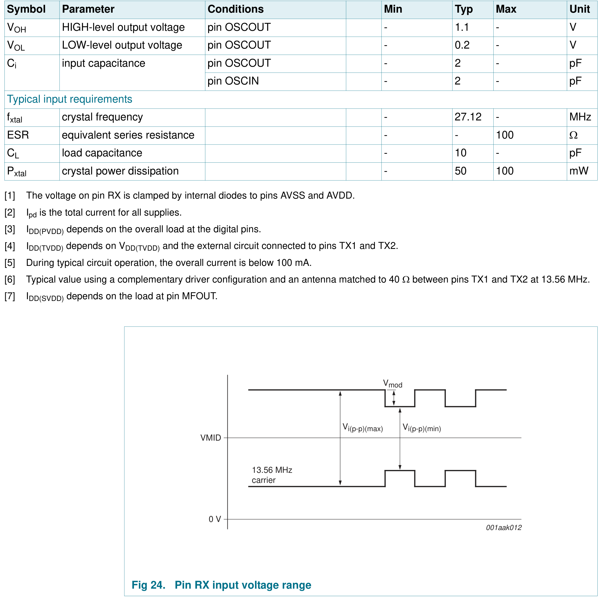

```
Voltage
   ^
   |
   +--- AVDD + 0.5V (Absolute Max limit - Internal ESD diode clamps to AVDD)
   |
   |    +-- Vi(max) ~ AVDD ----------------------------------------------------
   |    |
   |    |       _.-""""-._
   |    |     .'          `.
   |    |    /                 +----+---|----------------\----------------- VMID (AVDD / 2 ~ 1.65V Reference)
   |    |    \              /
   |    |     `.          .'
   |    |       `-......-'
   |    +-- Vi(min) ~ AVSS ----------------------------------------------------
   |
   +--- AVSS - 0.5V (Absolute Min limit - Internal ESD diode clamps to AVSS)
   |
 --+----------------------------------------------------------------------------> Time
```

#### RX Input Stage Voltage Characteristics

- **Bias Voltage ($V_{	ext{MID}}$):** Pin 16 (`VMID`) generates an internal DC reference voltage equal to $AVDD / 2 pprox 1.65	ext{ V}$. The RX pin is internally biased to $V_{	ext{MID}}$ through an on-chip resistor network.
- **Dynamic Voltage Swing ($V_{i(p-p)}$):** The peak-to-peak AC voltage of the subcarrier signal coupled onto pin `RX` must remain within the linear operating range: typically $0.1	ext{ V} \le V_{i(p-p)} \le AVDD$.
- **Clamping Limits:** Absolute maximum voltage rating on `RX` is $AVSS - 0.5	ext{ V}$ to $AVDD + 0.5	ext{ V}$. Internal antiparallel ESD protection diodes clamp excessive RF voltages to protect the receiver differential amplifier.

## 14.1 Timing characteristics

#### Table 154: SPI timing characteristics

| Symbol | Parameter | Conditions |  | Min | Typ | Max | Unit |
| --- | --- | --- | --- | --- | --- | --- | --- |
| t WL | pulse width LOW | line SCK |  | 50 | - | - | ns |
| t WH | pulse width HIGH | line SCK |  | 50 | - | - | ns |
| t h(SCKH-D) | SCK HIGH to data input hold time | SCK to changing MOSI |  | 25 | - | - | ns |

#### Table 154: SPI timing characteristics …continued

| Symbol | Parameter | Conditions |  | Min | Typ | Max | Unit |
| --- | --- | --- | --- | --- | --- | --- | --- |
| t su(D-SCKH) | data input to SCK HIGH set-up time | changing MOSI to SCK |  | 25 | - | - | ns |
| t h(SCKL-Q) | SCK LOW to data output hold time | SCK to changing MISO |  | - | - | 25 | ns |
| t (SCKL-NSSH) | SCK LOW to NSS HIGH time |  |  | 0 | - | - | ns |
| t NHNL | NSS high before communication |  |  | 50 | - | - | ns |

#### Table 155: I2C-bus timing in Fast mode

| Symbol | Parameter | Conditions | Fast mode |  | High-speed mode |  | Unit |
| --- | --- | --- | --- | --- | --- | --- | --- |
|  |  |  | Min | Max | Min | Max |  |
| f SCL | SCL clock frequency |  | 0 | 400 | 0 | 3400 | kHz |
| t HD;STA | hold time (repeated) START condition | after this period, the first clock pulse is generated | 600 | - | 160 | - | ns |
| t SU;STA | set-up time for a repeated START condition |  | 600 | - | 160 | - | ns |
| t SU;STO | set-up time for STOP condition |  | 600 | - | 160 | - | ns |
| t LOW | LOW period of the SCL clock |  | 1300 | - | 160 | - | ns |
| t HIGH | HIGH period of the SCL clock |  | 600 | - | 60 | - | ns |
| t HD;DAT | data hold time |  | 0 | 900 | 0 | 70 | ns |
| t SU;DAT | data set-up time |  | 100 | - | 10 | - | ns |
| t r | rise time | SCL signal | 20 | 300 | 10 | 40 | ns |
| t f | fall time | SCL signal | 20 | 300 | 10 | 40 | ns |
| t r | rise time | SDA and SCL signals | 20 | 300 | 10 | 80 | ns |
| t f | fall time | SDA and SCL signals | 20 | 300 | 10 | 80 | ns |
| t BUF | bus free time between a STOP and START condition |  | 1.3 | - | 1.3 | - | µs |

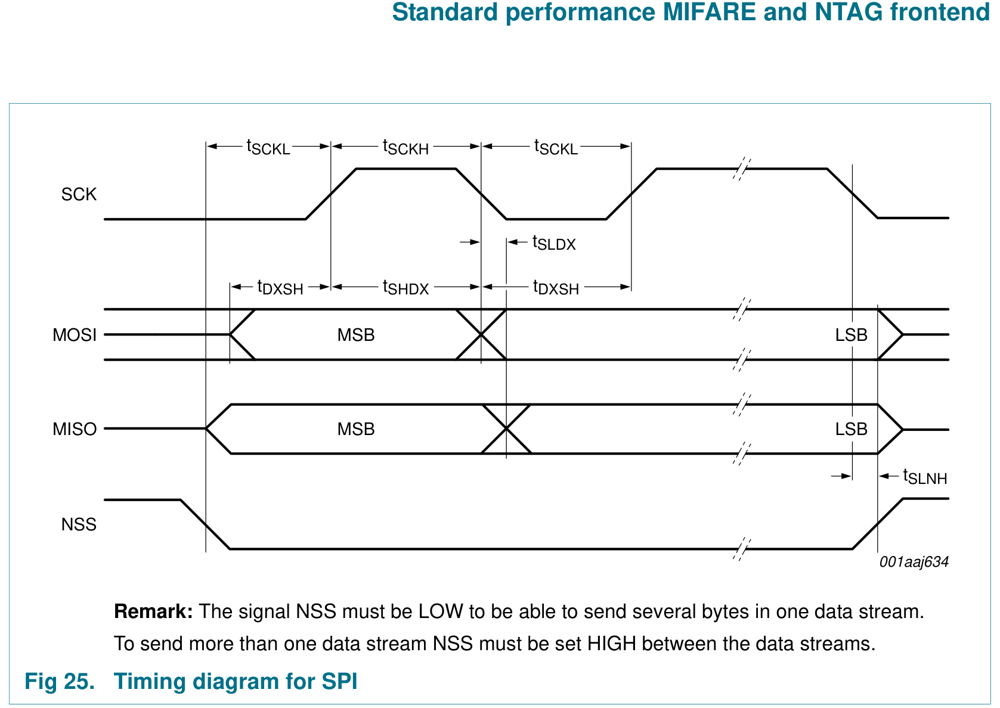

```
          |<-- tsu(NSS) -->|                                                   |<- th(NSS) ->|
NSS:   ---+                +---------------------------------------------------+             +----
          |                |                                                   |             |
                           |<-- tSCKL -->|   |<-- tSCKH -->|
SCK:   --------------------+             +---+             +--- ... -----------+-------------+
       (CPOL=0)            |             |   |             |                   |
                           |<-- tsu(D) ->|   |<-- th(D) -->|
MOSI:  --------------------+-------------+---+-------------+--- ... -------------------------+
                           |    Bit MSB      |    Bit 6    |
                           +-----------------+-------------+
                                             |<-- tv(Q) -->|                   |<-- tdis(Q) >|
MISO:  ======================================+-------------+--- ... -----------+=============+
       (High-Z)                              |   Bit MSB   |                   | (High-Z)
```

#### SPI AC Timing Specifications

| Parameter | Description | Min (ns) | Max (ns) |
| :--- | :--- | :---: | :---: |
| $t_{	ext{SCKL}}$ | SCK LOW pulse width | 40 | - |
| $t_{	ext{SCKH}}$ | SCK HIGH pulse width | 40 | - |
| $t_{	ext{su}(D)}$ | MOSI data setup time before SCK rising edge | 15 | - |
| $t_{h(D)}$ | MOSI data hold time after SCK rising edge | 15 | - |
| $t_{v(Q)}$ | MISO data valid delay time after SCK falling edge | - | 25 |
| $t_{	ext{dis}(Q)}$ | MISO disable time to High-Z following NSS rising edge | - | 25 |
| $t_{	ext{su}(NSS)}$ | NSS setup time before first rising edge of SCK | 40 | - |
| $t_{h(NSS)}$ | NSS hold time after last falling edge of SCK | 40 | - |

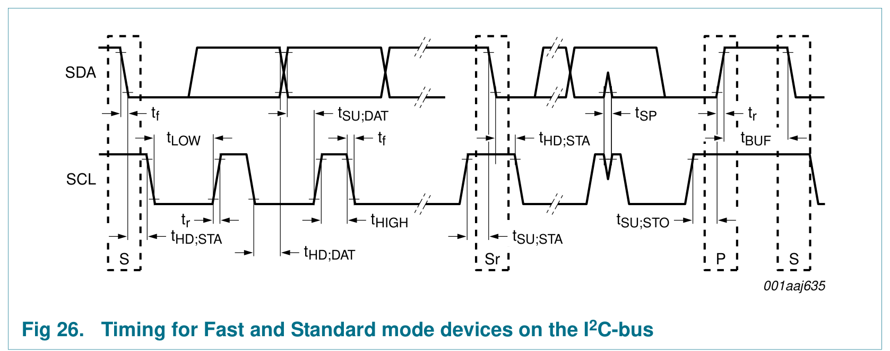

```
           |<-- tBUF -->|         |<- tf ->|      |<- tr ->|
SDA:   ----+            +---------+--------+      +--------+--------------------+---------
           |            |         |        \     /         |                               +------------+         |         +---+          |                     +--------
                        |<-tHD;STA|                        |<-- tSU;DAT ->|      |
SCL:   -----------------+         +------------------------+              +------+--------
                        |         |                        |              |      |
                        |<-tLOW ->|                        |<- tHIGH ---->|      |<-tSU;STO->|
                        |<-tf->|  |<-tr->|                 |<-tHD;DAT---->|
```

#### I2C-Bus Fast & Standard Mode Timing Parameters

| Parameter | Description | Standard Mode | Fast Mode | Unit |
| :--- | :--- | :---: | :---: | :---: |
| $f_{	ext{SCL}}$ | SCL clock frequency | 0 ~ 100 | 0 ~ 400 | kHz |
| $t_{	ext{LOW}}$ | LOW period of the SCL clock | $\ge 4.7$ | $\ge 1.3$ | $\mu$s |
| $t_{	ext{HIGH}}$ | HIGH period of the SCL clock | $\ge 4.0$ | $\ge 0.6$ | $\mu$s |
| $t_{	ext{HD;STA}}$ | Hold time (repeated) START condition | $\ge 4.0$ | $\ge 0.6$ | $\mu$s |
| $t_{	ext{SU;STA}}$ | Setup time for a repeated START condition | $\ge 4.7$ | $\ge 0.6$ | $\mu$s |
| $t_{	ext{HD;DAT}}$ | Data hold time | $\ge 0$ | $\ge 0$ | $\mu$s |
| $t_{	ext{SU;DAT}}$ | Data setup time | $\ge 250$ | $\ge 100$ | ns |
| $t_{	ext{SU;STO}}$ | Setup time for STOP condition | $\ge 4.0$ | $\ge 0.6$ | $\mu$s |
| $t_{	ext{BUF}}$ | Bus free time between STOP and START | $\ge 4.7$ | $\ge 1.3$ | $\mu$s |
| $t_{	ext{SP}}$ | Pulse width of spikes suppressed by input filter | N/A | $0 \sim 50$ | ns |

| tr tBUF |  |
| --- | --- |
|  | S |

# 15. Application information

A typical application diagram using a complementary antenna connection to the 
MFRC522 is shown in Figure 27.

The antenna tuning and RF part matching is described in the application note Ref. 1 and 
Ref. 2.

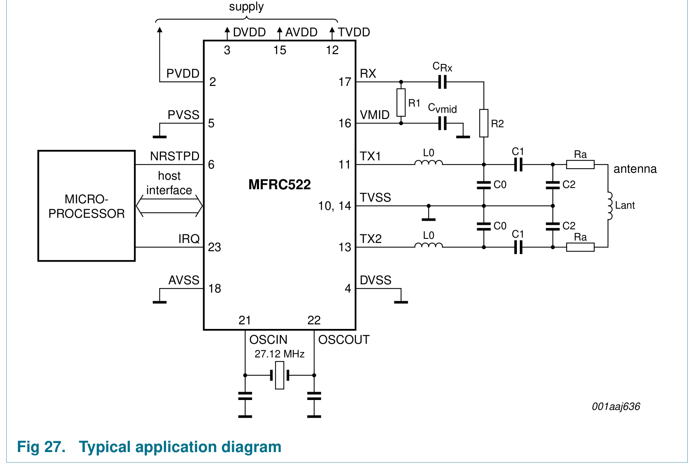

#### Complete Circuit Schematic & Component Analysis (Figure 27)

```
                       +3.3V (Supply Rails)
                     +-------+-------+
                     |       |       |
                     v DVDD  v AVDD  v TVDD
                 [3]     [15]    [12]
              +-------------------------------------------------------+
              | 2  PVDD                                          RX 17| <--+
              |                                                       |    |
              | 5  PVSS                                        VMID 16| -+ |
              |                                                       | [Cvm]|
              | 4  DVSS                                               | [100n|
              |                                                       |  | |
              | 18 AVSS                                               | GND|
              |                                                       |    |
              | 1  I2C (Mode select)                                  |    |
              | 32 EA  (Mode select)                                  |    |
              |                                                       |    |
              | 6  NRSTPD                                      OSCIN 21| -+ |
              | 23 IRQ                                                |  | |
              | 24 SDA/NSS/RX                                 OSCOUT 22| -+ |
              | 29 D5/SCK                                             |  | |
              | 30 D6/MOSI/TX                                         |  | |
              | 31 D7/MISO                                            |  | |
              |                                                       |  | |
              | 11 TVSS                                        TX1 10| -+ |
              | 13 TVSS                                        TX2 14| --+ |
              +-------------------------------------------------------+  | |
                                                                         | |
   TX Filtering & Antenna Matching Network:                              | |
                                                                         | |
   TX1 (Pin 10) ---+---[ L1: 1.0uH ]---+---[ C1: 27pF ]---+------------+ |
                   |                   |                  |             | |
                  ---                 ---                [Cp: 180pF]    | |
              C01 ---             C21 ---                 |             | |
                  --- 100pF           --- 220pF          GND            | |
                   |                   |                                | |
                  GND                 GND                ANTENNA COIL   | |
                                                          (13.56 MHz    | |
   TX2 (Pin 14) ---+---[ L2: 1.0uH ]---+---[ C2: 27pF ]--+   Loop)     | |
                   |                   |                  |             | |
                  ---                 ---                [Cp: 180pF]    | |
              C02 ---             C22 ---                 |             | |
                  --- 100pF           --- 220pF          GND            | |
                   |                   |                  |             | |
                  GND                 GND                 +-------------+ |
                                                          |               |
   RX Demodulator Voltage Divider Network:                |               |
                                                          |               |
   Antenna Return Node -----------------------------------+---[ R1: 1k0 ]-+
                                                                  |
                                                                 ---
                                                             C3  --- 10pF
                                                                 ---
                                                                  |
                                                                 GND
```

#### Detailed Bill of Materials (BOM) & Passive Network Functions

1. **EMC Low-Pass Filter ($L_1, C_{01}, L_2, C_{02}$):**
   - $L_1, L_2 = 1.0\ \mu	ext{H}$ (high-current RF inductors, $I_{	ext{sat}} \ge 250	ext{ mA}$).
   - $C_{01}, C_{02} = 100	ext{ pF}$ (NP0/C0G ceramic, 50V).
   - Second-order Butterworth low-pass filter with cut-off frequency $f_{	ext{cut}} pprox 14.5	ext{ MHz}$. Suppresses higher harmonics of the 13.56 MHz square-wave driver output to comply with CE/FCC electromagnetic compatibility regulations.
2. **Impedance Matching & DC Blocking ($C_1, C_2, C_{21}, C_{22}$):**
   - Series capacitors $C_1, C_2 = 27	ext{ pF}$; Parallel capacitors $C_{21}, C_{22} = 220	ext{ pF}$.
   - Transforms the inductive antenna impedance ($Z_{	ext{ant}} pprox 1.5\ \mu	ext{H} + 1.2\ \Omega$) into a symmetrical differential load matching the optimum driver impedance ($R_{	ext{match}} pprox 30\ \Omega$ to $50\ \Omega$).
3. **Antenna Coil Tuning ($C_p$):**
   - Resonant parallel capacitors $C_p = 180	ext{ pF}$ (C0G dielectric). Resonates the PCB track loop antenna at $13.56	ext{ MHz} \pm 100	ext{ kHz}$.
4. **RX Demodulation Feedback Network ($R_1, C_3$):**
   - Resistor divider $R_1 = 1.0	ext{ k}\Omega$ and filtering capacitor $C_3 = 10	ext{ pF}$ pick up the card's subcarrier load modulation directly from the antenna node.
   - Attenuates the carrier voltage swing to stay safely within the linear input range ($V_{i(p-p)} \le AVDD$) centered at $V_{	ext{MID}}$.
5. **Decoupling Capacitors:**
   - $C_{	ext{VMID}} = 100	ext{ nF}$ low-ESR ceramic connected between pin 16 (`VMID`) and `AVSS` to stabilize the internal demodulator analog bias voltage.
   - $100	ext{ nF} + 10\ \mu	ext{F}$ decoupling capacitors on `DVDD`, `AVDD`, and `TVDD` rails located immediately adjacent to IC package pins.

# 16. Test information

## 16.1 Test signals

### 16.1.1 Self test

The MFRC522 has the capability to perform a digital self test. The self test is started by 
using the following procedure:

1. Perform a soft reset.

2. Clear the internal buffer by writing 25 bytes of 00h and implement the Config 
command.

3. Enable the self test by writing 09h to the AutoTestReg register.

4. Write 00h to the FIFO buffer.

5. Start the self test with the CalcCRC command.

6. The self test is initiated.

7. When the self test has completed, the FIFO buffer contains the following 64 bytes:

FIFO buffer byte values for MFRC522 version 1.0:

00h, C6h, 37h, D5h, 32h, B7h, 57h, 5Ch,
C2h, D8h, 7Ch, 4Dh, D9h, 70h, C7h, 73h,
10h, E6h, D2h, AAh, 5Eh, A1h, 3Eh, 5Ah,
14h, AFh, 30h, 61h, C9h, 70h, DBh, 2Eh,
64h, 22h, 72h, B5h, BDh, 65h, F4h, ECh,
22h, BCh, D3h, 72h, 35h, CDh, AAh, 41h,
1Fh, A7h, F3h, 53h, 14h, DEh, 7Eh, 02h,
D9h, 0Fh, B5h, 5Eh, 25h, 1Dh, 29h, 79h

FIFO buffer byte values for MFRC522 version 2.0:

00h, EBh, 66h, BAh, 57h, BFh, 23h, 95h,
D0h, E3h, 0Dh, 3Dh, 27h, 89h, 5Ch, DEh,
9Dh, 3Bh, A7h, 00h, 21h, 5Bh, 89h, 82h, 
51h, 3Ah, EBh, 02h, 0Ch, A5h, 00h, 49h, 
7Ch, 84h, 4Dh, B3h, CCh, D2h, 1Bh, 81h,
5Dh, 48h, 76h, D5h, 71h, 061h, 21h, A9h,
86h, 96h, 83h, 38h, CFh, 9Dh, 5Bh, 6Dh, 
DCh, 15h, BAh, 3Eh, 7Dh, 95h, 03Bh, 2Fh

### 16.1.2 Test bus

The test bus is used for production tests. The following configuration can be used to 
improve the design of a system using the MFRC522. The test bus allows internal signals 
to be routed to the digital interface. The test bus comprises two sets of test signals which 
are selected using their subaddress specified in the TestSel2Reg register’s 
TestBusSel[4:0] bits. The test signals and their related digital output pins are described in 
Table 156 and Table 157.

#### Table 156: Test bus signals: TestBusSel[4:0] = 07h

| Pins | Internal signal name | Description |
| --- | --- | --- |
| D6 | s data _ | received data stream |
| D5 | s coll _ | bit-collision detected (106 kBd only) |
| D4 | s valid _ | s data and s coll signals are valid _ _ |
| D3 | s over _ | receiver has detected a stop condition |
| D2 | RCV reset _ | receiver is reset |
| D1 | - | reserved |

#### Table 157: Test bus signals: TestBusSel[4:0] = 0Dh

| Pins | Internal test signal name | Description |
| --- | --- | --- |
| D6 | clkstable | oscillator output signal |
| D5 | clk27/8 | oscillator output signal divided by 8 |
| D4 to D3 | - | reserved |
| D2 | clk27 | oscillator output signal |
| D1 | - | reserved |

### 16.1.3 Test signals on pins AUX1 or AUX2

The MFRC522 allows the user to select internal signals for measurement on pins AUX1 or 
AUX2. These measurements can be helpful during the design-in phase to optimize the 
design or used for test purposes.

Table 158 shows the signals that can be switched to pin AUX1 or AUX2 by setting 
AnalogSelAux1[3:0] or AnalogSelAux2[3:0] in the AnalogTestReg register.

Remark: The DAC has a current output, therefore it is recommended that a 1 k Ω 
pull-down resistor is connected to pin AUX1 or AUX2.

#### Table 158: Test signal descriptions

| AnalogSelAux1[3:0] or AnalogSelAux2[3:0] value | Signal on pin AUX1 or pin AUX2 |
| --- | --- |
| 0000 | 3-state |
| 0001 | DAC: register TestDAC1 or TestDAC2 |
| 0010 | DAC: test signal Corr1 |
| 0011 | reserved |
| 0100 | DAC: test signal MinLevel |
| 0101 | DAC: test signal ADC I _ |
| 0110 | DAC: test signal ADC Q _ |
| 0111 to 1001 | reserved |
| 1010 | HIGH |
| 1011 | LOW |
| 1100 | TxActive |

#### Table 158: Test signal descriptions …continued

| AnalogSelAux1[3:0] or AnalogSelAux2[3:0] value | Signal on pin AUX1 or pin AUX2 |
| --- | --- |
| 1101 | RxActive |
| 1110 | subcarrier detected |
| 1111 | TstBusBit |

#### 16.1.3.1 Example: Output test signals TestDAC1 and TestDAC2

The AnalogTestReg register is set to 11h. The output on pin AUX1 has the test signal 
TestDAC1 and the output on pin AUX2 has the test signal TestDAC2. The signal values of 
TestDAC1 and TestDAC2 are controlled by the TestDAC1Reg and TestDAC2Reg 
registers.

Figure 28 shows test signal TestDAC1 on pin AUX1 and TestDAC2 on pin AUX2 when the 
TestDAC1Reg register is programmed with a slope defined by values 00h to 3Fh and the 
TestDAC2Reg register is programmed with a rectangular signal defined by values 00h 
and 3Fh.

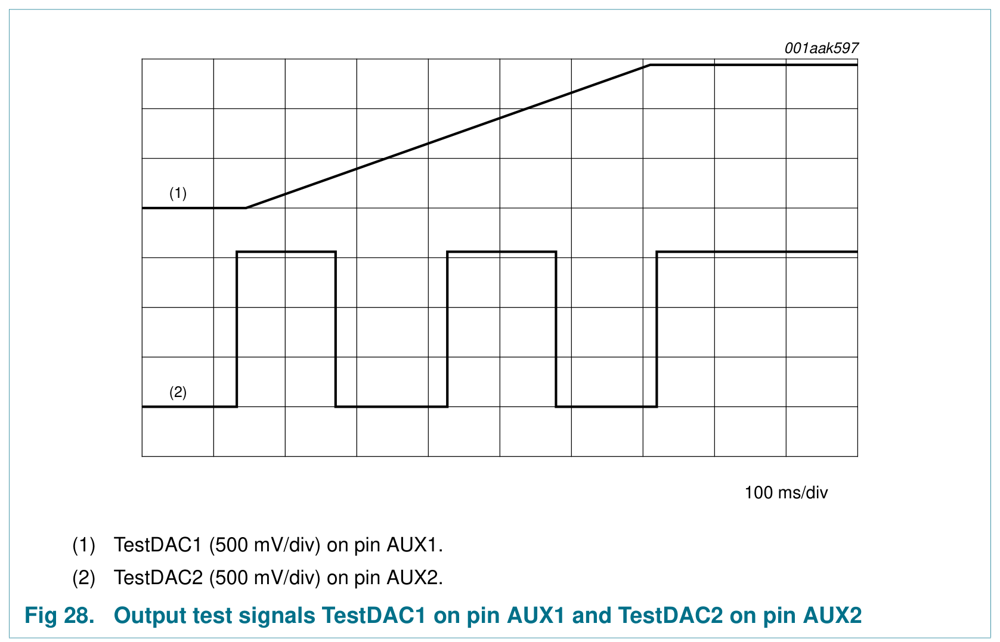

```
Voltage
   ^
   |  Trace 1 (Pin AUX1 - TestDAC1: 500 mV/div):
   |  Staircase slope waveform from 00h (0.0 V) to 3Fh (~1.65 V)
   |                .---|
   |            .---|
   |        .---|
   |    .---|
   +----+----------------------------------------------------------------------->
   |  Trace 2 (Pin AUX2 - TestDAC2: 500 mV/div):
   |  Square wave switching between 00h (0.0 V) and 3Fh (~1.65 V)
   |    +-------+       +-------+       +-------+
   |    |       |       |       |       |       |
   +----+       +-------+       +-------+       +-------------------------------> Time
   |<--------- 100 ms/div --------->|
```

#### TestDAC Diagnostic Waveforms

- **Test Mode Configuration:** Activated by writing `11h` to register `AnalogTestReg` (61h). Pin `AUX1` outputs analog diagnostic signal `TestDAC1`; pin `AUX2` outputs `TestDAC2`.
- **Signal Control:**
  - `TestDAC1Reg` (64h) programmed with sequential values from `00h` to `3Fh` produces a linear staircase ramp (64 discrete voltage levels from $0	ext{ V}$ to $V_{	ext{MID}} pprox 1.65	ext{ V}$).
  - `TestDAC2Reg` (65h) programmed alternating between `00h` and `3Fh` produces a precision square wave with 500 mV/div amplitude.
- **Purpose:** Verifies on-chip digital-to-analog converter (DAC) linearity and external oscilloscope calibration without requiring active RF communication.

| (1) |  |  |  |  |  |  |  |  |  |  |  |  |  |  |
| --- | --- | --- | --- | --- | --- | --- | --- | --- | --- | --- | --- | --- | --- | --- |
| (2) |  |  |  |  |  |  |  |  |  |  |  |  |  |  |

#### 16.1.3.2 Example: Output test signals Corr1 and MinLevel

Figure 29 shows test signals Corr1 and MinLevel on pins AUX1 and AUX2, respectively. 
The AnalogTestReg register is set to 24h.

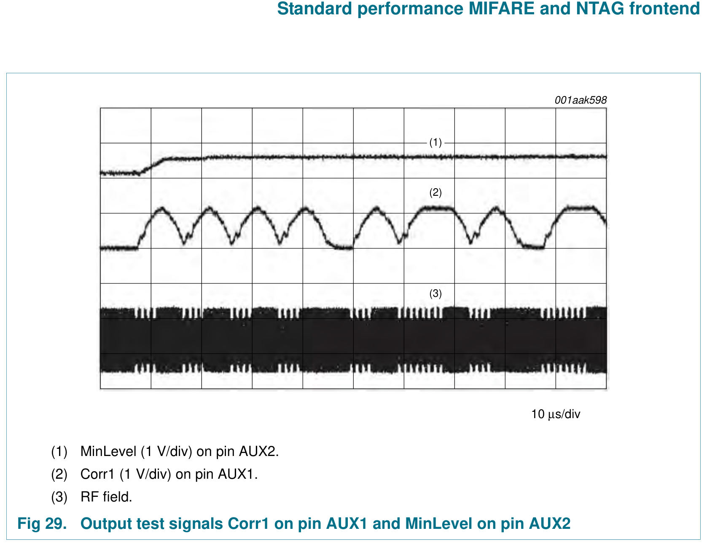

```
Voltage
   ^
   |  Trace 1 (Pin AUX2 - MinLevel: 1 V/div):
   |  ------------------------------------------------ (Internal Squelch Threshold Level)
   |
   |  Trace 2 (Pin AUX1 - Corr1: 1 V/div):
   |         /\              /\              /   |        /  \            /  \            /  \        (Demodulated Correlator Output Pulses)
   +-------+----+----------+----+----------+----+------------------------------->
   |
   |  Trace 3 (RF Field Carrier Envelope):
   |    ||||||||||||||||  ||||||||||||||||  |||||||||||||||| (13.56 MHz Carrier with Load Mod)
   +----------------------------------------------------------------------------> Time
   |<---------- 10 us/div ---------->|
```

#### Correlator Output & Threshold Analysis

- **Configuration:** Register `AnalogTestReg` (61h) programmed to test correlator performance.
- **Trace 1 (AUX2 - MinLevel):** DC reference threshold voltage programmed via register `RxThresholdReg` (18h) bitfield `MinLevel[3:0]`. Signals with correlation peak below this line are rejected as noise.
- **Trace 2 (AUX1 - Corr1):** Output of internal matched filter / correlator. Exhibits clean correlation peaks exceeding the MinLevel threshold whenever valid subcarrier pulses arrive from the transponder.
- **Trace 3 (RF Field):** Shows 13.56 MHz carrier envelope modulated by card load switching ($848	ext{ kHz}$ subcarrier bursts).

|  |  |  |  |  |  | (1) |  |  |  |
| --- | --- | --- | --- | --- | --- | --- | --- | --- | --- |
|  |  |  |  |  |  | (2) |  |  |  |
|  |  |  |  |  |  | (3) |  |  |  |

#### 16.1.3.3 Example: Output test signals ADC channel I and ADC channel Q

Figure 30 shows the channel behavior test signals ADC_I and ADC_Q on pins AUX1 and 
AUX2, respectively. The AnalogTestReg register is set to 56h.

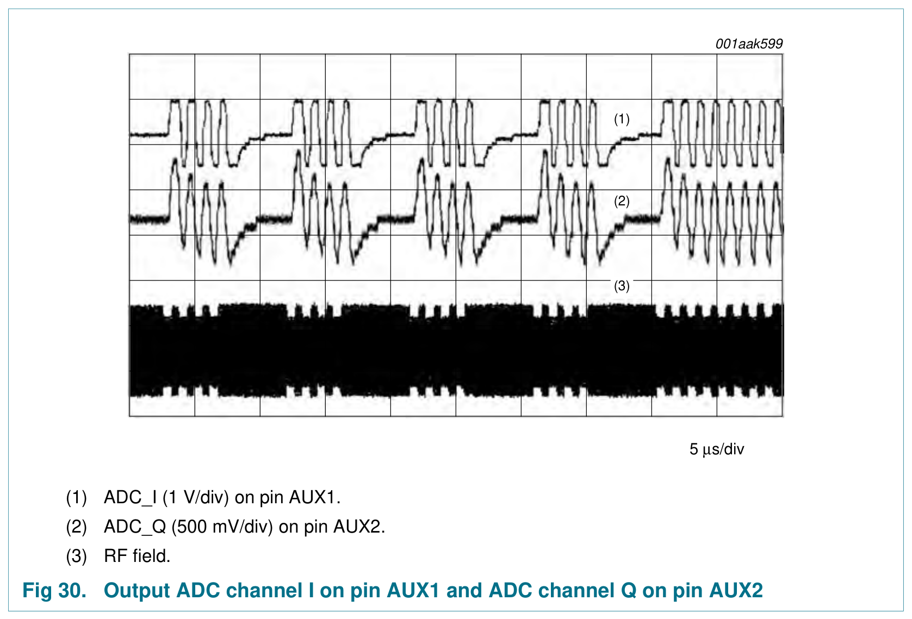

```
Voltage
   ^
   |  Trace 1 (Pin AUX1 - ADC_I: 1 V/div):
   |         /\              /\              /   |        /  \            /  \            /  \        (In-Phase Demodulated Baseband)
   +-------+----+----------+----+----------+----+------------------------------->
   |
   |  Trace 2 (Pin AUX2 - ADC_Q: 500 mV/div):
   |           /\              /\              /   |          /  \            /  \            /  \      (Quadrature Demodulated Baseband, 90 deg phase)
   +---------+----+----------+----+----------+----+----------------------------->
   |
   |  Trace 3 (RF Field Envelope):
   |    ||||||||||||||||  ||||||||||||||||  |||||||||||||||| (Subcarrier Load Modulation)
   +----------------------------------------------------------------------------> Time
   |<---------- 5 us/div ---------->|
```

#### In-Phase (I) & Quadrature (Q) Demodulation Analysis

- **Configuration:** Register `AnalogTestReg` (61h) set to `56h`.
- **I/Q Channels:** Quadrature downconversion ensures robust reception regardless of the tag antenna phase angle relative to the reader carrier:
  - `ADC_I` (Trace 1 on `AUX1`): In-phase channel baseband output.
  - `ADC_Q` (Trace 2 on `AUX2`): Quadrature channel baseband output, shifted 90 degrees in phase relative to channel I.
- **Vector Demodulation:** By combining $I$ and $Q$ channels mathematically ($\sqrt{I^2 + Q^2}$), the receiver decodes card responses reliably even at zero-crossings of either individual channel.

|  |  |  |  |  |  |  | (1) |  |  |
| --- | --- | --- | --- | --- | --- | --- | --- | --- | --- |
|  |  |  |  |  |  |  | (2) |  |  |
|  |  |  |  |  |  |  | (3) |  |  |

#### 16.1.3.4 Example: Output test signals RxActive and TxActive

Figure 31 shows the RxActive and TxActive test signals relating to RF communication. 
The AnalogTestReg register is set to CDh.

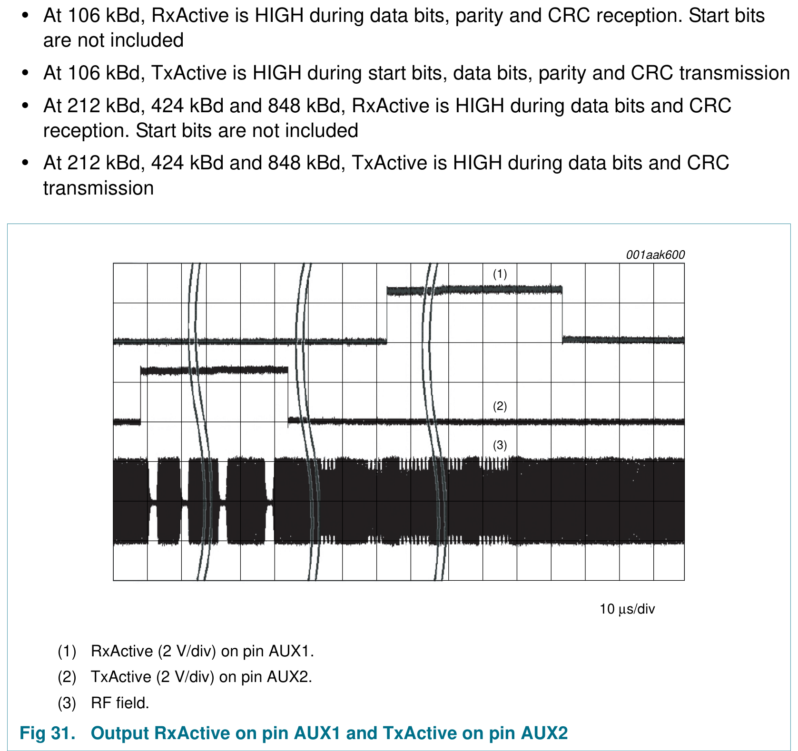

```
Logic Level
   ^
   |  Trace 1 (Pin AUX1 - RxActive: 2 V/div):
   |                                            +---------------------+
   |  LOW (Not receiving)                       | HIGH (Receiving PICC| LOW
   +--------------------------------------------+       Frame)        +--------->
   |
   |  Trace 2 (Pin AUX2 - TxActive: 2 V/div):
   |    +---------------------+
   |    | HIGH (Transmitting  | LOW (Not transmitting)
   +----+       PCD Frame)    +------------------------------------------------->
   |
   |  Trace 3 (13.56 MHz RF Field Carrier Activity):
   |    |  Transmitter Burst  |      Listening Window (Tag Response)  |
   |    |||||||||||||||||||||||.......................................|
   +----------------------------------------------------------------------------> Time
   |<---------- 10 us/div ---------->|
```

#### RxActive & TxActive Signal Operation

- **TxActive (Pin AUX2):**
  - At 106 kBd: Driven HIGH during transmission of start bits, data bits, parity bits, and CRC bytes.
  - Returns LOW during carrier pauses and reception listening intervals.
- **RxActive (Pin AUX1):**
  - At 106 kBd: Driven HIGH during active reception of data bits, parity bits, and CRC bytes from transponder (start bit is excluded).
  - At 212 kBd, 424 kBd, 848 kBd: Driven HIGH during data bits and CRC reception.
- **Protocol Timing Verification:** Allows precise oscilloscope measurement of frame turnaround time ($FDT$) and transponder response time without loading RF matching nodes.

|  |  |  |  |  |  |  |  |  |  |  | (1) |  |  |  |  |  |
| --- | --- | --- | --- | --- | --- | --- | --- | --- | --- | --- | --- | --- | --- | --- | --- | --- |
|  |  |  |  |  |  |  |  |  |  |  | (2) |  |  |  |  |  |
|  |  |  |  |  |  |  |  |  |  |  | (3) |  |  |  |  |  |

#### 16.1.3.5 Example: Output test signal RX data stream

Figure 32 shows the data stream that is currently being received. The TestSel2Reg 
register’s TestBusSel[4:0] bits are set to 07h to enable test bus signals on pins D1 to D6; 
see Section 16.1.2 on page 82. The TestSel1Reg register’s TstBusBitSel[2:0] bits are set 
to 06h (pin D6 = s_data) and AnalogTestReg register is set to FFh (TstBusBit) which 
outputs the received data stream on pins AUX1 and AUX2.

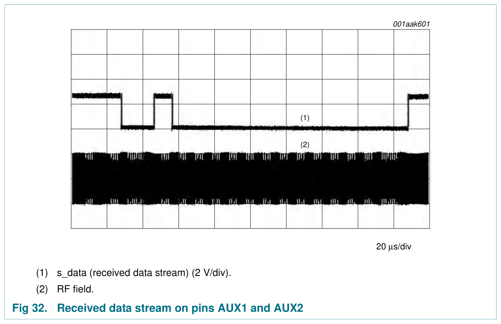

```
Signal
   ^
   |  Trace 1 (Pin AUX1/AUX2 - s_data: 2 V/div):
   |  Recovered digital bitstream after filtering, demodulation, and bit slicing:
   |      +---+       +---+---+       +---+
   |      |   |       |   |   |       |   |
   +------+   +-------+   +---+-------+   +------------------------------------->
   |
   |  Trace 2 (RF Field Envelope):
   |  Modulated 13.56 MHz carrier exhibiting transponder subcarrier load absorption:
   |    ||||||||||||||||  ||||||||||||||||  ||||||||||||||||
   +----------------------------------------------------------------------------> Time
   |<---------- 20 us/div ---------->|
```

#### Recovered Data Stream (`s_data`) Characteristics

- **Signal Source:** Internal bit decoder output routed to pins `AUX1` / `AUX2` via register `TestSel2Reg` (32h).
- **Function:** Represents the fully digitized baseband binary data stream after all analog filtering, correlation, automatic gain control (AGC), and threshold slicing.
- **Diagnostic Use:** Allows firmware engineers to verify parity errors, bit-framing timing, and collision bit indices directly on a logic analyzer before reading the FIFO.

|  |  |  |  |  |  | (1) |  |  |  |
| --- | --- | --- | --- | --- | --- | --- | --- | --- | --- |
|  |  |  |  |  |  | (2) |  |  |  |

#### 16.1.3.6 PRBS

The pseudo-random binary sequences PRBS9 and PRBS15 are based on ITU-TO150 
and are defined with the TestSel2Reg register. Transmission of either data stream is 
started by the Transmit command. The preamble/sync byte/start bit/parity bit are 
automatically generated depending on the mode selected.

Remark: All relevant registers for transmitting data must be configured in accordance with 
ITU-TO150 before selecting PRBS transmission.

# 17. Package outline

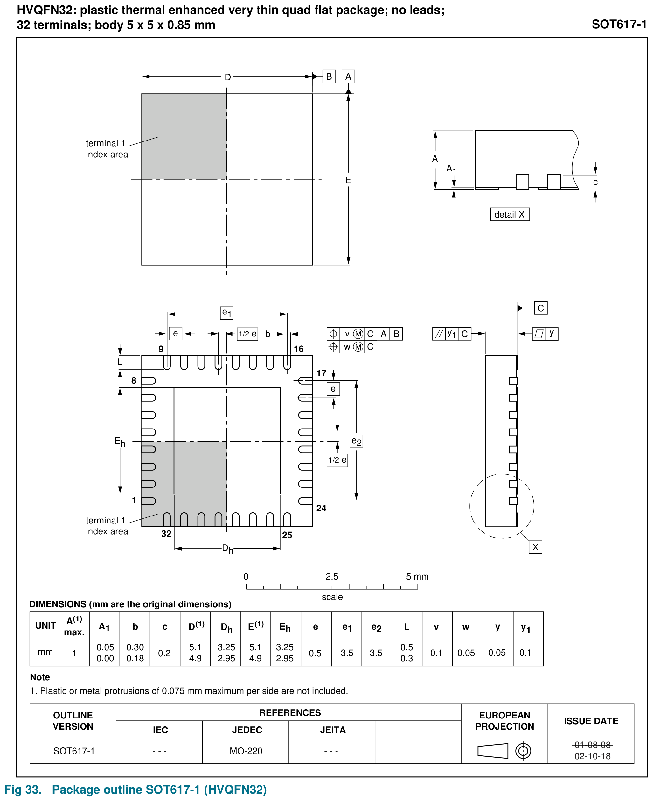

#### Package Mechanical Dimensions (HVQFN32 - SOT617-1)

| Symbol | Min (mm) | Nom (mm) | Max (mm) | Description |
| :--- | :---: | :---: | :---: | :--- |
| **A** | 0.80 | 0.85 | 1.00 | Overall package height |
| **A1** | 0.00 | 0.02 | 0.05 | Standoff height |
| **b** | 0.18 | 0.25 | 0.30 | Terminal pin width |
| **c** | - | 0.20 | - | Lead frame thickness |
| **D** | 4.90 | 5.00 | 5.10 | Package body length ($X$) |
| **Dh** | 3.10 | 3.25 | 3.40 | Exposed thermal pad length ($D_h$) |
| **E** | 4.90 | 5.00 | 5.10 | Package body width ($Y$) |
| **Eh** | 3.10 | 3.25 | 3.40 | Exposed thermal pad width ($E_h$) |
| **e** | - | 0.50 | - | Terminal pitch |
| **L** | 0.30 | 0.40 | 0.50 | Terminal pin contact length |

```
                       D = 5.00 mm
              +----------------------------+
              |   32  31  30  29 ... 25    |
            1 | [ ]                      [ ] | 24
            2 | [ ]    +---------------+ [ ] | 23
            3 | [ ]    |  Exposed Pad  | [ ] | 22
            4 | [ ]    |  Dh = 3.25 mm | [ ] | 21   E = 5.00 mm
            5 | [ ]    |  Eh = 3.25 mm | [ ] | 20
            6 | [ ]    |  (Connect to  | [ ] | 19
            7 | [ ]    |    GND/VSS)   | [ ] | 18
            8 | [ ]    +---------------+ [ ] | 17
              |    9  10  11  12 ... 16    |
              +----------------------------+
                       Pitch e = 0.50 mm
```

#### PCB Land Pattern & Thermal Guidelines

- **Exposed Die Pad (Flag):** The central exposed thermal die pad (size $3.25	ext{ mm} 	imes 3.25	ext{ mm}$) MUST be soldered directly to the PCB ground plane (`DVSS`/`AVSS`) using an array of at least $3 	imes 3$ thermal vias ($0.3	ext{ mm}$ drill diameter) to ensure low thermal resistance and low ground impedance for RF currents.

|  | M w M | C C |
| --- | --- | --- |

|  | e |
| --- | --- |

| UNIT | A(1) max. | A1 | b | c | D(1) | Dh | E(1) | Eh | e | e1 | e2 | L | v | w | y | y1 |
| --- | --- | --- | --- | --- | --- | --- | --- | --- | --- | --- | --- | --- | --- | --- | --- | --- |
| mm | 1 | 0.05 0.00 | 0.30 0.18 | 0.2 | 5.1 4.9 | 3.25 2.95 | 5.1 3 4.9 2 | .25 .95 | 0.5 | 3.5 | 3.5 | 0.5 0.3 | 0.1 | 0.05 | 0.05 | 0.1 |

| OUTLINE VERSION | REFERENCES |  |  |  | EUROPEAN PROJECTION | ISSUE DATE |
| --- | --- | --- | --- | --- | --- | --- |
|  | IEC | JEDEC | JEITA |  |  |  |
| SOT617-1 | - - - | MO-220 | - - - |  |  | 01-08-08 02-10-18 |

Detailed package information can be found at: 
http://www.nxp.com/package/SOT617-1.html.

# 18. Handling information

Moisture Sensitivity Level (MSL) evaluation has been performed according to 
SNW-FQ-225B rev.04/07/07 (JEDEC J-STD-020C). MSL for this package is level 1 which 
means 260 °C convection reflow temperature.

Dry pack is not required.

Unlimited out-of-pack floor life at maximum ambient 30 °C/85 % RH.

# 19. Packing information

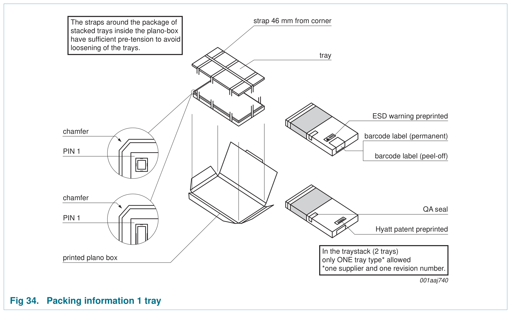

```
+-------------------------------------------------------------------------------+
| +---+                                                                         |
| | / | <-- PIN 1 Tray Chamfer (Orientation Reference)                          |
| +---+                                                                         |
|       +-------------------------------------------------------------+         |
|       |  [ ]  [ ]  [ ]  [ ]  [ ]  [ ]  [ ]  [ ]  [ ]  [ ]  [ ]  [ ] |         |
|       |  [ ]  [ ]  [ ]  [ ]  [ ]  [ ]  [ ]  [ ]  [ ]  [ ]  [ ]  [ ] |         |
|       |  [ ]  [ ]  [ ]  [ ]  [ ]  [ ]  [ ]  [ ]  [ ]  [ ]  [ ]  [ ] |         |
|       |  [ ]  [ ]  [ ]  [ ]  [ ]  [ ]  [ ]  [ ]  [ ]  [ ]  [ ]  [ ] |         |
|       |  [ ]  [ ]  [ ]  [ ]  [ ]  [ ]  [ ]  [ ]  [ ]  [ ]  [ ]  [ ] |         |
|       +-------------------------------------------------------------+         |
|                                                                               |
|   Strap Location: 46 mm from corner                                           |
|   Labels:                                                                     |
|   [ ESD Warning Label ]   [ Barcode Label (Permanent) ]                       |
|   [ QA Inspection Seal ]  [ Barcode Label (Peel-Off)  ]                       |
+-------------------------------------------------------------------------------+
```

#### Packaging, Dry Pack & Storage Specifications

- **Tray Format:** Matrix tray for SOT617-1 (HVQFN32) packages. Pocket count: standard JEDEC matrix tray.
- **Pin 1 Orientation:** Chamfer located at upper-left corner establishes device pin 1 orientation for automated pick-and-place equipment.
- **Moisture Sensitivity Level (MSL):** MSL 1 or MSL 2 classification according to IPC/JEDEC J-STD-020D. Devices are packed in vacuum-sealed moisture barrier bags (MBB) with desiccant and humidity indicator card (HIC).
- **Banding:** Two plastic straps wrapped around stacked trays positioned exactly 46 mm from tray corners with specified pre-tension to prevent vibration damage during transit.

# 20. Abbreviations

#### Table 159: Abbreviations

| Acronym | Description |
| --- | --- |
| ADC | Analog-to-Digital Converter |
| BPSK | Binary Phase Shift Keying |
| CRC | Cyclic Redundancy Check |
| CW | Continuous Wave |
| DAC | Digital-to-Analog Converter |
| HBM | Human Body Model |
| I2C | Inter-integrated Circuit |
| LSB | Least Significant Bit |
| MISO | Master In Slave Out |
| MM | Machine Model |
| MOSI | Master Out Slave In |
| MSB | Most Significant Bit |
| NRZ | Not Return to Zero |
| NSS | Not Slave Select |
| PLL | Phase-Locked Loop |
| PRBS | Pseudo-Random Bit Sequence |
| RX | Receiver |
| SOF | Start Of Frame |
| SPI | Serial Peripheral Interface |
| TX | Transmitter |
| UART | Universal Asynchronous Receiver Transmitter |

# 21. References

[1]
Application note  — MFRC52x Reader IC Family Directly Matched Antenna 
Design

[2]
Application note  — MIFARE (ISO/IEC 14443 A) 13.56 MHz RFID Proximity 
Antennas

# 22. Revision history

#### Table 160: Revision history

| Document ID | Release date | Data sheet status | Change notice | Supersedes |
| --- | --- | --- | --- | --- |
| MFRC522 v.3.9 | 20160427 | Product data sheet | - | MFRC522 v.3.8 |
| Modifications: | • Section 1 “Introduction” and Section 2 “General description”: updated and NTAG functionality added • Descriptive title updated |  |  |  |
| MFRC522 v.3.8 | 20140917 | Product data sheet | - | MFRC522 v.3.7 |
| Modifications: | • Table 150 “Limiting values”: updated |  |  |  |
| MFRC522 v.3.7 | 20140326 | Product data sheet | - | MFRC522 v.3.6 |
| Modifications: | • Change of descriptive title • Section 23.4 “Licenses” removed |  |  |  |
| MFRC522 v.3.6 | 20111214 | Product data sheet | - | MFRC522 35 _ |
| Modifications: | • Section 1.1 “Differences between version 1.0 and 2.0” on page 1: added • Table 2 “Ordering information” on page 3: updated • Section 9.3.2.10 “DemodReg register” on page 53: register updated and add reference to Timer unit • Section 8.5 “Timer unit” on page 31: Pre Scaler Information for version 2.0 added • Section 9.3.4.8 “VersionReg register” on page 66: version information structured in chip information and version information updated, including version 1.0 and 2.0 • Section 16.1 “Test signals” on page 82: selftest result including values for version 1.0 and 2.0 |  |  |  |
| MFRC522 35 _ | 20100621 | Product data sheet |  | MFRC522 34 _ |
| Modifications: | • Section 9.3.2.10 “DemodReg register” on page 53: register updated • Section 9.3.3.10 “TModeReg and TPrescalerReg registers” on page 60: register updated • Section 8.5 “Timer unit” on page 31: timer calculation updated • Section 9.3.4.8 “VersionReg register” on page 66: version B2h updated • Section 16.1 “Test signals” on page 82: selftest result updated |  |  |  |
| MFRC522 34 _ | 20100305 | Product data sheet |  | MFRC522 33 _ |
| Modifications: | • Section 8.5 “Timer unit”: information added • Table 106 “TModeReg register bit descriptions”: bit 7 updated • Table 154 “SPI timing characteristics”: row added |  |  |  |
| MFRC522 33 _ | 20091026 | Product data sheet | - | 112132 |

# 23. Legal information

## 23.1 Data sheet status

| Document status[1][2] | Product status[3] | Definition |
| --- | --- | --- |
| Objective [short] data sheet | Development | This document contains data from the objective specification for product development. |
| Preliminary [short] data sheet | Qualification | This document contains data from the preliminary specification. |
| Product [short] data sheet | Production | This document contains the product specification. |

[1]
Please consult the most recently issued document before initiating or completing a design.

[2]
The term ‘short data sheet’ is explained in section “Definitions”.

[3]
The product status of device(s) described in this document may have changed since this document was published and may differ in case of multiple devices. The latest product status 
information is available on the Internet at URL http://www.nxp.com.

## 23.2 Definitions

Suitability for use — NXP Semiconductors products are not designed, 
authorized or warranted to be suitable for use in life support, life-critical or 
safety-critical systems or equipment, nor in applications where failure or 
malfunction of an NXP Semiconductors product can reasonably be expected 
to result in personal injury, death or severe property or environmental 
damage. NXP Semiconductors and its suppliers accept no liability for 
inclusion and/or use of NXP Semiconductors products in such equipment or 
applications and therefore such inclusion and/or use is at the customer’s own 
risk.

Draft — The document is a draft version only. The content is still under 
internal review and subject to formal approval, which may result in 
modifications or additions. NXP Semiconductors does not give any 
representations or warranties as to the accuracy or completeness of 
information included herein and shall have no liability for the consequences of 
use of such information.

Short data sheet — A short data sheet is an extract from a full data sheet 
with the same product type number(s) and title. A short data sheet is intended 
for quick reference only and should not be relied upon to contain detailed and 
full information. For detailed and full information see the relevant full data 
sheet, which is available on request via the local NXP Semiconductors sales 
office. In case of any inconsistency or conflict with the short data sheet, the 
full data sheet shall prevail.

Applications — Applications that are described herein for any of these 
products are for illustrative purposes only. NXP Semiconductors makes no 
representation or warranty that such applications will be suitable for the 
specified use without further testing or modification.

Customers are responsible for the design and operation of their applications 
and products using NXP Semiconductors products, and NXP Semiconductors 
accepts no liability for any assistance with applications or customer product 
design. It is customer’s sole responsibility to determine whether the NXP 
Semiconductors product is suitable and fit for the customer’s applications and 
products planned, as well as for the planned application and use of 
customer’s third party customer(s). Customers should provide appropriate 
design and operating safeguards to minimize the risks associated with their 
applications and products.

Product specification — The information and data provided in a Product 
data sheet shall define the specification of the product as agreed between 
NXP Semiconductors and its customer, unless NXP Semiconductors and 
customer have explicitly agreed otherwise in writing. In no event however, 
shall an agreement be valid in which the NXP Semiconductors product is 
deemed to offer functions and qualities beyond those described in the 
Product data sheet.

NXP Semiconductors does not accept any liability related to any default, 
damage, costs or problem which is based on any weakness or default in the 
customer’s applications or products, or the application or use by customer’s 
third party customer(s). Customer is responsible for doing all necessary 
testing for the customer’s applications and products using NXP 
Semiconductors products in order to avoid a default of the applications and 
the products or of the application or use by customer’s third party 
customer(s). NXP does not accept any liability in this respect.

## 23.3 Disclaimers

Limited warranty and liability — Information in this document is believed to 
be accurate and reliable. However, NXP Semiconductors does not give any 
representations or warranties, expressed or implied, as to the accuracy or 
completeness of such information and shall have no liability for the 
consequences of use of such information. NXP Semiconductors takes no 
responsibility for the content in this document if provided by an information 
source outside of NXP Semiconductors.

Limiting values — Stress above one or more limiting values (as defined in 
the Absolute Maximum Ratings System of IEC 60134) will cause permanent 
damage to the device. Limiting values are stress ratings only and (proper) 
operation of the device at these or any other conditions above those given in 
the Recommended operating conditions section (if present) or the 
Characteristics sections of this document is not warranted. Constant or 
repeated exposure to limiting values will permanently and irreversibly affect 
the quality and reliability of the device.

In no event shall NXP Semiconductors be liable for any indirect, incidental, 
punitive, special or consequential damages (including - without limitation - lost 
profits, lost savings, business interruption, costs related to the removal or 
replacement of any products or rework charges) whether or not such 
damages are based on tort (including negligence), warranty, breach of 
contract or any other legal theory.

Terms and conditions of commercial sale — NXP Semiconductors 
products are sold subject to the general terms and conditions of commercial 
sale, as published at http://www.nxp.com/profile/terms, unless otherwise 
agreed in a valid written individual agreement. In case an individual 
agreement is concluded only the terms and conditions of the respective 
agreement shall apply. NXP Semiconductors hereby expressly objects to 
applying the customer’s general terms and conditions with regard to the 
purchase of NXP Semiconductors products by customer.

Notwithstanding any damages that customer might incur for any reason 
whatsoever, NXP Semiconductors’ aggregate and cumulative liability towards 
customer for the products described herein shall be limited in accordance 
with the Terms and conditions of commercial sale of NXP Semiconductors.

Right to make changes — NXP Semiconductors reserves the right to make 
changes to information published in this document, including without 
limitation specifications and product descriptions, at any time and without 
notice. This document supersedes and replaces all information supplied prior 
to the publication hereof.

No offer to sell or license — Nothing in this document may be interpreted or 
construed as an offer to sell products that is open for acceptance or the grant, 
conveyance or implication of any license under any copyrights, patents or 
other industrial or intellectual property rights.

NXP Semiconductors’ specifications such use shall be solely at customer’s 
own risk, and (c) customer fully indemnifies NXP Semiconductors for any 
liability, damages or failed product claims resulting from customer design and 
use of the product for automotive applications beyond NXP Semiconductors’ 
standard warranty and NXP Semiconductors’ product specifications.

Export control — This document as well as the item(s) described herein 
may be subject to export control regulations. Export might require a prior 
authorization from competent authorities.

Quick reference data — The Quick reference data is an extract of the 
product data given in the Limiting values and Characteristics sections of this 
document, and as such is not complete, exhaustive or legally binding.

Translations — A non-English (translated) version of a document is for 
reference only. The English version shall prevail in case of any discrepancy 
between the translated and English versions.

Non-automotive qualified products — Unless this data sheet expressly 
states that this specific NXP Semiconductors product is automotive qualified, 
the product is not suitable for automotive use. It is neither qualified nor tested 
in accordance with automotive testing or application requirements. NXP 
Semiconductors accepts no liability for inclusion and/or use of 
non-automotive qualified products in automotive equipment or applications.

## 23.4 Trademarks

Notice: All referenced brands, product names, service names and trademarks 
are the property of their respective owners.

In the event that customer uses the product for design-in and use in 
automotive applications to automotive specifications and standards, customer 
(a) shall use the product without NXP Semiconductors’ warranty of the 
product for such automotive applications, use and specifications, and (b) 
whenever customer uses the product for automotive applications beyond

I2C-bus  — logo is a trademark of NXP B.V.

MIFARE  — is a trademark of NXP B.V.

# 24. Contact information

For more information, please visit: http://www.nxp.com

For sales office addresses, please send an email to: salesaddresses@nxp.com
